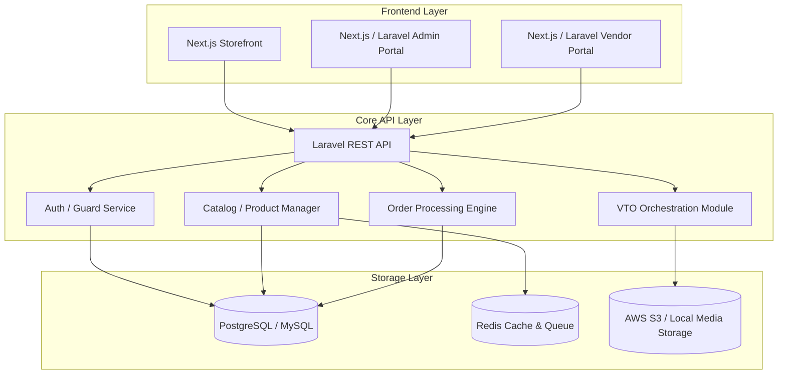

# Building Block View

This view shows the internal decomposition of the system into sub-components, services, and libraries.

---

## 🏛️ System Decomposition Diagram

---

## 📦 Component Descriptions

* **Next.js Storefront**: Interactive client portal for browsing products, managing cart, and invoking VTO try-on options.
* **Laravel REST API**: Core backend engine handling authentication, business logic, authorization, database operations, and job queues.
* **VTO Orchestration Module**: Integrates with external VTO APIs, handles image upload buffering, and coordinates the processing states.
