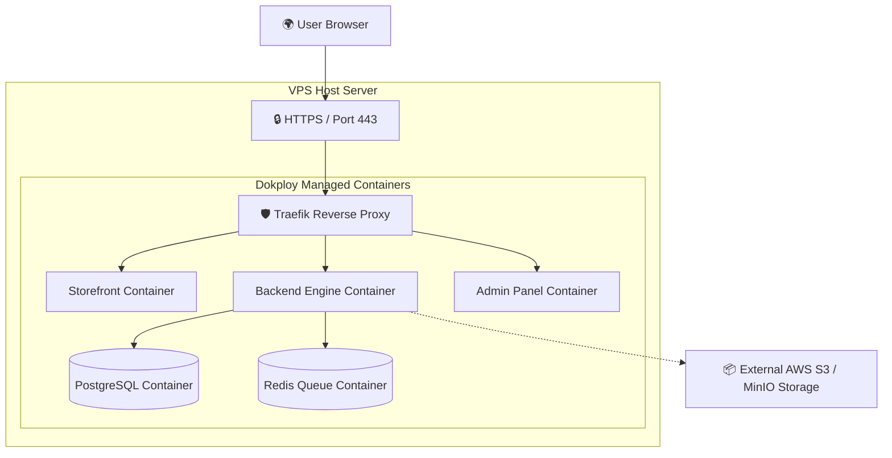

# Deployment View

This view maps the software components to the physical hosting infrastructure.

---

## 🌐 Infrastructure Architecture Diagram

Below is the standard layout for single-server VPS deployment managed using **Dokploy**.

---

## ⚙️ Deployment Specifications

* **Traefik Reverse Proxy**: Automatically handles SSL (Let's Encrypt) and routes traffic to respective containers.
* **Dokploy**: Orchestrates builds, handles environment variables, updates config files, and exposes deployments via webhooks.
* **Storage Backup**: PostgreSQL container writes automated backups to a mounted host volume daily.
