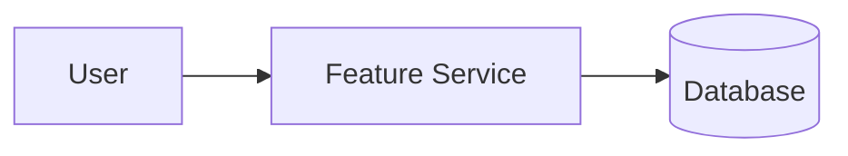

# Feature Spec: [Feature Title]

* **Status**: [Draft / Proposed / In Development / Released]
* **Author**: [Name/Email]
* **Target Release**: [v1.x / Qx]

---

## 📝 Description

Provide a high-level summary of what this feature does and why it is being implemented.

## 👥 User Stories & Use Cases

* **As a** [role], **I want to** [action], **so that** [benefit].
* **As a** [role], **I want to** [action], **so that** [benefit].

## 🏛️ High-Level Design / Data Flow

Provide a summary of the technical design or include a Mermaid.js diagram showing database or API flow.

## 🧪 Acceptance Criteria

List specific test cases that verify the feature is working as intended:
1. **Scenario 1**: Given [context], when [action], then [expected result].
2. **Scenario 2**: Given [context], when [action], then [expected result].
