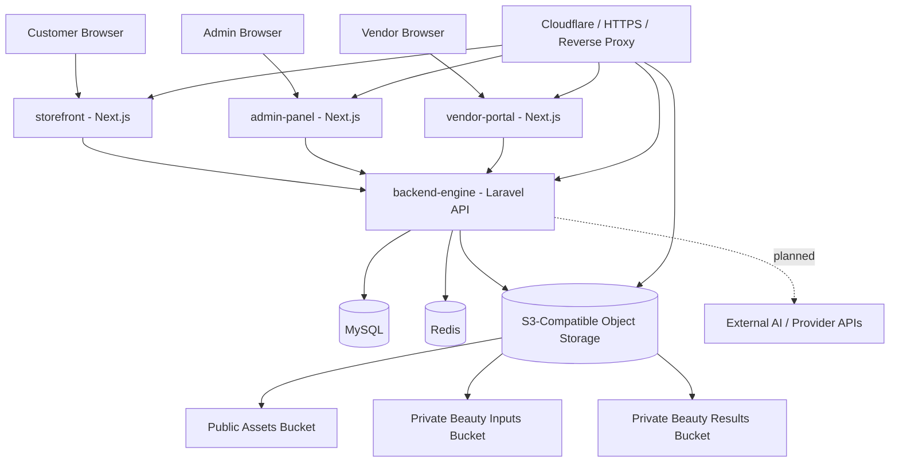
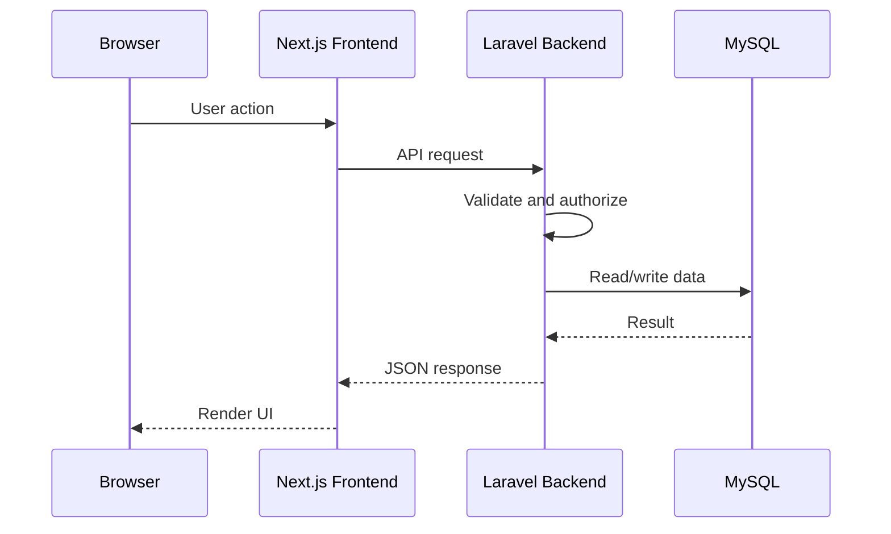
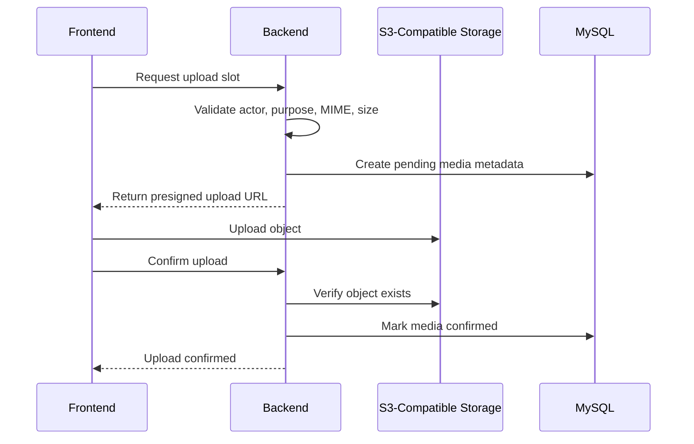
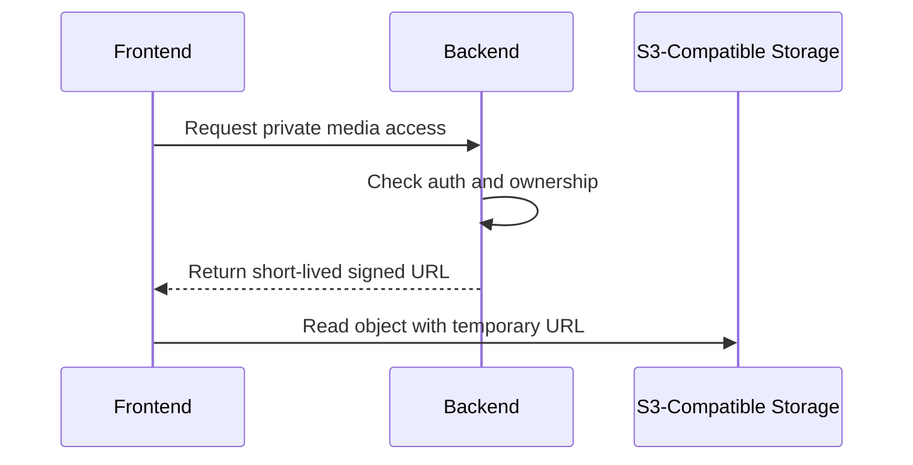
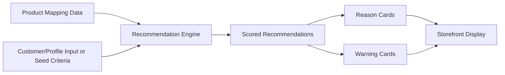

# High-Level Design: Nuvia Beauty System Architecture

## Document Control

| Field | Value |
|---|---|
| Project | Nuvia Beauty |
| Repository | `Absolute-Martial/Nuvia-Beauty` |
| Branch | `development` |
| Document type | High-Level Design (HLD) |
| Audience | Product Managers, Lead Architects, Engineering Leads, Key Stakeholders |
| Current baseline | Base app deployed; Phase 4 storage and beauty product intelligence planned next |
| Primary services | `backend-engine`, `storefront`, `admin-panel`, `vendor-portal` |

## 1. System Overview and Objectives

Nuvia Beauty is a beauty-focused commerce platform built from a multi-service web application architecture. The system currently consists of a Laravel backend, three Next.js frontend services, MySQL, Redis, and an S3-compatible storage direction using MinIO/AIStor as the preferred self-hosted provider.

The product direction is to move beyond generic ecommerce and support beauty-specific product confidence. The system will allow vendors to manage beauty products with structured attributes, customers to receive explainable product recommendations, and administrators to manage platform-level controls, mappings, storage, and operational visibility.

### 1.1 Primary Objectives

1. Provide a working customer storefront, vendor portal, admin panel, and backend API.
2. Add S3-compatible storage for public and private media.
3. Support beauty-specific product attributes and mappings.
4. Generate deterministic, explainable product recommendations.
5. Prepare the platform for future AI/provider workflows such as skin analysis, try-on, and seller-assisted consultation.
6. Maintain clear security boundaries between frontend services and protected backend infrastructure.

### 1.2 Strategic Objective

The strategic objective is to establish Nuvia Beauty as a foundation for a beauty-commerce and consultation platform where:

```text
Commerce works first.
Storage works safely.
Beauty intelligence works explainably.
AI/provider workflows are added only after the foundation is stable.
```

## 2. Business and Functional Requirements

### 2.1 Business Requirements

| Requirement | Description |
|---|---|
| Beauty-focused commerce | Products must support beauty-specific metadata beyond ordinary product titles and categories. |
| Vendor enablement | Vendors must be able to manage products and shop-facing data through the vendor portal. |
| Admin control | Admins must manage platform data, configuration, mapping, and operational controls. |
| Customer confidence | Customers should receive clearer product guidance through explainable recommendations. |
| Media readiness | Product/shop media and future beauty/customer media must be stored safely and scalably. |
| AI readiness | The system must be prepared for external AI/provider integration without exposing secrets to the browser. |
| Push readiness | The deployed system must be demonstrable and credible for early users, testers, partners, or stakeholders. |

### 2.2 Functional Requirements

#### Current/Core Functional Requirements

```text
Customer storefront runtime
Admin panel runtime
Vendor portal runtime
Laravel backend runtime
MySQL persistence
Redis cache/session/queue support
Docker Compose deployment baseline
HTTPS/domain-routed deployed environment
```

#### Phase 4 Functional Requirements

```text
S3-compatible storage configuration
Public/private media separation
Backend-issued upload slot flow
Private signed download flow
Media metadata tracking
Beauty product attribute mapping
Recommendation scoring service
Reason and warning cards
Storefront recommendation display
Admin/vendor mapping support where practical
```

#### Future Functional Requirements

```text
Customer beauty profiles
Seller-assisted consultation
AI/provider task orchestration
Perfect Corp / YouCam integration
Quota and usage tracking
Saved profile reopen flow
Try-on result media lifecycle
```

## 3. Scope and System Boundaries

### 3.1 In Scope for Target Architecture

```text
Next.js customer storefront
Next.js admin dashboard
Next.js vendor portal
Laravel backend API
MySQL database
Redis cache/queue/session layer
S3-compatible object storage
Public/private bucket strategy
Beauty product intelligence layer
Backend-controlled provider integration boundary
Documentation and operational checklists
```

### 3.2 Out of Scope for Immediate Phase 4 Build

```text
Full customer self-scan
Live multi-provider AI orchestration
Hair try-on
Jewelry try-on
Native mobile app
Subscription billing
Advanced analytics
Cross-profile ML recommendations
Clinical/medical diagnosis features
Social feed or public result sharing
```

### 3.3 Key Boundary Rule

Frontend services are browser-facing clients. They must not directly own protected operations.

Correct pattern:

```text
Frontend -> backend-engine -> MySQL / Redis / S3-compatible storage / external APIs
```

Incorrect pattern:

```text
Frontend -> database
Frontend -> Redis
Frontend -> storage credentials
Frontend -> provider API keys
```

## 4. High-Level Architecture Diagram



## 5. Component Descriptions

### 5.1 Storefront

| Attribute | Description |
|---|---|
| Directory | `storefront/` |
| Runtime | Next.js `15.5.18`, React `19.2.6` |
| Port | `3003` |
| Role | Customer-facing shopping and future recommendation UI |

Responsibilities:

```text
Product browsing UI
Customer-facing product details
Recommendation card rendering
PWA-capable customer interface
Backend API consumption
```

Not responsible for:

```text
Database access
Provider API calls
Storage credential handling
Private media authorization
Authoritative recommendation scoring
```

### 5.2 Admin Panel

| Attribute | Description |
|---|---|
| Directory | `admin-panel/` |
| Runtime | Next.js `15.5.18`, React `19.2.6` |
| Port | `3002` |
| Role | Platform administration dashboard |

Responsibilities:

```text
Admin UI
Operational tables and forms
Product/vendor management views
Future provider/storage configuration visibility
Future failed task and quota views
```

### 5.3 Vendor Portal

| Attribute | Description |
|---|---|
| Directory | `vendor-portal/` |
| Runtime | Next.js `15.5.18`, React `19.2.6` |
| Port | `3004` |
| Role | Seller/vendor-facing dashboard |

Responsibilities:

```text
Vendor dashboard UI
Product/shop management views
Vendor-facing media and product workflows
Future beauty product metadata support
Backend API consumption
```

### 5.4 Backend Engine

| Attribute | Description |
|---|---|
| Directory | `backend-engine/` |
| Runtime | PHP `^8.3`, Laravel `^13.0` |
| Port | `8000` |
| Role | Protected business logic and integration boundary |

Responsibilities:

```text
API routing
Authentication/authorization boundary
Business logic
Database access
Storage abstraction
Media metadata
Recommendation scoring
External provider orchestration in future phase
Queue/job processing in future phase
```

### 5.5 MySQL

Role:

```text
Primary relational persistence layer
```

Stores:

```text
commerce data
users/vendors/admin-managed entities
future media metadata
future beauty mappings
future recommendation records
future provider task records
```

### 5.6 Redis

Role:

```text
Cache/session/queue backend depending on environment
```

Current Docker Compose direction uses Redis for cache, queue, and session. `.env.example` still uses local development defaults for file/sync behavior.

### 5.7 S3-Compatible Object Storage

Role:

```text
Object storage for public assets and private beauty/customer media
```

Preferred provider:

```text
MinIO / MinIO AIStor
```

Port model observed in deployment:

```text
S3 API endpoint: 9000
Console endpoint: 9001
```

## 6. Core Modules and System Interactions

### 6.1 Commerce Module

Primary owner:

```text
backend-engine
```

Consumers:

```text
storefront
admin-panel
vendor-portal
```

Responsibilities:

```text
products
categories
vendors/shops
orders
customer-visible product data
admin/vendor product operations
```

### 6.2 Storage Module

Primary owner:

```text
backend-engine
```

Target interactions:

```text
Frontend requests upload slot
Backend validates request
Backend returns presigned upload URL
Frontend uploads directly to object storage
Frontend confirms upload
Backend stores metadata and controls future access
```

Required services:

```text
StorageService
MediaAssetService
MediaAssetPolicy
DeleteExpiredMediaAssets job
```

### 6.3 Beauty Product Mapping Module

Primary owner:

```text
backend-engine
```

Consumers:

```text
storefront for recommendations
vendor-portal for vendor product metadata
admin-panel for admin mapping controls
```

Data examples:

```text
skin type tags
tone tags
undertone tags
concern tags
ingredient tags
avoid tags
explanation templates
```

### 6.4 Recommendation Module

Primary owner:

```text
backend-engine
```

Recommendation approach:

```text
deterministic scoring first
explicit reasons and warnings
no clinical/medical claim language
```

Output shape:

```json
{
  "product_id": 123,
  "score": 87,
  "confidence": "high",
  "reasons": ["Matches oily skin profile", "Targets dark spot concern"],
  "warnings": ["Avoid if sensitive to fragrance"]
}
```

### 6.5 AI/Provider Module

Status:

```text
Planned, not required for Phase 4 completion
```

Future responsibilities:

```text
provider task creation
file preparation
polling
result normalization
quota reconciliation
failed task handling
demo fallback mode
```

Provider keys must remain backend-only.

## 7. Data Flow and Integration Points

### 7.1 Standard Frontend Request Flow



### 7.2 Storage Upload Flow



### 7.3 Private Media Read Flow



### 7.4 Recommendation Flow



## 8. Technology Stack and Infrastructure Overview

### 8.1 Frontend Stack

| Service | Framework | React | Port |
|---|---|---:|---:|
| `storefront` | Next.js `15.5.18` | `19.2.6` | `3003` |
| `admin-panel` | Next.js `15.5.18` | `19.2.6` | `3002` |
| `vendor-portal` | Next.js `15.5.18` | `19.2.6` | `3004` |

Common frontend tooling:

```text
Yarn Classic workspaces
TypeScript 5.9.3
Tailwind CSS 3.4.14
Axios
React Query
Jotai
next-i18next
i18next
```

### 8.2 Backend Stack

| Component | Current value |
|---|---|
| Backend framework | Laravel `^13.0` |
| PHP | `^8.3` |
| Docker base image | `php:8.3-cli-alpine` |
| HTTP runtime | `php artisan serve` |
| Database | MySQL 8.0 |
| Cache/queue/session | Redis 7.4 Alpine in Compose |
| S3 adapter | `league/flysystem-aws-s3-v3` |

### 8.3 Infrastructure Stack

```text
Docker Compose
Cloudflare / HTTPS routing
Let's Encrypt certificates
MySQL volume
Redis volume
S3-compatible storage endpoint
MinIO/AIStor preferred storage provider
```

## 9. Scalability, Security, and Performance Considerations

### 9.1 Scalability

Current architecture can scale by separating:

```text
frontend web containers
backend API containers
queue worker containers
MySQL database service
Redis service
object storage service
```

Future scaling actions:

```text
add backend worker service
move provider calls to queues
use CDN for public media
use object storage lifecycle rules
add database indexes for mapping/recommendation queries
cache recommendation results where appropriate
```

### 9.2 Security

Key rules:

```text
No backend secrets in frontend variables.
No storage credentials in browser bundles.
No provider keys in frontend code.
Private media requires backend authorization.
Signed URLs must be short-lived.
Raw private media must not be placed in public buckets.
Sensitive logs must avoid secrets and full signed URLs.
```

### 9.3 Performance

Performance targets for Phase 4:

| Area | Target |
|---|---:|
| Recommendation generation for seeded dataset | Under 1 second |
| Upload slot creation | Under 500 ms excluding network variance |
| Signed upload URL TTL | 15 minutes default |
| Signed download URL TTL | 60 minutes default |
| Public media delivery | CDN-ready |

Recommended performance approach:

```text
avoid provider calls in request lifecycle
store metadata in MySQL, objects in S3-compatible storage
use Redis for queue/cache where appropriate
index mapping tables by product and tags
keep recommendation scoring deterministic for initial release
```

## 10. External Dependencies and APIs

### 10.1 Current External/Infrastructure Dependencies

```text
Cloudflare or equivalent DNS/CDN/WAF layer
Let's Encrypt certificate provisioning
Docker runtime
MySQL
Redis
S3-compatible object storage
```

### 10.2 Planned Provider Dependencies

Future AI/provider workflows may use:

```text
Perfect Corp / YouCam APIs
```

Provider integration rules:

```text
backend-only API keys
provider calls through jobs/services
normalized result storage
frontend receives only safe backend-shaped responses
demo fallback mode for testing
```

### 10.3 Storage API Dependency

The storage layer should depend on S3-compatible APIs through Laravel/Flysystem abstraction.

Preferred implementation:

```text
Laravel filesystem disk -> S3-compatible endpoint -> MinIO/AIStor or AWS S3-compatible provider
```

## 11. Assumptions and Constraints

### 11.1 Assumptions

```text
Base deployment remains available for testing.
Current service split remains unchanged.
Laravel backend remains the protected authority.
MinIO/AIStor or compatible S3 endpoint is available.
MySQL and Redis are available through Compose/deployment.
Beauty product mappings can be introduced without breaking existing commerce flows.
AI/provider integration will be added after storage and recommendation foundations are stable.
```

### 11.2 Constraints

```text
Do not downgrade Next.js, React, PHP, or Laravel versions.
Do not create a new service unless justified by deployment/runtime needs.
Do not expose backend secrets to frontend services.
Do not hardcode MinIO-only assumptions in business logic.
Do not store raw private files in MySQL.
Do not make medical or clinical claims in recommendation output.
```

## 12. Risks and Mitigation Strategies

| Risk | Impact | Mitigation |
|---|---|---|
| Storage misconfiguration | Upload/read failures | Use explicit disk configs and verify each bucket separately. |
| Private media becomes public | High privacy/security risk | Separate buckets and test public access denial. |
| Frontend secret exposure | High security risk | Keep secrets backend-only and inspect browser bundle/network. |
| Recommendation output appears generic | Product value risk | Use structured beauty mappings, reasons, and warnings. |
| Scope expands into AI too early | Delivery risk | Keep AI/provider workflows after storage and mapping foundations. |
| Route conflicts with existing package routes | Integration risk | Document final API contracts and inspect route list. |
| Environment drift | Deployment risk | Maintain env docs and deployment checklist. |
| Docs drift from code | Architecture risk | Update docs in the same commit as behavior changes. |
| Storage provider lock-in | Portability risk | Code against S3-compatible abstraction, not hardcoded MinIO APIs. |

## 13. Deployment and Environment Overview

### 13.1 Deployed Service Model

Observed deployment model:

```text
storefront domain -> port 3003
admin domain -> port 3002
vendor domain -> port 3004
backend API domain -> port 8000
S3 API domain -> port 9000
S3 console domain -> port 9001
```

### 13.2 Environment Types

| Environment | Purpose |
|---|---|
| Local | Developer testing with Docker Compose and local source mounts |
| Staging/Testing | Deployed validation environment with domains and HTTPS |
| Production | Future customer/vendor-facing environment |

### 13.3 Deployment Requirements

```text
Docker images for all services
APP_KEY configured for backend
database credentials configured
Redis available if queue/cache/session use Redis
frontend NEXT_PUBLIC URLs configured
S3-compatible endpoint configured
public/private bucket policies configured
HTTPS routing verified
```

## 14. Future Scalability and Extensibility

### 14.1 Future Beauty Profile Module

Future tables/services:

```text
beauty_profiles
beauty_profile_snapshots
beauty_product_effect_logs
saved recommendations
profile preference tags
```

Purpose:

```text
support reusable customer beauty profiles without requiring a new raw photo every session
```

### 14.2 Future Seller Consultation Module

Future capabilities:

```text
seller-assisted consultation session
guest/new/returning customer modes
capture/upload media
save/discard session
recommendation review
customer profile reopen
```

### 14.3 Future Provider Orchestration Module

Future capabilities:

```text
provider task creation
provider polling
normalized analysis results
quota events
failed task handling
demo mode fallback
```

### 14.4 Future Scaling Improvements

```text
dedicated queue worker containers
object lifecycle policies
CDN for public media
database indexing and query optimization
admin failed task dashboard
observability dashboards
feature flag service
multi-tenant shop domain support
```

## 15. Architecture Review Checklist

```text
[ ] Service boundaries are clear.
[ ] Frontend services do not own protected operations.
[ ] Backend owns data, storage, and provider boundaries.
[ ] Public and private media are separated.
[ ] Recommendation logic is deterministic and explainable.
[ ] Current vs planned features are clearly labeled.
[ ] Deployment ports and service domains are understood.
[ ] Security risks are mitigated before AI/provider workflows.
[ ] Future scalability path is not blocked by current design.
```

## 16. Conclusion

The proposed architecture positions Nuvia Beauty as a scalable beauty-commerce platform with a clear path from deployed base application to differentiated beauty intelligence. The immediate design priority is the stable foundation: S3-compatible storage, public/private media separation, beauty product mapping, and explainable recommendations.

Once these foundations are verified, the system can safely expand into customer beauty profiles, seller-assisted consultation, Perfect Corp/YouCam provider workflows, quota controls, and reusable personalized beauty guidance.
