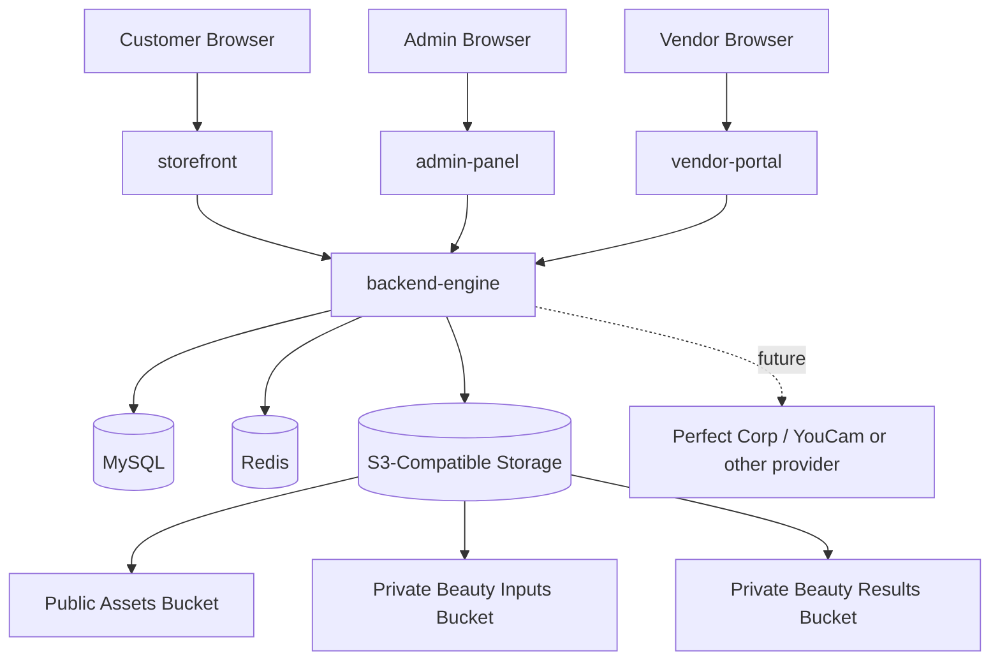
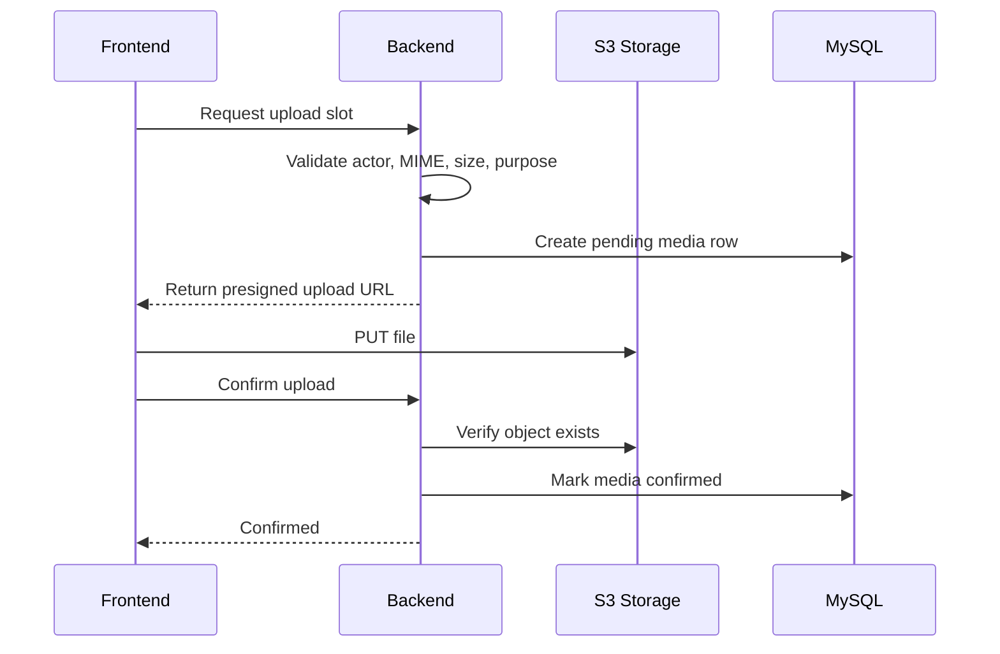
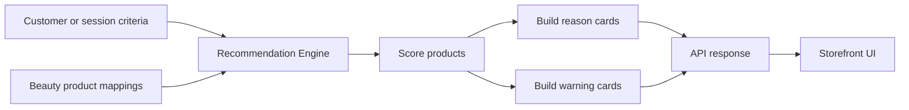

# RFC: Phase 4 S3-Compatible Storage and Beauty Product Intelligence

## Document Overview

| Field | Value |
|---|---|
| Project | Nuvia Beauty |
| Repository | `Absolute-Martial/Nuvia-Beauty` |
| Branch | `development` |
| Document type | Request for Comments (RFC) |
| Status | Draft for review |
| Target phase | Phase 4 |
| Primary scope | S3-compatible storage foundation and beauty product intelligence |
| Audience | Product, engineering, architecture, deployment, and stakeholder review |

## 1. Purpose and Background

Nuvia Beauty currently has a deployed base application with four main runtime services: `storefront`, `admin-panel`, `vendor-portal`, and `backend-engine`. The deployment also includes backend API routing and S3/MinIO-compatible service surfaces.

The next product step is to move from a generic deployed ecommerce base into a beauty-focused platform. This requires two foundations before advanced AI/provider workflows are added:

1. A safe S3-compatible storage layer for public assets and private beauty/customer media.
2. A beauty product intelligence layer that supports structured product mapping and explainable recommendations.

This RFC proposes the technical solution, implementation plan, API surface, data model, rollout strategy, and review criteria for that phase.

## 2. Problem Statement

The current deployed base app can host the services, but it does not yet fully prove the beauty-platform goal.

Current gaps:

```text
No finalized public/private S3-compatible storage abstraction.
No backend-issued upload-slot flow.
No media metadata tracking model.
No private signed download flow.
No beauty-specific product mapping layer.
No deterministic recommendation engine.
No customer-facing reason/warning recommendation cards.
No finalized admin/vendor mapping workflow.
```

Without these foundations, moving directly into full AI analysis, virtual try-on, or seller-assisted consultation would create security, product, and cost risks.

## 3. Goals and Non-Goals

### 3.1 Goals

```text
Implement S3-compatible storage abstraction in backend.
Use MinIO/AIStor as preferred self-hosted provider without hardcoding provider-specific logic.
Separate public product/shop media from private beauty/customer media.
Create backend-controlled upload and read flows.
Track media metadata in MySQL.
Add beauty-specific product mapping capability.
Build deterministic recommendation scoring.
Return explainable reason and warning cards.
Expose safe APIs for storefront, vendor portal, and admin panel.
Keep documentation aligned with implementation.
```

### 3.2 Non-Goals

```text
Full customer self-scan.
Full live Perfect Corp / YouCam workflow.
Multi-provider AI orchestration.
Hair or jewelry try-on.
Native mobile application.
Subscription billing.
Advanced analytics platform.
Clinical or medical diagnosis.
Machine-learning model training.
```

## 4. Proposed Solution and Architecture Overview

The proposed solution adds a backend-owned storage domain and beauty intelligence domain while keeping the existing service layout.

```text
storefront      -> backend-engine -> MySQL
admin-panel     -> backend-engine -> Redis
vendor-portal   -> backend-engine -> S3-compatible storage
backend-engine  -> future external provider APIs
```

### 4.1 Proposed Architecture



### 4.2 Design Principle

The backend is the authority for:

```text
authorization
media ownership
upload slot creation
signed URL generation
provider API access
recommendation scoring
database writes
```

Frontend services are clients only.

## 5. Technical Design Details

### 5.1 Storage Design

#### Storage Provider Contract

The application will use S3-compatible storage as the contract.

Preferred deployment:

```text
MinIO / MinIO AIStor
```

Portability target:

```text
AWS S3 or another S3-compatible object store by environment change
```

#### Buckets

| Bucket | Visibility | Purpose |
|---|---|---|
| `nuvia-public-assets` | Public/CDN-readable | Product images, shop logos, banners, public UI assets |
| `nuvia-private-beauty-inputs` | Private | Customer/source photos and future analysis inputs |
| `nuvia-private-beauty-results` | Private | Generated results, overlays, and future try-on media |
| `nuvia-private-calibration` | Private | Explicit opt-in calibration images, future phase |

#### Laravel Disks

Proposed disks:

```text
s3_public
s3_beauty_inputs
s3_beauty_results
s3_beauty_calibration
```

#### Environment Variables

```env
STORAGE_DRIVER=s3_compatible
S3_PROVIDER=minio_aistor
S3_ENDPOINT=https://s3-assets-example-domain
S3_REGION=us-east-1
S3_ACCESS_KEY_ID=
S3_SECRET_ACCESS_KEY=
S3_USE_PATH_STYLE_ENDPOINT=true

S3_PUBLIC_BUCKET=nuvia-public-assets
S3_BEAUTY_INPUTS_BUCKET=nuvia-private-beauty-inputs
S3_BEAUTY_RESULTS_BUCKET=nuvia-private-beauty-results
S3_BEAUTY_CALIBRATION_BUCKET=nuvia-private-calibration

S3_UPLOAD_URL_TTL_MINUTES=15
S3_DOWNLOAD_URL_TTL_MINUTES=60
```

### 5.2 Media Metadata Design

Proposed table:

```text
beauty_media_assets
```

Recommended fields:

```text
id
session_id nullable
profile_id nullable
shop_id nullable
owner_type
owner_id
asset_type
storage_provider
disk_name
bucket
object_key
object_version nullable
content_type
size_bytes
checksum_sha256 nullable
visibility
status
expires_at nullable
discarded_at nullable
deleted_at nullable
created_at
updated_at
```

Status values:

```text
pending_upload
uploaded
confirmed
discarded
expired
deleted
delete_failed
```

### 5.3 Beauty Product Mapping Design

Proposed table:

```text
beauty_product_mappings
```

Recommended fields:

```text
id
product_id
concern_tags JSON
skin_type_tags JSON
tone_tags JSON
undertone_tags JSON
ingredient_tags JSON
avoid_tags JSON
explanation_template nullable
created_at
updated_at
```

### 5.4 Recommendation Design

The first recommendation engine will be deterministic.

Inputs:

```text
product mapping tags
customer/session criteria
selected concern tags
selected skin type/tone preferences
avoid tags
```

Output:

```json
{
  "product_id": 123,
  "score": 87,
  "confidence": "high",
  "reasons": [
    "Matches oily skin profile",
    "Targets dark spot concern"
  ],
  "warnings": [
    "Avoid if sensitive to fragrance"
  ]
}
```

Rules:

```text
No clinical diagnosis language.
No medical promises.
No hidden scoring without explanation.
Every recommendation must include reasons.
Warnings must appear when avoid tags match.
```

## 6. APIs, Interfaces, and Data Flow

### 6.1 Proposed Storage APIs

```http
POST /api/v1/storage/upload-slots
POST /api/v1/storage/media/{mediaId}/confirm
GET  /api/v1/storage/media/{mediaId}/download-url
DELETE /api/v1/storage/media/{mediaId}
```

#### Upload Slot Request

```json
{
  "asset_type": "beauty_input",
  "content_type": "image/jpeg",
  "size_bytes": 4200000,
  "purpose": "beauty_recommendation",
  "shop_id": "optional",
  "session_id": "optional"
}
```

#### Upload Slot Response

```json
{
  "media_id": "uuid",
  "bucket": "nuvia-private-beauty-inputs",
  "object_key": "beauty/inputs/session-id/media-id/source.jpg",
  "upload": {
    "method": "PUT",
    "url": "short-lived-presigned-url",
    "expires_at": "2026-05-27T15:00:00Z",
    "headers": {
      "Content-Type": "image/jpeg"
    }
  }
}
```

### 6.2 Proposed Beauty APIs

```http
GET  /api/v1/beauty/product-mappings
POST /api/v1/beauty/product-mappings
PUT  /api/v1/beauty/product-mappings/{id}
POST /api/v1/beauty/recommendations/generate
GET  /api/v1/beauty/recommendations/{id}
```

### 6.3 Upload Data Flow



### 6.4 Recommendation Data Flow



## 7. Alternatives Considered and Trade-Offs

### 7.1 Store Files on Local Disk

Decision: Reject for target architecture.

Trade-off:

```text
Simple initially, but weak for deployment, scaling, private media lifecycle, and future provider workflows.
```

### 7.2 Use AWS S3 Directly

Decision: Supported as future-compatible option, not preferred for current self-hosted setup.

Trade-off:

```text
Strong managed service, but external cost and dependency increase. S3-compatible abstraction keeps migration possible.
```

### 7.3 Hardcode MinIO APIs

Decision: Reject.

Trade-off:

```text
May expose provider-specific features quickly, but creates lock-in and makes AWS-compatible migration harder.
```

### 7.4 Start with Live AI Provider First

Decision: Reject for Phase 4.

Trade-off:

```text
More impressive demo, but higher cost, more failure modes, and unsafe without storage/media foundation.
```

### 7.5 Deterministic Recommendation First

Decision: Accept.

Trade-off:

```text
Less advanced than AI, but explainable, cheap, controllable, and good enough to prove beauty-commerce differentiation.
```

## 8. Security, Scalability, and Performance Considerations

### 8.1 Security

Security requirements:

```text
Backend-only storage credentials.
Backend-only provider API keys.
Short-lived signed URLs.
Ownership check before private media access.
MIME and file size validation before upload slot creation.
No raw image bytes in MySQL.
No full signed URLs or secrets in logs.
No private customer media in public buckets.
```

### 8.2 Scalability

Scalability path:

```text
static/public assets through CDN
private assets through S3-compatible storage
provider calls through queue workers
recommendations cached where useful
database indexes for product mappings and media status
separate worker service for media cleanup/provider workflows
```

### 8.3 Performance

Initial targets:

| Area | Target |
|---|---:|
| Upload slot creation | Under 500 ms excluding network variance |
| Recommendation generation | Under 1 second for seeded product data |
| Signed upload TTL | 15 minutes default |
| Signed download TTL | 60 minutes default |
| Private media access | Backend authorization required before URL generation |

## 9. Risks, Assumptions, and Constraints

### 9.1 Risks

| Risk | Impact | Mitigation |
|---|---|---|
| Storage endpoint misconfiguration | Uploads fail | Validate each disk/bucket separately. |
| Private media exposed publicly | High security/privacy impact | Separate buckets and test access denial. |
| Frontend secret exposure | High security impact | Keep credentials backend-only and inspect browser network. |
| Recommendation logic feels weak | Product risk | Use reason cards, warning cards, and curated seed mappings. |
| Scope expands into AI too early | Delivery risk | Keep provider integration out of required Phase 4 scope. |
| Documentation drift | Engineering risk | Update docs in same commit as implementation changes. |

### 9.2 Assumptions

```text
The existing deployed base app remains available for validation.
The service layout remains unchanged.
MinIO/AIStor-compatible endpoint is available.
MySQL remains the primary data store.
Redis remains available for future queue/cache/session scaling.
Beauty product mappings can be added without breaking current product flows.
```

### 9.3 Constraints

```text
Do not expose backend secrets to frontend services.
Do not hardcode MinIO-only behavior.
Do not store raw file bytes in MySQL.
Do not add clinical/medical recommendation language.
Do not require live AI provider calls for this phase.
```

## 10. Migration and Rollout Strategy

### 10.1 Rollout Phases

#### Phase 1: Configuration and Docs

```text
Add storage env variables.
Add Laravel disk configuration.
Update storage docs and changelog.
Validate deployed endpoint connectivity.
```

#### Phase 2: Media Metadata and Upload Flow

```text
Add media metadata migration.
Add storage service layer.
Add upload-slot API.
Add confirm API.
Add private download API.
```

#### Phase 3: Public/Product Media

```text
Route product/shop assets to public bucket.
Verify public media access.
Verify frontend rendering.
```

#### Phase 4: Beauty Mapping

```text
Add beauty product mapping model/table.
Seed initial product mapping data.
Expose backend mapping APIs.
Add admin/vendor view or documented seed workflow.
```

#### Phase 5: Recommendation Engine

```text
Add deterministic scoring service.
Add reason/warning builder.
Add recommendation endpoint.
Render cards on storefront.
```

#### Phase 6: Verification

```text
Validate no secrets in browser.
Validate private media is not public.
Validate recommendations with seeded products.
Update docs and changelog.
Prepare push summary.
```

### 10.2 Rollback Strategy

```text
Keep local filesystem config available during transition.
Feature-flag recommendation UI if needed.
Disable upload endpoints if storage validation fails.
Preserve migrations with reversible rollback where practical.
Keep old product display flow operational while recommendation UI is added.
```

## 11. Testing and Validation Approach

### 11.1 Backend Tests

```text
Upload slot rejects unsupported MIME types.
Upload slot rejects oversized files.
Upload slot creates pending media metadata.
Confirm endpoint fails for missing object.
Confirm endpoint marks uploaded object confirmed.
Private download endpoint requires authorization.
Delete/discard marks media correctly.
Recommendation endpoint returns scored products.
Warnings appear when avoid tags match.
```

### 11.2 Frontend Tests

```text
Storefront renders recommendation cards.
Reason cards display correctly.
Warning cards display correctly.
Vendor/admin mapping screen or seed workflow is usable.
No backend-only secrets appear in client-visible configuration.
```

### 11.3 Deployment Validation

```text
Storefront reachable.
Admin panel reachable.
Vendor portal reachable.
Backend API reachable.
S3-compatible endpoint reachable.
Public bucket object accessible as expected.
Private bucket object not publicly accessible.
Signed URL flow works.
```

### 11.4 Manual Verification

```text
Create or seed beauty product mappings.
Generate recommendations for sample criteria.
Review top recommended products.
Confirm reasons are understandable.
Confirm warnings appear when expected.
Inspect browser network requests for secret leakage.
```

## 12. Open Questions and Discussion Points

1. Should beauty product mapping be editable by vendors, admins only, or both?
2. Should recommendation scoring be global or shop-specific in the first version?
3. What is the minimum set of beauty tags required for launch?
4. Should private media default retention be 24 hours, 7 days, or configurable per use case?
5. Should public product media immediately move to S3-compatible storage, or should only new uploads use it first?
6. Should recommendation results be persisted or generated on demand for Phase 4?
7. Which UI surface should expose mapping first: admin panel or vendor portal?
8. Should provider/demo mode be added now or deferred to the next phase?

## 13. Success Metrics and Expected Outcomes

### 13.1 Success Metrics

| Metric | Target |
|---|---:|
| Public/private bucket separation | 100% verified |
| Storage credentials exposed to browser | 0 |
| Upload slot flow | Works end-to-end |
| Private signed download flow | Works end-to-end |
| Seeded mapped beauty products | Minimum 10 |
| Recommendation results per request | Minimum 3 |
| Recommendation reasons | Minimum 2 per product |
| Recommendation generation latency | Under 1 second for seeded dataset |
| Documentation coverage | Root + affected services updated |

### 13.2 Expected Outcomes

```text
Nuvia Beauty has a safe media foundation.
Product data supports beauty-specific intelligence.
Customers can see explainable recommendations.
Vendor/admin workflows have a clear mapping path.
The platform becomes ready for seller consultation and provider/AI integration.
The system is push-ready as a differentiated beauty-commerce product.
```

## 14. Approval and Review Stakeholders

| Stakeholder | Review responsibility | Approval needed |
|---|---|---|
| Product owner | Scope, product value, launch readiness | Yes |
| Lead architect | System architecture, boundaries, extensibility | Yes |
| Backend engineer | Laravel APIs, storage, data model, recommendation logic | Yes |
| Frontend engineer | Storefront/vendor/admin integration | Yes |
| DevOps/deployment owner | S3/MinIO/AIStor, domains, Docker, environment | Yes |
| Security reviewer | Secrets, private media, signed URLs, access rules | Yes |
| QA/test owner | Validation plan and acceptance checklist | Recommended |

## 15. Decision Request

Reviewers are asked to approve or comment on:

```text
S3-compatible storage as the application contract.
MinIO/AIStor as preferred self-hosted storage provider.
Backend-issued upload and signed-read flow.
Public/private bucket separation.
Deterministic recommendation engine before live AI provider workflow.
Beauty product mapping as the first intelligence data model.
Phase 4 rollout order and acceptance criteria.
```

## 16. Proposed Decision

Approve Phase 4 implementation with the following priority order:

```text
1. Storage env and disk configuration.
2. Media metadata and upload/download APIs.
3. Beauty product mapping table and seed data.
4. Deterministic recommendation service.
5. Storefront recommendation display.
6. Admin/vendor mapping support or documented controlled seed workflow.
7. Verification, documentation, and push summary.
```

Do not start live AI/provider workflows until storage, media metadata, product mapping, recommendations, and private media access are verified.
