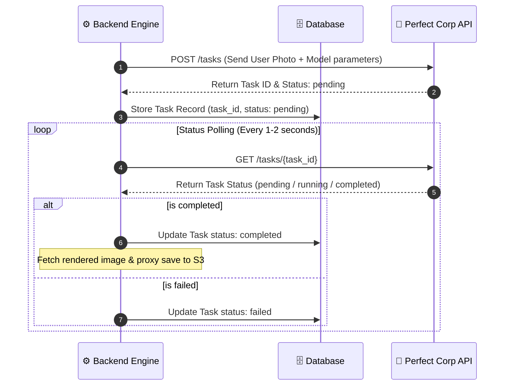

# 🔌 YouCam VTO Integration Proxy

The Backend Engine acts as the exclusive secure gateway communicating with Perfect Corp (YouCam) Virtual Try-On (VTO) APIs.

---

## 🎨 Supported Try-On Families

* 👕 **AI Clothes VTO**: Virtual apparel dressing overlays.
* ⌚ **AI Watch VTO**: Smart wear simulation.
* 👜 **AI Bag VTO**: Handbag placement rendering.
* 👟 **AI Shoes VTO**: Footwear trial alignment.

---

## 🔄 Task Lifecycle Flow

---

## 🛡️ Integration Security Rules

1. **Secrets Security**: The `YOUCAM_API_KEY` and authorization tokens must remain strictly server-side. Never expose these tokens to frontends or client logs.
2. **Rate Limiting**: Apply throttles to task creation and photo upload routes to prevent API credential lockouts and minimize billing overages.
3. **Data Verification**: Enforce file type and mime validation (e.g. `image/jpeg`, `image/png`) before making external API requests.
4. **Secret Shielding**: Log all third-party API errors without printing raw request headers containing secrets.
