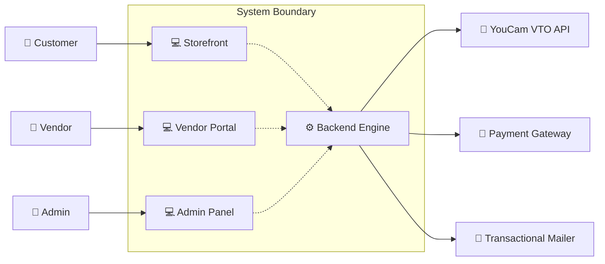

# System Context View

This view describes the system boundary, showing how our system interacts with external actors (users) and external services.

---

## 📊 Mermaid Diagram

---

## 🔌 Interface Descriptions

* **YouCam VTO API**: External REST integration used to send user photos and retrieve simulated overlay try-on results.
* **Payment Gateway**: Processes customer card payments securely.
* **Email Service**: Delivers registration, verification, and order receipt emails.
