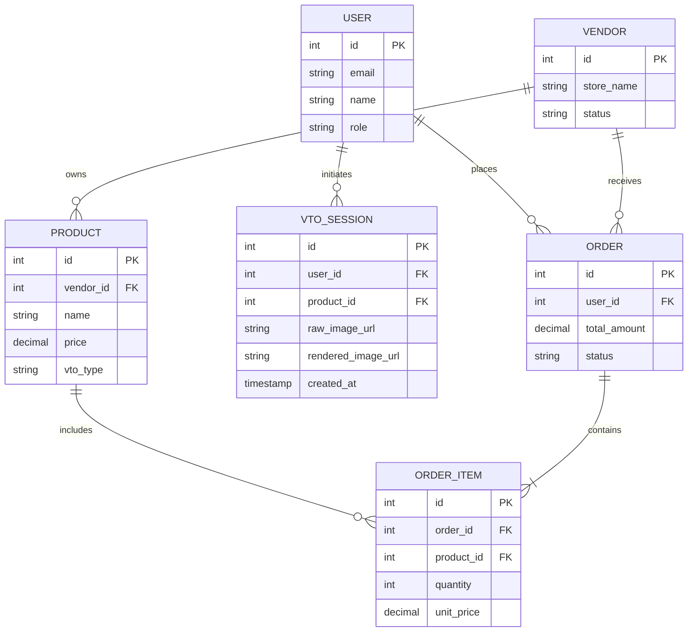

# Domain Model

This view represents the core business entities and their relationships.

---

## 📊 Entity Relationship Diagram

```mermaid
erDiagram
    USER ||--o{ ORDER : places
    USER ||--o{ VTO_SESSION : initiates
    VENDOR ||--o{ PRODUCT : owns
    VENDOR ||--o{ ORDER : receives
    PRODUCT ||--o{ ORDER_ITEM : includes
    ORDER ||--|{ ORDER_ITEM : contains
    
    USER {
        int id PK
        string email
        string name
        string role
    }
    
    VENDOR {
        int id PK
        string store_name
        string status
    }
    
    PRODUCT {
        int id PK
        int vendor_id FK
        string name
        decimal price
        string vto_type
    }
    
    ORDER {
        int id PK
        int user_id FK
        decimal total_amount
        string status
    }
    
    ORDER_ITEM {
        int id PK
        int order_id FK
        int product_id FK
        int quantity
        decimal unit_price
    }
    
    VTO_SESSION {
        int id PK
        int user_id FK
        int product_id FK
        string raw_image_url
        string rendered_image_url
        timestamp created_at
    }
```
