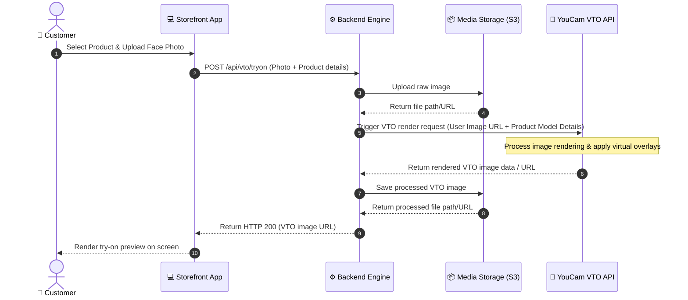

# Runtime View

This view describes how components interact at runtime to execute specific business processes.

---

## 🔄 Example Flow: Virtual Try-On (VTO) Sequence

The following sequence diagram outlines how a user uploads a photo to try on a cosmetic or fashion product.

