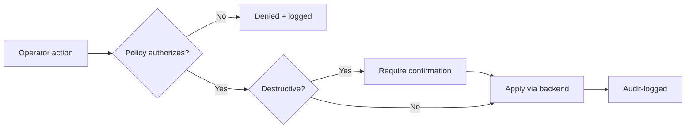

# admin-flows.md

Owner: Susank Shakya

<aside>
🧭

**`docs/admin-panel/admin-flows.md`** · the core workflows an operator performs in the admin panel.

</aside>

# 1. Purpose & scope

This page describes the **core operator workflows** in the admin panel and the access rules that govern them. Each flow is a thin UI over a `backend-engine` API and is gated by a Policy.

# 2. Flows

| Flow | What the operator does | Backend |
| --- | --- | --- |
| Catalog | Create/update products, manage availability and assets. | `/products` |
| Settings | Toggle feature flags, demo-mode, thresholds, TTL overrides. | settings system |
| Audit | Review storage access and sensitive actions. | audit log (read-only) |
| Operations | Inspect queue/job health and recent failures. | `operations/` |

# 3. A typical change

# 4. Access

- **Role-based**; each flow gated by a Policy (zero-trust, ADR 0012).
- Destructive actions require confirmation and are audit-logged.
- Operators never see private media or full signed URLs.

# 5. Related documentation

- Catalog: `product-management.md`. Settings: `settings-management.md`. Audit: `audit-views.md`. Backend: `backend-engine/api-contracts.md`.