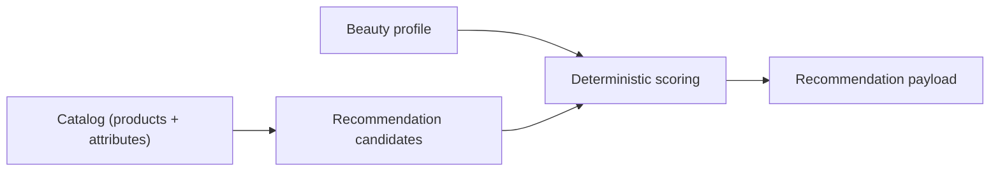

# product-management.md

Owner: Susank Shakya

<aside>
📦

**`docs/admin-panel/product-management.md`** · managing the product catalog that feeds recommendations and try-on.

</aside>

# 1. Purpose & scope

This page describes how operators **manage the product catalog** that feeds recommendations and the try-on studio. Catalog data is the candidate set the deterministic recommender scores, so its quality directly shapes recommendation quality.

# 2. Capabilities

| Capability | Detail |
| --- | --- |
| Lifecycle | Create, edit, and archive products. |
| Media | Manage product images via the public assets bucket (`nuvia-public-assets`). |
| Scoring attributes | Maintain categories, shades, ingredients, and tags used by scoring. |
| Availability | Control visibility/availability in the storefront. |

# 3. How catalog feeds recommendations

Attributes such as shade, ingredients, and avoid-tags are the features the recommender matches against the profile.

# 4. Rules

- Catalog changes propagate to recommendation candidates.
- Product media is **public**; never store private/beauty media here (see `storage/private-bucket-policy.md`).
- All edits are authorized by Policy and audit-logged.

# 5. Related documentation

- Storefront: `storefront/recommendation-ui.md`. Scoring: `integrations/ai-provider/orchestration.md`. Storage: `storage/storage-architecture.md`. Vendor mappings: `vendor-portal/`.