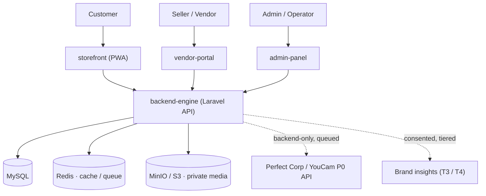

# architecture/

Owner: Susank Shakya

<aside>
🏛️

**`docs/architecture/`** — the authoritative architecture set for **Nuvia Beauty / MatchMuse**: high-level system design, the target reference architecture, Architecture Decision Records, and C4-style diagrams. Start here to understand how the four deployable apps, the modular backend, storage, and the AI provider boundary fit together.

</aside>

# Purpose & scope

This folder documents *how Nuvia Beauty is built and why*. It is the single entry point for architects, engineering leads, and technical reviewers who need to understand the system end-to-end before contributing to any specific module.

- **In scope:** system context, deployable apps, backend domain modules, storage architecture, trust boundaries, the consent-driven ecosystem, the recommendation pipeline, and the decisions that shaped them.
- **Out of scope:** per-feature implementation detail (see `backend-engine/`, `storefront/`, `admin-panel/`, `vendor-portal/`), storage operational runbooks (see `storage/` and `operations/`), and delivery sequencing (see `implementation-plan/`).

# Architectural principles

Every design decision in this folder is anchored to a small set of non-negotiable principles:

1. **Backend-only orchestration.** AI provider keys, storage credentials, and quota decisions live exclusively in `backend-engine`. Frontends are browser-facing clients that never hold secrets or make authoritative decisions.
2. **Deterministic, explainable recommendations.** Scoring is rule-based, reproducible, and auditable — every suggestion carries reasons and warnings. Opaque ranking is deferred until after the deterministic baseline is trusted.
3. **Privacy-first media lifecycle.** Raw facial images flow through controlled backend paths, are stored in private buckets, are never written into MySQL, and are never shared upward to brands.
4. **Tiered, revocable consent (T0–T4).** Nothing leaves a session unless the customer explicitly allows it; every grant is logged and reversible.
5. **Multi-tenant isolation.** Shops and brands can never see each other's sessions, profiles, or recommendations; tenancy is resolved and enforced server-side.
6. **Zero-trust access.** Every request is authenticated and authorized per resource with least privilege and default-deny.
7. **Non-medical framing.** All outputs are cosmetic-fit guidance, never clinical or diagnostic claims.
8. **Modular monolith, extracted incrementally.** The backend is internally modular with explicit contracts; modules become standalone services only when scale or ownership demands it — never an up-front microservices split.

# System at a glance

# Contents

| Page | What it covers | Primary audience |
| --- | --- | --- |
| `hld-system-architecture.md` | The complete High-Level Design: the four deployable apps, backend domain modules, storage architecture, data flows, trust boundaries, and the consent-driven ecosystem. | Architects, technical reviewers, engineering leads |
| `reference-architecture.md` | The reusable, best-practice implementation patterns for the stack and the modular-to-services evolution path, including the custom-model progression. | Implementers and future contributors |
| `adr/` | An enriched index of Architecture Decision Records (ADR 0001–0015) with status and summaries, linking to the canonical ADR Pack. | Engineering peer group |
| `diagrams/` | C4-style context and container diagrams plus key sequence diagrams (consultation, provider fallback, consent). | Anyone onboarding to the system |

# Trust boundaries overview

Nuvia Beauty enforces a strict client/server boundary. The detailed boundary table lives in `hld-system-architecture.md`, but the headline rules are:

- **Frontend → Backend:** the frontend cannot send authoritative quota, provider, or storage decisions.
- **Backend → Storage:** the backend issues short-lived signed URLs only after authorization; no credentials reach the browser.
- **Backend → Provider:** provider calls happen only through backend queue workers.
- **Backend → Brand:** only structured, consented attributes are shared (T3 aggregated, T4 identified); raw media never leaves.
- **Cross-tenant:** shops and brands are hard-isolated from one another.

# Related documentation

- Canonical source documents in **Technical Papers**: [High-Level Design](https://app.notion.com/p/High-Level-Design-36ff29d2a6b18142a5b4e5c386737c9f?pvs=21), [Reference Architecture](https://app.notion.com/p/Reference-Architecture-36ff29d2a6b181a3a17ad985ffef1d0c?pvs=21), [ADR Pack](https://app.notion.com/p/ADR-Pack-36ff29d2a6b18108958af03b19f13a6e?pvs=21), [Concept Paper](https://app.notion.com/p/Concept-Paper-36ff29d2a6b181c99153ed2b811f1312?pvs=21).
- Terminology is defined in [Project Foundations — Goals, Context, Constraints & Glossary](https://app.notion.com/p/Project-Foundations-Goals-Context-Constraints-Glossary-2d2e79ba4f7d45b89d965c4d025d32cd?pvs=21).
- Delivery sequencing lives in `implementation-plan/`; storage and operational detail live in the `storage/` and `operations/` folders.

[diagrams/](architecture/diagrams%206362dcfabef7411a95011f1d52264dcc.md)

[adr/](architecture/adr%20255896f92275495ba64233b2ab690b1a.md)

[[hld-system-architecture.md](http://hld-system-architecture.md)](architecture/hld-system-architecture%20md%20a6cfb693002b40a3b403e22ba135a9ac.md)

[[reference-architecture.md](http://reference-architecture.md)](architecture/reference-architecture%20md%20c4bd64be4d37438f8e7876af3cabf3a4.md)