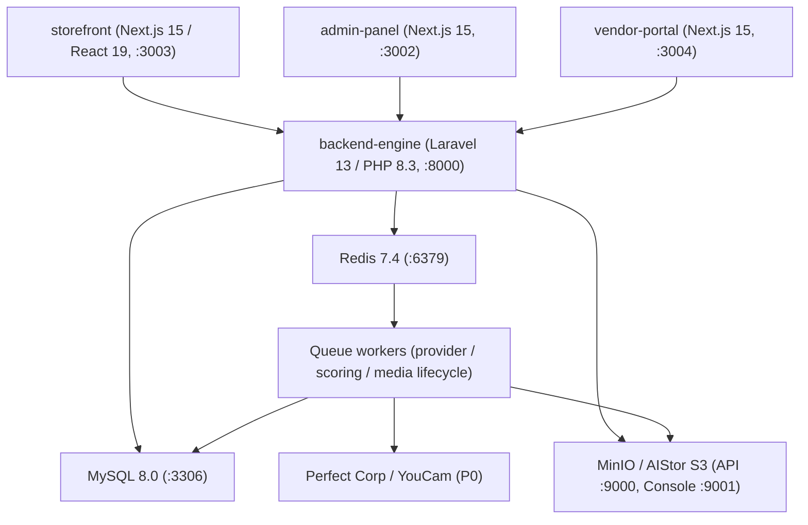

# container-diagram.md

Owner: Susank Shakya

<aside>
📦

**`docs/architecture/diagrams/container-diagram.md`** · C4 Level 2 — Containers

</aside>

# Purpose

This diagram shows the **deployable units** of Nuvia Beauty — the four applications and the data stores — and how they connect at runtime. It refines the system context one level down, making the backend's role as the single protected authority explicit.

# Containers

| Container | Tech / Port | Responsibility |
| --- | --- | --- |
| storefront | Next.js 15 / React 19 · :3003 | Customer PWA: discovery, consented analysis, recommendations, saved profile & consent. |
| admin-panel | Next.js 15 · :3002 | Operator console: providers, quota, mappings, catalog, audit. |
| vendor-portal | Next.js 15 · :3004 | Seller workspace: assisted consultations, capture, result review/correction. |
| backend-engine | Laravel 13 / PHP 8.3 · :8000 | Single protected authority: auth, domains, orchestration, persistence, signed media, audit. |
| MySQL | 8.0 · :3306 | Primary relational store for structured domain data (no raw image bytes). |
| Redis | 7.4 · :6379 | Cache and queue backing all async/provider work. |
| MinIO / AIStor | S3 API :9000, Console :9001 | S3-compatible storage; public assets and private beauty media via signed URLs. |

# C4 — Containers

# Notes

- The three Next.js apps are Yarn workspaces (`@nuvia/storefront`, `@nuvia/admin-panel`, `@nuvia/vendor-portal`) and never talk to MySQL, Redis, storage, or providers directly — only to `backend-engine`.
- `backend-engine` is organized into domain modules under `app/Domains/` (e.g. `Beauty`, `Storage`, `Consent`).
- Redis backs both the cache and the queue; long-running work (provider analysis, scoring, media lifecycle) runs on dedicated queue workers.
- Storage is S3-compatible with path-style endpoints (`S3_USE_PATH_STYLE_ENDPOINT=true`); signed PUT TTL ≈ 15m, signed GET TTL ≈ 60m.

# Related

- Zoom out: [[context-diagram.md](http://context-diagram.md)](context-diagram%20md%2096e5b13d3cec4e1fab877c75f87bee7f.md). Behavior: [[sequence-diagrams.md](http://sequence-diagrams.md)](sequence-diagrams%20md%20c94c0f41b2404b5da83dccc160261bb5.md). Narrative: `hld-system-architecture.md` §3–4.