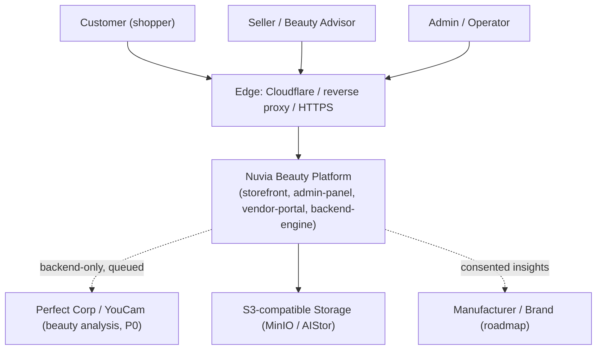

# context-diagram.md

Owner: Susank Shakya

<aside>
🗺️

**`docs/architecture/diagrams/context-diagram.md`** · C4 Level 1 — System Context

</aside>

# Purpose

This diagram defines the **boundary** of Nuvia Beauty: the people who use it, the external systems it relies on, and the consent and trust rules that govern those interactions. It is the highest-level view and the starting point for understanding the architecture before drilling into containers and sequences.

# Actors & external systems

| Element | Type | Interaction with Nuvia |
| --- | --- | --- |
| Customer (shopper) | Person | Browses, consents to analysis, views recommendations, manages saved profile and consent. |
| Seller / Beauty Advisor | Person | Runs assisted consultations, captures media with consent, reviews and corrects results. |
| Admin / Operator | Person | Administers providers, quota, mappings, and audit views. |
| Manufacturer / Brand | Person (roadmap) | Receives consented, aggregated demand and product-fit insights; runs sampling (T4). |
| Perfect Corp / YouCam (P0) | External system | Skin/tone beauty analysis; called backend-only, queued, with fallback. |
| S3-compatible storage (MinIO / AIStor) | External system | Stores public assets and private beauty media; accessed via backend-issued signed URLs. |
| Edge (Cloudflare / reverse proxy) | External system | TLS termination, routing, and CDN delivery for public assets. |

# C4 — System context

# Trust & consent boundaries

- All external provider calls are **backend-only**; no provider credentials ever reach the browser.
- Private media never transits a public bucket; frontends only ever hold short-lived signed URLs.
- Customer beauty analysis runs **only with explicit consent**, and sharing upward to brands is governed by revocable consent tiers (T0–T4).
- Raw media never leaves the controlled backend; only structured, consented attributes flow to brands.

# Related

- Drill down: [[container-diagram.md](http://container-diagram.md)](container-diagram%20md%2025cff974532240b99d5dbaeb34a47185.md) (runtime containers) and [[sequence-diagrams.md](http://sequence-diagrams.md)](sequence-diagrams%20md%20c94c0f41b2404b5da83dccc160261bb5.md) (behavioral flows).
- Context narrative: `hld-system-architecture.md` §2 and the [Concept Paper](https://app.notion.com/p/Concept-Paper-36ff29d2a6b181c99153ed2b811f1312?pvs=21).