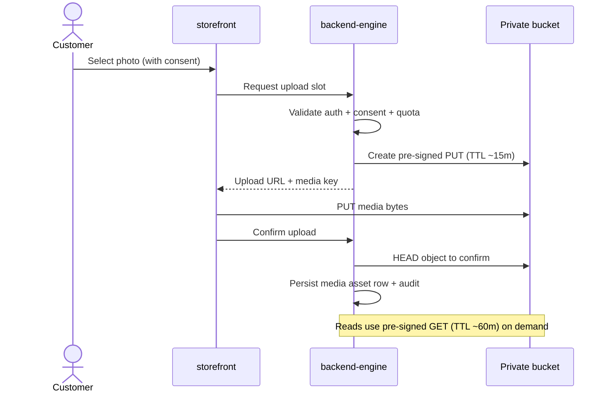
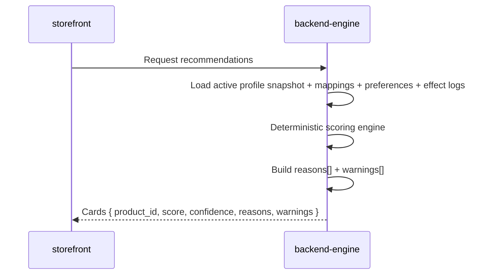
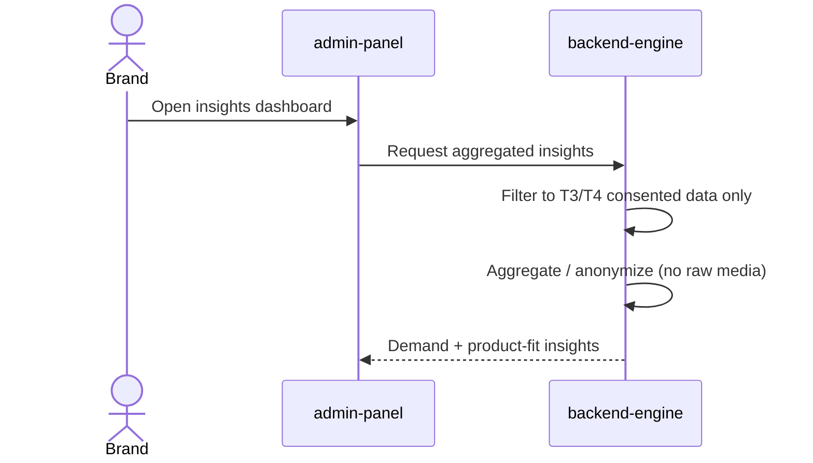

# sequence-diagrams.md

Owner: Susank Shakya

<aside>
🔁

**`docs/architecture/diagrams/sequence-diagrams.md`** · behavioral views of the key runtime flows

</aside>

# Purpose

These sequences show how the platform behaves over time for its most important flows. In every case the **backend-engine is the only component that touches providers, storage credentials, or the database**, and consent/quota checks happen server-side before any work begins.

# 1. Media upload + signed download



# 2. Assisted consultation + Perfect Corp P0 (with fallback)

```mermaid
sequenceDiagram
	actor S as Seller
	participant VP as vendor-portal
	participant BE as backend-engine
	participant Q as Queue (Redis)
	participant W as Worker
	participant PC as Perfect Corp / YouCam
	S->>VP: Start consultation (consent captured)
	VP->>BE: Create session + analysis request
	BE->>BE: Validate session + quota; resolve media
	BE->>Q: Create beauty_ai_tasks + enqueue job
	Q->>W: Worker picks task
	alt provider success
		W->>PC: P0 analysis request (backend-only)
		PC-->>W: Analysis result
	else timeout / error / quota
		W->>W: Deterministic demo-mode fallback
	end
	W->>BE: Store beauty_analysis_results + snapshot
	BE->>BE: Regenerate recommendations + reconcile quota + audit
	BE-->>VP: Results + recommendations
```

# 3. Recommendation scoring



# 4. Consent grant / revoke

```mermaid
sequenceDiagram
	actor U as Customer
	participant FE as storefront
	participant BE as backend-engine
	U->>FE: Change sharing tier (T0–T4)
	FE->>BE: Update consent grant
	BE->>BE: Persist consent_grants (versioned) + audit
	alt revoke
		BE->>BE: Stop future sharing; mark snapshots non-shareable
	end
	BE-->>FE: Updated consent state
```

# 5. Consented brand insights (roadmap)



# Related

- Structure: [[context-diagram.md](http://context-diagram.md)](context-diagram%20md%2096e5b13d3cec4e1fab877c75f87bee7f.md) and [[container-diagram.md](http://container-diagram.md)](container-diagram%20md%2025cff974532240b99d5dbaeb34a47185.md).
- Flow narrative: `hld-system-architecture.md` §5 and the [Reference Architecture](https://app.notion.com/p/Reference-Architecture-36ff29d2a6b181a3a17ad985ffef1d0c?pvs=21) standard patterns.