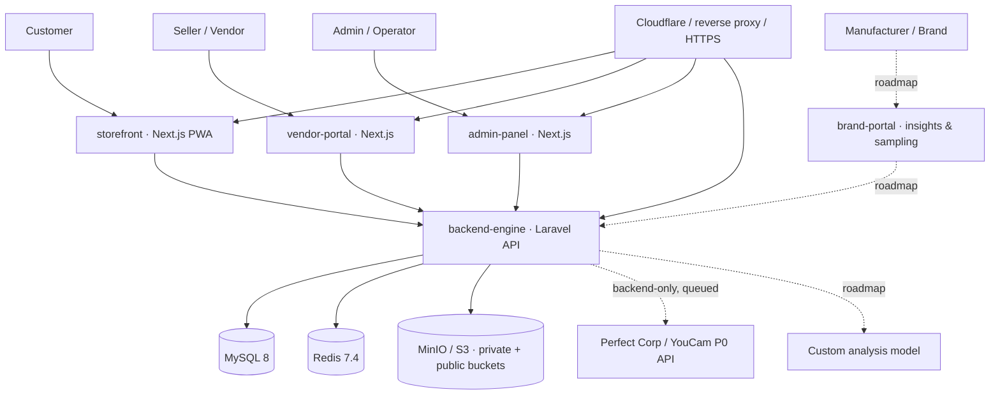
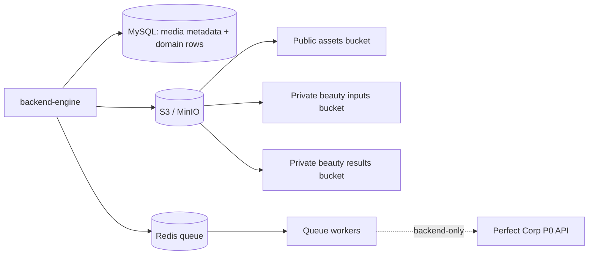
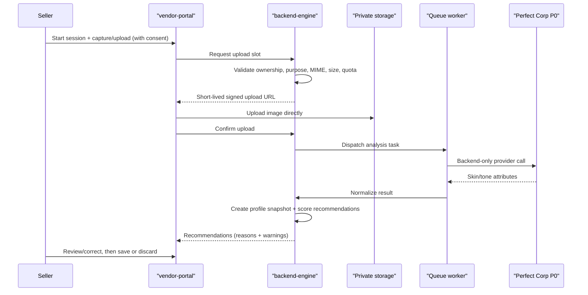

# hld-system-architecture.md

Owner: Susank Shakya

<aside>
🏗️

**`docs/architecture/hld-system-architecture.md`** · High-Level Design for **Nuvia Beauty / MatchMuse**

**Version:** 0.1.0 (held stable during early design) · **Audience:** Product Managers, Lead Architects, Engineering Leads, Stakeholders

**Current baseline:** base app deployed; storage + beauty product intelligence is the active foundation, with seller consultation and Perfect Corp P0 orchestration sequenced next.

</aside>

This document is the self-contained High-Level Design. The canonical maintained versions live in [High-Level Design](https://app.notion.com/p/High-Level-Design-36ff29d2a6b18142a5b4e5c386737c9f?pvs=21) and [High-Level Design (HLD) — System Architecture](https://app.notion.com/p/High-Level-Design-HLD-System-Architecture-f32e54776c7a4a91bb476be774d5d6a3?pvs=21); this page inlines the complete design for use directly within the docs set.

# 1. Purpose, scope & business context

Nuvia Beauty is a **retail confidence system** that turns a short, seller-assisted in-store consultation into a privacy-aware, explainable, and reusable product recommendation experience for small and medium beauty retailers. It is built on a multi-service web application: a Laravel backend, three Next.js frontends, MySQL, Redis, and S3-compatible object storage (MinIO/AIStor preferred).

Nuvia sits *beside* a commerce platform — it reuses commerce identity, seller/shop context, and product-catalogue references, but owns its own beauty domain: profiles, sessions, media lifecycle, and recommendation logic. Beyond a single shop, it is designed as a **consent-driven, three-sided ecosystem** connecting cosmetic manufacturers/brands, direct sellers, and customers.

**Strategic sequencing:**

```
Commerce works first.
Storage works safely.
Beauty intelligence works explainably.
AI / provider workflows are added only after the foundation is stable.
```

## 1.1 Primary objectives

1. Provide a working customer storefront, vendor portal, admin panel, and backend API.
2. Add S3-compatible storage for public and private media with strict separation.
3. Support beauty-specific product attributes and mappings.
4. Generate deterministic, explainable product recommendations.
5. Prepare for AI/provider workflows (skin analysis, seller consultation, try-on) without exposing secrets.
6. Maintain clear security boundaries between browser-facing frontends and protected backend infrastructure.

# 2. System context



Nuvia Beauty is **not** a beauty filter and **not** a medical diagnosis tool. All outputs are framed as cosmetic-fit guidance with reasons and warnings attached.

# 3. The four deployable apps

The system runs as **four deployable apps**. Frontends are browser-facing clients only; the backend owns all protected operations.

| Service | Directory | Runtime | Port | Role |
| --- | --- | --- | --- | --- |
| Storefront | `storefront/` | Next.js 15.5.18 / React 19.2.6 | 3003 | Customer shopping, saved profile, consent controls, recommendation UI |
| Admin Panel | `admin-panel/` | Next.js 15.5.18 / React 19.2.6 | 3002 | Platform administration: provider/quota/mapping controls, audit views |
| Vendor Portal | `vendor-portal/` | Next.js 15.5.18 / React 19.2.6 | 3004 | Seller consultation UI, product mapping, vendor metrics |
| Backend Engine | `backend-engine/` | PHP ^8.3 / Laravel ^13.0 | 8000 | Protected business logic, data, storage, and provider-integration boundary |

**Common frontend tooling:** Yarn Classic workspaces, TypeScript 5.9.3, Tailwind CSS 3.4.14, Axios, React Query, Jotai, next-i18next / i18next.

**Backend responsibilities:** API routing, the authentication/authorization boundary, business logic, database access, storage abstraction, media metadata, recommendation scoring, and (planned) provider orchestration and queue processing.

<aside>
🔑

**Boundary rule.** Correct: `Frontend → backend-engine → MySQL / Redis / S3 / external APIs`. Incorrect: `Frontend → database | Redis | storage credentials | provider API keys`. A new service is created only when justified by deployment/runtime needs.

</aside>

# 4. Backend domain modules

The backend is **internally modular** with explicit boundaries: each module owns its tables and exposes internal contracts; cross-module access goes through contracts, not shared tables. Modules are promoted to standalone services only when scale or ownership requires it.

| Module | Responsibility | Owned data (indicative) |
| --- | --- | --- |
| Identity & Access | Authentication, authorization, tenant/role resolution (zero-trust). | users, roles, tenant/shop bindings |
| Consultation / Session | Capture flow, draft/discard, session lifecycle. | `beauty_sessions` |
| Profile | Profile snapshots, history, reopen links. | `profile_snapshots`, `beauty_profiles` |
| Analysis / AI | Provider orchestration, normalization, custom model (roadmap). | `beauty_ai_tasks`, `beauty_analysis_results` |
| Recommendation | Deterministic scoring, reasons, warnings. | `beauty_recommendations` |
| Catalog | Product mapping, tags, avoid tags, explanation templates. | product mappings, tag tables |
| Consent & Sharing | Consent grants, tier checks, revocation. | `consent_grants` |
| Insights / Brand | Anonymized aggregation, sampling campaigns. | `outcomes`, `sampling_campaigns`, `brands` |
| Media | Private storage, signed URLs, lifecycle. | media asset metadata |
| Quota | Usage accounting, limits, fallback. | quota events |
| Audit | Event logging across all modules. | audit log |

# 5. Storage architecture

Nuvia separates structured relational data from binary media and from ephemeral cache/queue state.

- **MySQL 8** — primary relational persistence: commerce data, media *metadata*, beauty mappings, recommendation records, provider task records, profiles, consent grants, outcomes, and model versions. **Raw image bytes are never stored in MySQL.**
- **Redis 7.4** — cache, session, and queue backend depending on environment.
- **S3-compatible object storage** (MinIO/AIStor preferred; S3 API on 9000, console on 9001) — object storage split into a **public assets bucket** and **private beauty inputs / results buckets**. Access to private media is always through short-lived, backend-issued signed URLs.



# 6. Core data flows & trust boundaries

## 6.1 Seller consultation



## 6.2 Recommendation

```
active profile snapshot
  + product mappings
  + avoid tags
  + preferences
  + effect logs
  → deterministic score
  → reasons
  → warnings
  → recommendation card
```

A recommendation record is a small, explainable object:

```json
{
  "product_id": 123,
  "score": 87,
  "confidence": "high",
  "reasons": ["Matches oily skin profile", "Targets dark spot concern"],
  "warnings": ["Avoid if sensitive to fragrance"]
}
```

## 6.3 Private media lifecycle

```
request upload slot → upload directly to private storage → confirm upload
  → link media asset to session → issue signed reads only after authorization
  → expire / delete when discarded or retention ends
```

## 6.4 Trust boundaries

| Boundary | Rule |
| --- | --- |
| Frontend → Backend | Frontend cannot send authoritative quota, provider, or storage decisions. |
| Backend → Storage | Backend issues short-lived signed URLs only after authorization. |
| Backend → Provider | Provider calls happen through backend / queue only; keys stay backend-side. |
| Customer links | Signed, expiring, revocable access only. |
| Admin / vendor access | Tenant/shop ownership checked server-side. |
| Backend → Brand | Only structured, consented attributes shared; raw media never leaves; T3 aggregated, T4 identified. |
| Consent gate | Every share requires a logged, revocable consent grant checked server-side. |
| Cross-tenant | Shops and brands cannot access each other's sessions, profiles, or recommendations. |

# 7. Zero-trust access layer

Access follows a **zero-trust** model: never trust by location or layer; verify every request explicitly with least privilege and default-deny.

```
authenticate every request (customer, seller, vendor, brand, admin, service)
authorize per-request against tenant + role + resource ownership
short-lived tokens; refresh server-side; no long-lived secrets on clients
service-to-service calls are mutually authenticated
media access only via signed, expiring URLs after authorization
default deny; explicit allow; log every access decision
```

# 8. Multi-tenant model & data isolation

Nuvia is multi-tenant by shop (and, on the roadmap, by brand). Tenancy is resolved **server-side** from the shop/domain context; the frontend's `shop_id` is never trusted alone. Each shop is served via its own subdomain (e.g. `<shop>.beauty.nuvia.com`) loading vendor-specific branding, catalog, and rules over a shared backend. Database and storage access are hard-scoped so vendors and brands never see each other's data.

# 9. Consent-driven ecosystem

## 9.1 Consent tiers

```
T0 session only        — analysis + recommendations, media deleted after
T1 save profile        — reopenable profile + history
T2 share with shop     — follow-up, restock-aware suggestions
T3 anonymized to brand — aggregate demand + product-fit, no identity
T4 identified to brand — targeted samples, offers, cross-shop loyalty
default T0/T1; per-tier, granular, revocable; downgrades stop new sharing
```

## 9.2 Brand feedback loop

```
consented profile attributes + outcomes
  → anonymize (T3) or identify (T4)
  → aggregate by region / segment
  → brand demand & product-fit insights
  → targeted sampling (T4 only)
```

# 10. Functional & non-functional requirements

## 10.1 Functional (current foundation → next)

```
Current / core: storefront, admin panel, vendor portal, Laravel backend,
  MySQL persistence, Redis cache/session/queue, Docker Compose baseline,
  HTTPS/domain-routed environment.
Storage + intelligence: S3-compatible storage, public/private separation,
  backend-issued upload slots, private signed downloads, media metadata,
  beauty product attribute mapping, recommendation scoring, reason/warning
  cards, storefront recommendation display.
Next: customer beauty profiles, seller-assisted consultation, AI/provider
  orchestration, Perfect Corp / YouCam integration, quota tracking, saved
  profile reopen, try-on result media lifecycle.
```

## 10.2 Non-functional targets

| Area | Target |
| --- | --- |
| Recommendation generation (seeded dataset) | Under 1 second |
| Upload slot creation | Under 500 ms (excl. network) |
| Signed upload URL TTL | 15 minutes (default) |
| Signed download URL TTL | 60 minutes (default) |
| Public media delivery | CDN-ready |

# 11. Security considerations

```
No backend secrets in frontend variables.
No storage credentials in browser bundles.
No provider keys in frontend code.
Private media requires backend authorization; signed URLs are short-lived.
Raw private media is never placed in public buckets.
Raw image bytes are never stored in MySQL.
Sensitive logs avoid secrets and full signed URLs.
No medical or clinical claims in recommendation output.
```

# 12. Technology stack

| Component | Value |
| --- | --- |
| Backend framework | Laravel ^13.0 (PHP ^8.3, `php:8.3-cli-alpine`) |
| Frontends | Next.js 15.5.18 / React 19.2.6 (Node 24.15) |
| Database | MySQL 8.0 (3306) |
| Cache / queue / session | Redis 7.4 Alpine (6379) |
| Object storage | S3-compatible via `league/flysystem-aws-s3-v3`; MinIO/AIStor (9000 / 9001) |
| Edge | Cloudflare / reverse proxy / HTTPS |
| Planned providers | Perfect Corp / YouCam (backend-only keys, calls via jobs) |

# 13. Deployment overview

```
storefront domain -> port 3003
admin domain      -> port 3002
vendor domain     -> port 3004
backend API       -> port 8000
S3 API domain     -> port 9000
S3 console        -> port 9001
```

**Environments:** Local (Docker Compose), Staging/Testing (domains + HTTPS), Production (future). Deployment requires Docker images for all services, backend `APP_KEY`, DB credentials, Redis, frontend `NEXT_PUBLIC` URLs, the S3 endpoint, bucket policies, and HTTPS routing. Detailed procedures live in the `deployment/` folder.

# 14. Assumptions & constraints

**Assumptions:** the base deployment is available; the four-service split is unchanged; Laravel remains the protected authority; an S3 endpoint, MySQL, and Redis are available; beauty mappings can be added without breaking commerce; AI is added only after foundations are stable.

**Constraints:**

```
Do not downgrade Next.js, React, PHP, or Laravel versions.
Do not create a new service unless justified by deployment/runtime needs.
Do not expose backend secrets to frontend services.
Do not hardcode MinIO-only assumptions in business logic.
Do not store raw private files in MySQL.
Do not make medical or clinical claims in recommendation output.
```

# 15. Risks & mitigations

| Risk | Impact | Mitigation |
| --- | --- | --- |
| Storage misconfiguration | Upload/read failures | Explicit disk configs; verify each bucket separately |
| Private media becomes public | High privacy/security | Separate buckets; test public-access denial |
| Frontend secret exposure | High security | Backend-only secrets; inspect browser bundle/network |
| Generic recommendations | Product value | Structured mappings, reasons, warnings |
| AI scope too early | Delivery risk | AI after storage/mapping foundations |
| Provider downtime / quota exhaustion | Blocked consultations | Multi-provider fallback chain + demo fallback; failed-task visibility |
| Cross-tenant data leakage | High trust/privacy | Hard tenant isolation in DB and storage; server-side scoping |
| Docs drift from code | Architecture risk | Update docs in the same commit as behavior |

# 16. Limitations

- Analysis quality depends on capture conditions (lighting, camera).
- Recommendations are bounded by the mapped product catalog and current stock.
- The MVP assumes seller involvement rather than full self-service.
- Ecosystem features depend on manufacturer participation and customer consent.

# 17. Future enhancements

- **Beauty profile module:** `beauty_profiles`, `beauty_profile_snapshots`, `beauty_product_effect_logs`, saved recommendations, preference tags.
- **Seller consultation module:** sessions, guest/new/returning modes, capture/upload, save/discard, review, profile reopen.
- **Provider orchestration module:** task creation, polling, normalized results, quota events, failed-task handling, demo fallback.
- **Custom analysis model:** cold-start → consented data collection → train → distill, keeping the provider as fallback (see Reference Architecture).
- **Scaling:** dedicated queue workers, object lifecycle policies, CDN for public media, indexing, a failed-task dashboard, observability, feature flags, and multi-tenant shop domains.

# 18. References

- Canonical HLD pages: [High-Level Design](https://app.notion.com/p/High-Level-Design-36ff29d2a6b18142a5b4e5c386737c9f?pvs=21), [High-Level Design (HLD) — System Architecture](https://app.notion.com/p/High-Level-Design-HLD-System-Architecture-f32e54776c7a4a91bb476be774d5d6a3?pvs=21).
- [Reference Architecture](https://app.notion.com/p/Reference-Architecture-36ff29d2a6b181a3a17ad985ffef1d0c?pvs=21) · [ADR Pack](https://app.notion.com/p/ADR-Pack-36ff29d2a6b18108958af03b19f13a6e?pvs=21) · [Concept Paper](https://app.notion.com/p/Concept-Paper-36ff29d2a6b181c99153ed2b811f1312?pvs=21).
- Diagrams: see `diagrams/` (context, container, sequence). Decisions: see `adr/`.