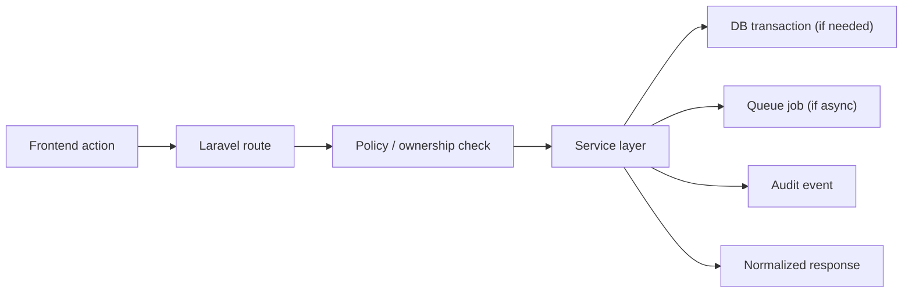
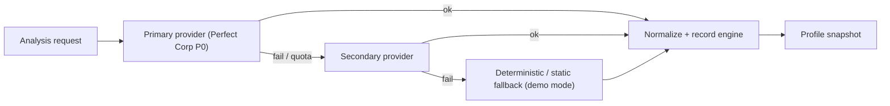
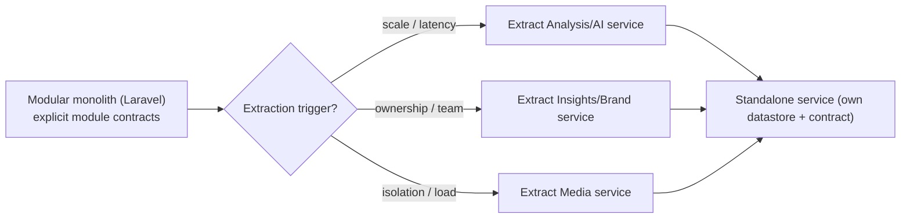
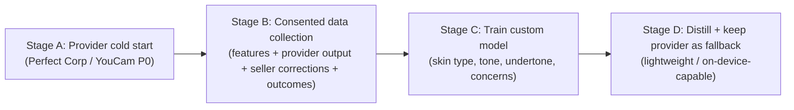

# reference-architecture.md

Owner: Susank Shakya

<aside>
🧱

**`docs/architecture/reference-architecture.md`** · the standard implementation pattern for Nuvia Beauty

**Version:** 0.1.0 (held stable during early design). The canonical maintained version is [Reference Architecture](https://app.notion.com/p/Reference-Architecture-36ff29d2a6b181a3a17ad985ffef1d0c?pvs=21); this page inlines the full reference architecture for direct use in the docs set.

</aside>

# 1. Purpose & scope

This reference architecture defines the **reusable, best-practice patterns** every Nuvia Beauty feature should follow. Where the HLD describes *what the system is*, this document describes *how to build inside it consistently* so that new work extends the Beauty domain rather than creating parallel systems. It is the contract that keeps implementers, reviewers, and future contributors aligned.

# 2. Standard stack

```
Four apps: storefront (3003), admin-panel (3002), vendor-portal (3004), backend-engine (8000)
backend-engine: Laravel 13 / PHP 8.3 (internally modular; domains extracted to services over time)
frontends: Next.js 15 / React 19
MySQL 8 primary database (3306)
Redis 7.4 queue/cache (6379)
MinIO/AIStor S3-compatible private media (S3 API 9000, console 9001)
Cloudflare / reverse proxy
Perfect Corp / YouCam provider via backend queue workers
```

# 3. Standard request pattern

Every frontend-initiated operation follows the same server-side path so authorization, transactions, async work, and auditing are never skipped.

```
frontend action
  → Laravel route
    → policy / ownership check
    → service layer
    → database transaction if needed
    → queue job if async
    → audit event
    → normalized response
```



# 4. Standard provider pattern

AI provider work is always backend-only, queued, quota-checked, and normalized into stable domain rows.

```
validate session and quota
resolve private media
create beauty_ai_tasks row
dispatch provider job
call provider from backend only
poll result
store beauty_analysis_results
create beauty_profile_snapshots
regenerate recommendations
reconcile quota
```

# 5. Standard media pattern

```
backend creates upload slot
frontend uploads to signed URL
backend confirms object
media asset row stores bucket / key / version
backend issues signed reads after authorization
lifecycle jobs expire / delete media
```

# 6. Standard tenant pattern

```
resolve shop / domain context server-side
validate authenticated vendor / admin / customer access
reject ambiguous or unknown tenant
never trust frontend shop_id alone
```

# 7. Standard recommendation pattern

```
active profile snapshot
product mappings
preferences and avoid tags
effect logs
scoring engine
reason / warning builder
recommendation record
frontend card
```

# 8. Provider orchestration & fallback chain

Providers are orchestrated behind a single backend gateway with an explicit fallback chain, so a consultation is never fully blocked and every result records which engine produced it.



- **Primary → secondary → deterministic/static** fallback, recording which engine delivered the result and its response time.
- **Provider toggles and a demo fallback** allow graceful degradation when a provider is unavailable or quota is exhausted.
- **Failed-task visibility** gives operators a clear view of errors for support and reliability.

# 9. Modular-to-services evolution path

Nuvia is a **modular monolith** that extracts services incrementally — not a permanent monolith and not an up-front microservices split.



**Extraction triggers (a module is promoted to a service only when one is met):**

| Trigger | Example |
| --- | --- |
| Scale / latency | Analysis/AI orchestration needs independent scaling of queue workers. |
| Ownership / team boundary | A dedicated team owns Insights/Brand and needs an independent release cadence. |
| Isolation / blast radius | Media handling is isolated to contain failure and tighten its security surface. |
| Compliance | Consent & Sharing requires a hardened, separately audited boundary. |

When extracted, a module keeps its own datastore and is reached only through its published contract — never via shared tables.

# 10. Custom analysis model progression

To reduce dependence on third-party APIs, lower per-session cost, and improve accuracy for the actual customer demographic, the analysis capability evolves through a **cold-start → distill → own-model** progression rather than a day-one build.



<aside>
🧠

**Model governance:** segmented fairness audits across skin tones (especially South Asian / darker tones), per-attribute confidence reporting, model versioning for reproducibility, and a training-data opt-out independent of feature use.

</aside>

# 11. Cross-cutting concerns

| Concern | Standard approach |
| --- | --- |
| Configuration | Environment-driven; backend reads secrets from server-side env only. See `deployment/environment-variables.md`. |
| Secrets | Provider/storage keys and `APP_KEY` are backend-only; never shipped in `NEXT_PUBLIC_*` variables. |
| Caching | Redis for sessions, hot reads, and recommendation caching where deterministic. |
| Queues | Redis-backed queue for all async/provider work; dedicated workers as scale grows. |
| Audit logging | Every sensitive action and access decision is logged; logs avoid secrets and full signed URLs. |
| Tenancy | Server-side shop/domain resolution; hard isolation across shops and brands. |

# 12. Security baseline

- No provider keys in frontend.
- No storage credentials in frontend.
- No raw image bytes in MySQL.
- No public private-media URLs.
- No raw provider payloads returned to the customer frontend.
- No clinical claims.
- Audit sensitive actions.

# 13. Extension rules

New features should **extend the existing Beauty domain** rather than creating parallel systems. New protected features are added to the backend first, then consumed by frontends through typed or clearly documented API clients.

**Do not add:**

```
Next.js backend business logic
Prisma / PostgreSQL side path
native app requirement for MVP features
multi-provider AI before P0 stability
clinical or diagnostic claims
```

# 14. References

- Canonical: [Reference Architecture](https://app.notion.com/p/Reference-Architecture-36ff29d2a6b181a3a17ad985ffef1d0c?pvs=21).
- Related: [High-Level Design](https://app.notion.com/p/High-Level-Design-36ff29d2a6b18142a5b4e5c386737c9f?pvs=21) · [ADR Pack](https://app.notion.com/p/ADR-Pack-36ff29d2a6b18108958af03b19f13a6e?pvs=21) · `hld-system-architecture.md` · `adr/` · `diagrams/`.
- Integration and storage detail live in the `integrations/` and `storage/` folders.