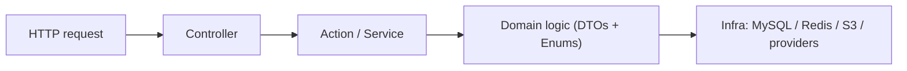

# README.md

Owner: Susank Shakya

<aside>
⚙️

**`docs/backend-engine/README.md`** · overview of the Laravel backend that owns every API, all data, and all external-provider orchestration.

</aside>

# 1. Purpose & scope

`backend-engine` is the **single source of truth and the only trusted tier** in Nuvia Beauty. It owns all APIs, CRUD, authentication/authorization, AI orchestration, and external-provider calls. The three frontends (storefront, admin-panel, vendor-portal) are thin clients that never hold credentials and never call providers directly. This folder documents the backend's API surface, schema, jobs, settings, validation strategy, and the hard guardrails that AI agents must follow when building it.

# 2. Technology

| Concern | Choice |
| --- | --- |
| Language / framework | PHP ^8.3 / Laravel ^13.0 |
| Port | `:8000` |
| Database | MySQL 8.0 (`:3306`) |
| Cache / queue | Redis 7.4 (`:6379`) |
| Object storage | S3-compatible MinIO / AIStor via `league/flysystem-aws-s3-v3` |
| Runtime image | `php:8.3-cli-alpine` |

# 3. Domain modules

Code is organized into domain modules under `app/Domains/` (e.g. `Beauty`, `Storage`, `Audit`). New backend business logic belongs in a domain module first; top-level `app/Models` should stay minimal and framework-facing. The modules:

| Domain | Responsibility |
| --- | --- |
| Identity &amp; Access | Auth, roles, tenancy, policies. |
| Consultation / Session | Seller consultation lifecycle (draft / completed / discarded). |
| Profile | Structured beauty profiles and snapshots. |
| Analysis / AI | Provider orchestration, analysis tasks and results. |
| Recommendation | Deterministic scoring into the canonical payload. |
| Catalog | Products, variants, ingredients, avoid-tags. |
| Consent &amp; Sharing | Tiered, revocable consent (T0–T4) and sharing rules. |
| Insights / Brand | Consented, aggregated brand insights (no raw media). |
| Media | Signed URLs, media assets, lifecycle. |
| Quota | Quota accounts and events for provider usage. |
| Audit | Audit trail for sensitive actions. |

# 4. Layered request flow

Controllers only call Actions/Services; they never touch the database, storage, or providers directly (enforced by `agent-guardrails.md`).

# 5. In this folder

| Document | Covers |
| --- | --- |
| [[api-contracts.md](http://api-contracts.md)](api-contracts%20md%209468ad6610754cc38b2fff1900887999.md) | API surface and shared response shapes. |
| [[database-schema.md](http://database-schema.md)](database-schema%20md%207af46af094054b8a99a1f95b10ab3bc8.md) | Core entities and relationships. |
| [[queue-jobs.md](http://queue-jobs.md)](queue-jobs%20md%209ec82aa303ec4d25818ec725c4f0d3d7.md) | Background jobs and workers. |
| [[settings-system.md](http://settings-system.md)](settings-system%20md%20065f2b0084fa4b06a7265a35d0c65467.md) | Runtime configuration. |
| [[validation.md](http://validation.md)](validation%20md%20a11c1a59a2f44f339fdaee8e884154d4.md) | Type-safety and request validation strategy. |
|  | Hard rules for building the backend (REST-first, redaction, idempotency, `AGENTS.md`). |

# 6. Principles (ADR 0013)

- Laravel is the **primary** backend; Rust may be added later only for isolated, internal, compute-heavy services.
- Rust-like safety in Laravel: Larastan/PHPStan (max), `declare(strict_types=1)`, DTOs + Enums at boundaries, strict Form Requests + Policies.
- All provider calls and private-media access route through the Zero Access Layer (ADR 0015).

# 7. Related documentation

- Integrations: `integrations/ai-provider/orchestration.md`. Storage: `storage/`. Decisions: [ADR Pack](https://app.notion.com/p/ADR-Pack-36ff29d2a6b18108958af03b19f13a6e?pvs=21) (ADR 0002, 0012, 0013, 0014, 0015).
