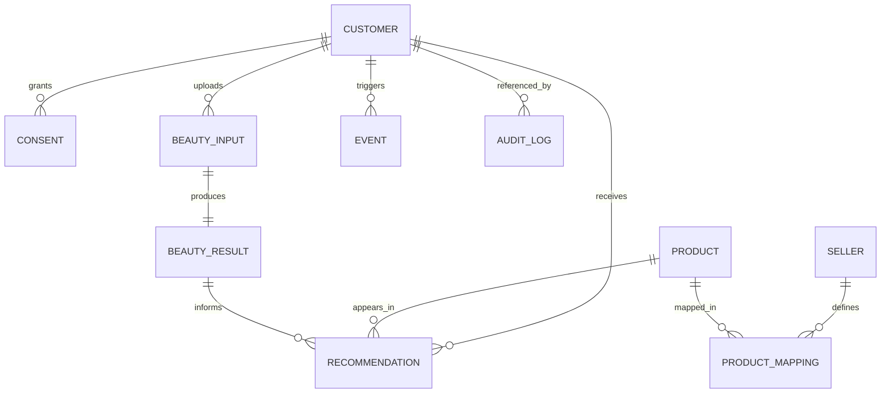

# database-schema.md

Owner: Susank Shakya

<aside>
🗃️

**`docs/backend-engine/database-schema.md`** · the core relational schema (MySQL 8.0) and how the beauty domain entities relate.

</aside>

# 1. Purpose & scope

This page describes the **core relational schema** in MySQL 8.0. Entities below are representative of the domain modules; exact columns live in Laravel migrations. No raw media bytes are ever stored here — the database holds object keys and structured data only.

# 2. Entity relationships

# 3. Key tables (representative)

| Table | Holds |
| --- | --- |
| `beauty_sessions` | Consultation sessions (draft / completed / discarded). |
| `beauty_profiles` / `beauty_profile_snapshots` | Saved structured profile and point-in-time snapshots. |
| `beauty_media_assets` | Object keys + metadata for private media (never bytes). |
| `beauty_ai_tasks` | Queued analysis tasks (status, mode, provider). |
| `beauty_analysis_results` | Normalized analysis attributes and confidence. |
| `beauty_product_mappings` / `beauty_product_effect_logs` | Seller mappings and observed product effects. |
| `beauty_recommendations` | Scored output (`score`, `confidence`, `reasons`, `warnings`). |
| `beauty_quota_accounts` / `beauty_quota_events` | Provider usage quota and ledger. |
| `consent_grants` | Tiered, revocable consent (T0–T4). |
| `product_ingredients` / `avoid_tags` | Catalog ingredient data and avoid signals. |
| `brands` / `manufacturers` | Brand entities for consented insights. |
| `model_versions` / `sampling_campaigns` | Custom-model versioning and sampling (roadmap, ADR 0008). |
| `audit_logs` | Access + lifecycle trail for sensitive actions. |

# 4. Multi-tenancy

- Tenant-owned rows carry a `shop_id`; queries are tenant-scoped server-side (ADR 0010), and object keys embed `shop_id` for storage isolation.

# 5. Consent, retention & integrity

- Deleting/revoking a consent cascades to deletion of related inputs and results (see `storage/media-lifecycle.md`).
- T0 data is session-only; T1+ retains structured snapshots while minimizing raw inputs.
- Timestamps and soft-deletes follow Laravel conventions; foreign keys enforce referential integrity.

# 6. Indexing & performance

- Hot lookups (recommendations by customer, tasks by status, media by session) are indexed; large historical tables (events, audit) are partitioned/archived per retention.

# 7. Related documentation

- API: [[api-contracts.md](http://api-contracts.md)](api-contracts%20md%209468ad6610754cc38b2fff1900887999.md). Jobs: [[queue-jobs.md](http://queue-jobs.md)](queue-jobs%20md%209ec82aa303ec4d25818ec725c4f0d3d7.md). Storage: `storage/storage-architecture.md`. Decisions: ADR 0008, 0010.