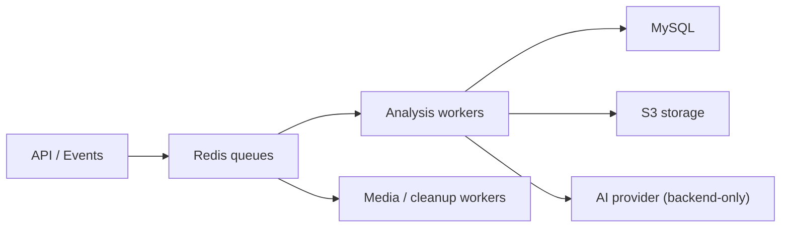

# queue-jobs.md

Owner: Susank Shakya

<aside>
🧵

**`docs/backend-engine/queue-jobs.md`** · the Redis-backed background jobs that keep API requests fast and provider work off the request path.

</aside>

# 1. Purpose & scope

Long-running and provider-bound work runs as **background jobs on Redis-backed queues**, keeping API requests fast and provider calls out of the HTTP path. This page lists the jobs, the queue topology, and the reliability conventions.

# 2. Jobs

| Job | Trigger | Work |
| --- | --- | --- |
| Process beauty input | Upload confirmed (`MediaUploaded`) | Call P0 analysis (or demo-mode), store result, snapshot |
| Score recommendations | Analysis stored / event | Deterministically score, persist recommendation set |
| Media safety scan | New media | Validate content before exposure |
| Consent cleanup | `ConsentRevoked` | Delete affected inputs/results |
| Cleanup / expiry | Scheduled | Delete expired media, enforce retention |
| Quota reconcile | Task completed / failed | Reconcile `beauty_quota_events` |

# 3. Queue topology

- Separate queues/priorities for latency-sensitive analysis vs. scheduled maintenance.
- Queue backend: **Redis 7.4** (`:6379`).

# 4. Reliability conventions

- **Idempotent** jobs keyed to a `beauty_ai_tasks` row, with bounded retries and exponential backoff.
- On provider failure, jobs use the **demo-mode fallback** rather than failing the user flow.
- **Dead-letter handling** surfaces stuck/failed jobs to operations.
- Quota is reconciled even on failure (no double-charge).

# 5. Monitoring

- Track queue depth, job latency, retry rate, fallback rate, and dead-letter volume.
- Alerts fire on sustained backlog or rising failure rate (`operations/`).

# 6. Related documentation

- Orchestration: `integrations/ai-provider/orchestration.md`. Lifecycle: `storage/media-lifecycle.md`. Runbook: `operations/` (`runbooks/ai-provider-failure.md`).