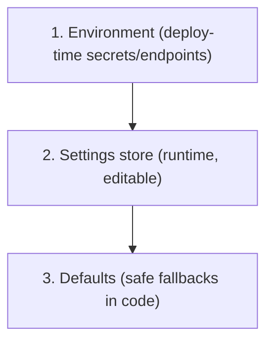

# settings-system.md

Owner: Susank Shakya

<aside>
🎛️

**`docs/backend-engine/settings-system.md`** · the typed, layered runtime configuration system.

</aside>

# 1. Purpose & scope

A typed settings system provides **runtime configuration without code changes**, layered above environment variables. It lets operators flip feature flags, tune thresholds, and force demo-mode without a redeploy, while keeping secrets out of the editable store.

# 2. Layers

1. **Environment** — deploy-time secrets/endpoints (storage, providers, DB, Redis).
2. **Settings store** — runtime, editable values (feature flags, TTL overrides, demo-mode toggle, thresholds).
3. **Defaults** — safe fallbacks baked into code.

# 3. Resolution order

A read resolves **settings store → environment → code default**, so an operator override wins, but a missing value always falls back to a safe default. Sensitive values are read from environment only and are never placed in the editable store.

# 4. Representative settings

| Setting | Type | Example |
| --- | --- | --- |
| `ai.demo_mode` | bool | Force deterministic demo-mode |
| `ai.provider` | enum | `perfect_corp` / `demo` |
| `media.download_ttl` | int (sec) | Override signed GET TTL |
| `recommendation.min_confidence` | float | Suppression threshold |
| `feature.<name>` | bool | Feature flags |

# 5. Conventions

- Settings are typed via Enums/DTOs; reads are validated, not free-form.
- Sensitive values stay in environment, never the editable settings store.
- The demo-mode toggle for providers is a settings-level flag so demos never depend on live credentials.
- Settings changes to sensitive behavior are audit-logged.

# 6. Related documentation

- Env reference: `deployment/environment-variables.md`. Demo-mode: `integrations/perfect-corp/demo-mode.md`. Validation: [[validation.md](http://validation.md)](validation%20md%20a11c1a59a2f44f339fdaee8e884154d4.md).