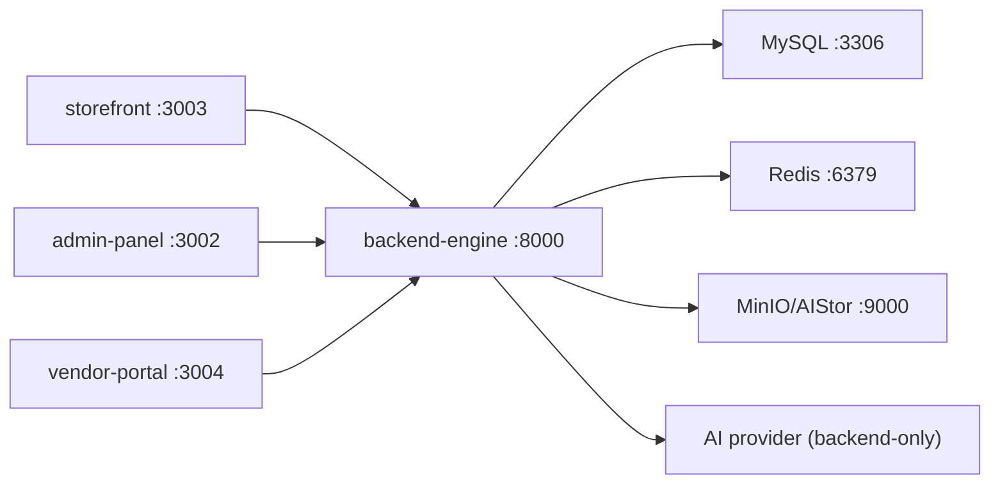

# README.md

Owner: Susank Shakya

<aside>
🚀

**`docs/deployment/README.md`** · how Nuvia Beauty is run and shipped — stack topology, compose files, and the path to production.

</aside>

# 1. Purpose & scope

This page describes how the Nuvia Beauty stack is **run and shipped**. Everything runs as a Docker Compose stack so local, staging, and production share the same images and differ only by configuration. The default posture is demo-mode — the stack runs end to end without live provider credentials.

# 2. Stack topology

| Service | Port | Role |
| --- | --- | --- |
| `backend-engine` (Laravel) | `:8000` | APIs, data, provider orchestration (only trusted tier). |
| `storefront` | `:3003` | Customer PWA. |
| `admin-panel` | `:3002` | Internal operator app. |
| `vendor-portal` | `:3004` | Seller / advisor app. |
| MySQL 8 | `:3306` | Relational data (no media bytes). |
| Redis 7.4 | `:6379` | Cache + queues. |
| MinIO / AIStor (S3) | `:9000` API / `:9001` console | Private + public object storage. |

# 3. Compose files

| File | Use |
| --- | --- |
| `docker-compose.yml` | Base service definitions. |
| `docker-compose.dev.yml` | Local development overlay. |
| `docker-compose.production.yml` | Staging/production overlay. |

# 4. Path to production

1. [[local-setup.md](http://local-setup.md)](local-setup%20md%206abbaa6a9f474ae4b51fc1edba2ca4ac.md) — run the full stack locally.
2. [[staging-deployment.md](http://staging-deployment.md)](staging-deployment%20md%200c15e6899cab4bc5ba37bca6571938e3.md) — deploy + verify on staging.
3. [[production-readiness.md](http://production-readiness.md)](production-readiness%20md%204a0fae0daf6e4e87ab5a75757909ec84.md) — go/no-go gate.
4. [[environment-variables.md](http://environment-variables.md)](environment-variables%20md%20559e80250b104a79b8f50e0ef8a3aa6e.md) and [[rollback.md](http://rollback.md)](rollback%20md%20ce2b95b2b57b431891c2528be2613c84.md) support every stage.

# 5. Principles

- **Same image, config-only changes** across environments.
- **No secrets in code or images** — configuration via environment only (`environment-variables.md`).
- **Demo-mode default** — no live credentials required to run.
- **Gated promotion** — tests + evidence before staging → production.

# 6. Related documentation

- Config: [[environment-variables.md](http://environment-variables.md)](environment-variables%20md%20559e80250b104a79b8f50e0ef8a3aa6e.md). Tests: `testing/`. Evidence & gates: `implementation-plan/`. Operations: `operations/`.