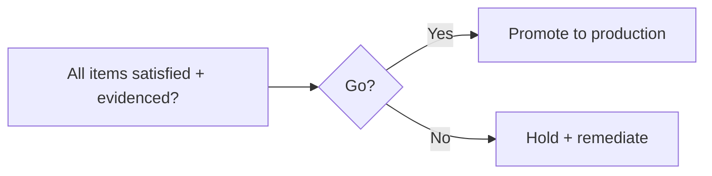

# production-readiness.md

Owner: Susank Shakya

<aside>
✅

**`docs/deployment/production-readiness.md`** · the go/no-go gate that must pass before a production release.

</aside>

# 1. Purpose & scope

This page defines the **go/no-go gate** before production. It is a hard gate: every item must be satisfied and evidenced, or the release does not proceed. It consolidates the guarantees from testing, storage, security, and operations into a single decision point.

# 2. Readiness checklist

**Quality**

- [ ]  All test suites pass (backend, frontend, e2e, storage, security) — see `testing/`.
- [ ]  Staging verified end to end; evidence recorded under `implementation-plan/evidence/staging-verification/`.

**Security & data**

- [ ]  Secrets/credentials provisioned and rotated; no secrets in code or images.
- [ ]  Private buckets confirmed non-public; audit logging on.

**Resilience**

- [ ]  Backups configured; restore rehearsed ([[backup-restore.md](http://backup-restore.md)](../operations/backup-restore%20md%202ddc8e163c0545908bed05ddb3fa5899.md)).
- [ ]  Monitoring + alerts live ([[monitoring.md](http://monitoring.md)](../operations/monitoring%20md%2025dd9e9c06a94ff7998ee1271ff6a335.md)).
- [ ]  Rollback plan validated ([[rollback.md](http://rollback.md)](rollback%20md%20ce2b95b2b57b431891c2528be2613c84.md)).

# 3. Decision

- Record the go/no-go outcome in the checklist at [[go-no-go.md](http://go-no-go.md)](../implementation-plan/checklists/go-no-go%20md%20371108bcfa0f4ee5add362ed4f05a956.md).

# 4. Sign-off

- The decision and its owner are logged with a timestamp; a “no-go” lists the blocking items and their owners.

# 5. Related documentation

- Staging: [[staging-deployment.md](http://staging-deployment.md)](staging-deployment%20md%200c15e6899cab4bc5ba37bca6571938e3.md). Tests: `testing/`. Operations: `operations/`. Evidence & gates: `implementation-plan/`.