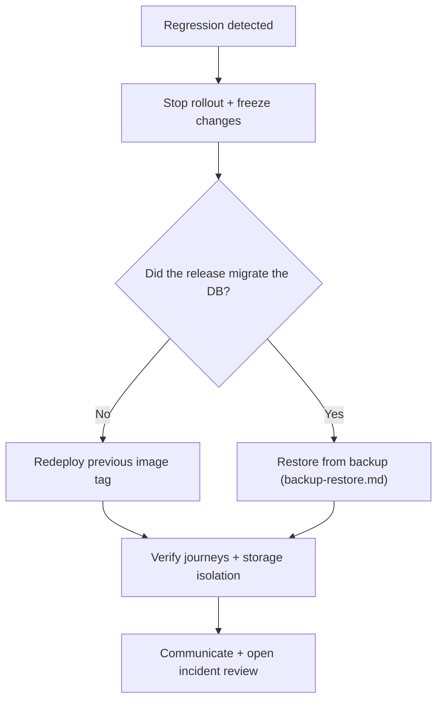

# rollback.md

Owner: Susank Shakya

<aside>
↩️

**`docs/deployment/rollback.md`** · restore the last known-good state quickly when a deploy goes wrong.

</aside>

# 1. Purpose & scope

This page defines how to **roll back** to the last known-good state. Because the same image is promoted across environments, rollback is normally a fast image-tag swap — with special care for database migrations, which cannot always be reversed safely.

# 2. Triggers

- Failed health checks after a rollout.
- A broken core journey (browse→recommend, consent→self-scan, consultation).
- A data-integrity risk, or a storage/security regression (e.g. private media reachable).

# 3. Decision flow



# 4. Steps

1. Stop the rollout; freeze further changes.
2. Redeploy the previous known-good image tag:

```
docker compose -f docker-compose.yml -f docker-compose.production.yml up -d
```

1. **Migrations** — if the release migrated the DB, restore from backup ([[backup-restore.md](http://backup-restore.md)](../operations/backup-restore%20md%202ddc8e163c0545908bed05ddb3fa5899.md)) rather than blindly rolling back schema.
2. Verify core journeys + signed URLs + private-media isolation.
3. Communicate status; open an incident review.

# 5. Evidence & follow-up

- Follow the runbook [[failed-deployment.md](http://failed-deployment.md)](../operations/runbooks/failed-deployment%20md%200e50ac3d42644c1e9fe80da4de2bd2c1.md); record the timeline and the fix.

# 6. Related documentation

- Staging: [[staging-deployment.md](http://staging-deployment.md)](staging-deployment%20md%200c15e6899cab4bc5ba37bca6571938e3.md). Readiness: [[production-readiness.md](http://production-readiness.md)](production-readiness%20md%204a0fae0daf6e4e87ab5a75757909ec84.md). Backups: [[backup-restore.md](http://backup-restore.md)](../operations/backup-restore%20md%202ddc8e163c0545908bed05ddb3fa5899.md).