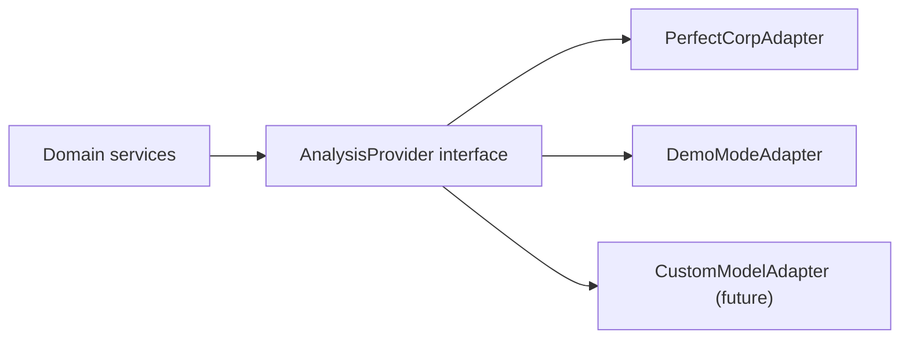

# provider-boundaries.md

Owner: Susank Shakya

<aside>
🚧

**`docs/integrations/ai-provider/provider-boundaries.md`** · the strict boundaries that keep AI providers isolated, swappable, and safe.

</aside>

# 1. Purpose & scope

This page defines the **boundaries** around every external AI provider so that secrets stay server-side, providers can be swapped without touching callers, and the blast radius of any provider issue is contained. These boundaries implement the zero-trust posture of [ADR Pack](https://app.notion.com/p/ADR-Pack-36ff29d2a6b18108958af03b19f13a6e?pvs=21) ADR 0012 and the backend-only orchestration of ADR 0002.

# 2. Boundaries

- **Backend-only** — all provider calls originate in `backend-engine`; no frontend ever calls a provider directly.
- **No client credentials** — provider keys live only in backend environment variables, never in any `NEXT_PUBLIC_*` value.
- **Adapter isolation** — providers sit behind an adapter that exposes the internal contract; swapping or adding a provider does not change any caller.
- **Data minimization** — only the necessary, consented data is sent; private media is referenced by **private object key**, never a public URL, and raw media is never shared upward (ADR 0009).
- **Tenant scoping** — every call carries the resolved `shop_id`/session context so results are attributed and isolated correctly.

# 3. Adapter pattern

Callers depend only on the `AnalysisProvider` interface and the normalized result shape. Concrete adapters (Perfect Corp, demo-mode, and the future custom model in ADR 0008) are interchangeable behind it.

# 4. What crosses the boundary

| Allowed outbound | Never outbound |
| --- | --- |
| Consented image referenced by signed/scoped access | Storage credentials, APP_KEY, provider keys |
| Minimal attributes required for analysis | Raw media to brands or other tenants |
| Tenant/session context needed for attribution | Identifiable customer data beyond consent tier |

# 5. Why these boundaries

- **Limit blast radius** — a provider outage or breach cannot reach the frontend or other tenants.
- **Provider substitution** — the adapter lets Nuvia move from Perfect Corp P0 toward a custom model without rewrites.
- **Secret hygiene** — keys never leave the backend, satisfying the security constraints in `storage/` and the deployment env reference.

# 6. Related documentation

- Orchestration: `orchestration.md`. Safety: `safety-rules.md`. Contract: `perfect-corp/request-response-contract.md`.
- Decisions: ADR 0002, 0008, 0009, 0012. Security: `storage/private-bucket-policy.md`.