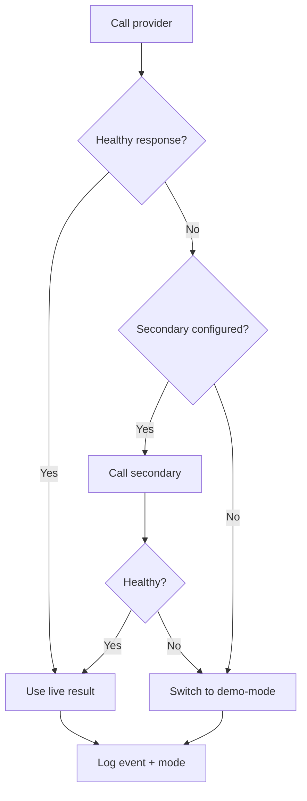

# fallback-behavior.md

Owner: Susank Shakya

<aside>
🔁

**`docs/integrations/perfect-corp/fallback-behavior.md`** · what happens when the live provider is unavailable, so user flows never break.

</aside>

# 1. Purpose & scope

This page defines the **fallback behavior** that keeps the analysis pipeline working when the live provider is degraded or unavailable. Fallback is transparent to the user and always produces output in the same internal contract.

# 2. Triggers

- **Timeout** — the provider call exceeds its per-call budget.
- **Error** — network failure or an error response from the provider.
- **Quota exhaustion** — the tenant/provider quota is depleted.

# 3. Fallback chain

```
primary provider (Perfect Corp P0)
  -> secondary provider (if configured)
    -> deterministic demo-mode / safe defaults
```



# 4. Rules

- Fallback is transparent to the user; output uses the same contract (`request-response-contract.md`).
- Every fallback is logged with reason and the resulting `mode`.
- Quota is reconciled correctly even when a call fails (no double-charge).
- Repeated failures alert operations (`runbooks/ai-provider-failure.md`).

# 5. Monitoring

- Track fallback rate and trigger breakdown (timeout vs error vs quota); a rising rate signals provider degradation.
- Sustained demo-mode in production is an operational alert, not a silent state.

# 6. Related documentation

- Demo-mode: `demo-mode.md`. Contract: `request-response-contract.md`. Orchestration: `ai-provider/orchestration.md`. Runbook: `operations/` (`runbooks/ai-provider-failure.md`).