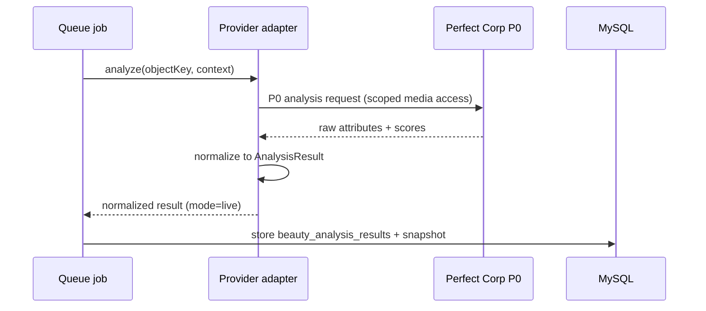

# p0-analysis-api.md

Owner: Susank Shakya

<aside>
🔍

**`docs/integrations/perfect-corp/p0-analysis-api.md`** · the P0 analysis capability and how the backend uses it.

</aside>

# 1. Purpose & scope

The **P0 analysis** capability performs beauty-attribute detection on a consented image. It is called only from `backend-engine` queue jobs, behind the provider adapter, and its output is normalized into the internal contract before any downstream use.

# 2. Usage

- **Auth** — server-side credentials from environment only; never exposed to clients.
- **Input** — a consented image referenced by a **private object key** (not a public URL); the backend grants scoped access for the provider call.
- **Output** — attributes/scores normalized into the internal contract (`request-response-contract.md`).
- **Limits** — timeouts, rate limits, and quotas are handled by the orchestration layer (`ai-provider/orchestration.md`).

# 3. Call sequence

# 4. Captured attributes (representative)

| Attribute group | Examples |
| --- | --- |
| Skin | apparent skin type, tone band, texture cues |
| Concern signals | dryness / oiliness cues, redness cues (retail-safe phrasing only) |
| Quality | capture confidence, landmark coverage |

All attributes are described in retail-safe, non-clinical language (ADR 0005); the adapter maps provider fields to this vocabulary.

# 5. Failure handling

- On timeout, error, or quota exhaustion the job switches to demo-mode (`demo-mode.md`) via the fallback chain and logs the event.
- The stored result records `mode` (live / demo); downstream handling is identical.

# 6. Notes & configuration

- Exact provider endpoints/keys are environment-configured per deployment (`PERFECT_CORP_*` in `README.md`).
- The provider is one implementation of the `AnalysisProvider` interface; the custom model (ADR 0008) will later plug into the same interface.

# 7. Related documentation

- Contract: `request-response-contract.md`. Fallback: `fallback-behavior.md`. Orchestration: `ai-provider/orchestration.md`. Safety: `ai-provider/safety-rules.md`.