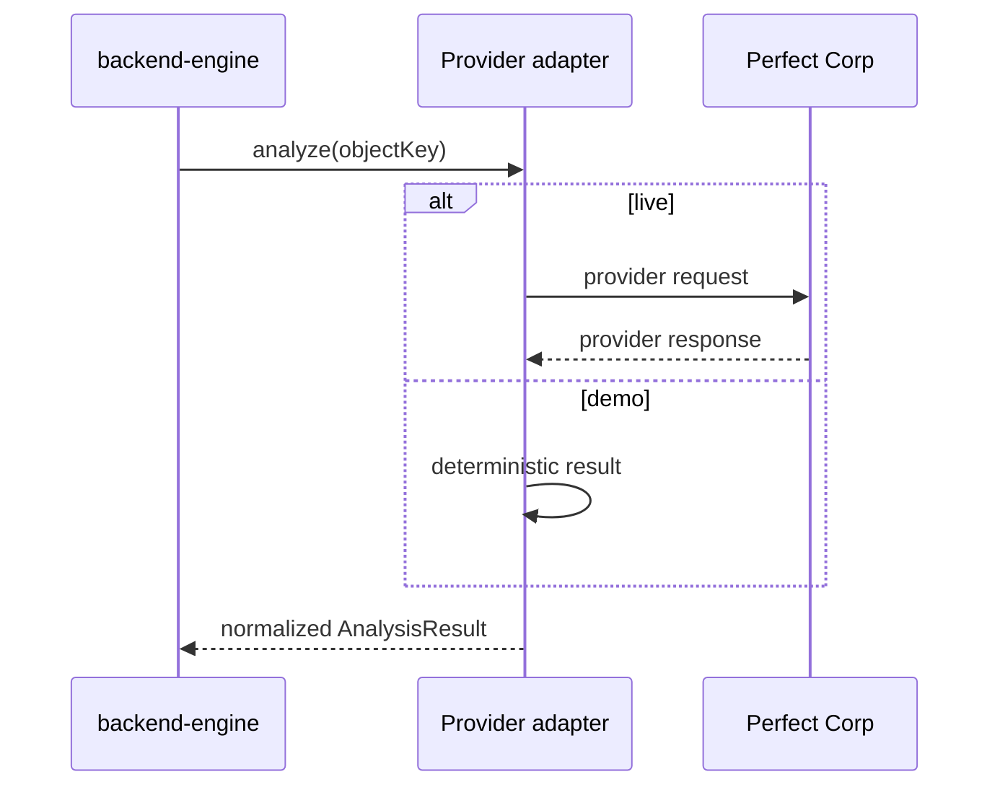

# request-response-contract.md

Owner: Susank Shakya

<aside>
📜

**`docs/integrations/perfect-corp/request-response-contract.md`** · the stable internal contract the backend depends on — identical for live and demo modes.

</aside>

# 1. Purpose & scope

This is the **internal contract** the backend depends on — identical for live and demo modes, so callers never branch on provider state. The adapter normalizes every provider payload into this shape before it reaches any domain service.

# 2. Sequence



# 3. Request

```json
{
  "object_key": "inputs/shop_123/sess_456/ab12.jpg",
  "shop_id": "shop_123",
  "session_id": "sess_456",
  "consent_tier": "T1"
}
```

# 4. Normalized response

```json
{
  "attributes": { "skin_type": "oily", "tone_band": "medium" },
  "confidence": 0.74,
  "warnings": ["patch test recommended"],
  "mode": "live | demo"
}
```

# 5. Field reference

| Field | Type | Meaning |
| --- | --- | --- |
| `attributes` | object | Normalized, retail-safe beauty attributes. |
| `confidence` | number (0–1) | Overall confidence; low values trigger warnings/suppression. |
| `warnings` | string[] | Retail-safe cautions surfaced to the user. |
| `mode` | "live" | "demo" | Source of the result; recorded for audit only. |

# 6. Rules

- The adapter normalizes provider payloads into this shape; callers never see raw provider fields.
- `mode` is recorded for audit but does **not** change downstream handling.
- This analysis result feeds `beauty_analysis_results` and the profile snapshot, which the deterministic recommender turns into the `{product_id, score, confidence, reasons[], warnings[]}` recommendation payload.

# 7. Related documentation

- API: `p0-analysis-api.md`. Demo-mode: `demo-mode.md`. Orchestration: `ai-provider/orchestration.md`.