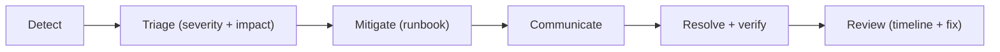

# incident-response.md

Owner: Susank Shakya

<aside>
🚨

**`docs/operations/incident-response.md`** · how we respond when something breaks — the process, severities, and runbooks.

</aside>

# 1. Purpose & scope

This page defines the **incident-response process** — the umbrella procedure that every alert and report follows. Specific mitigations live in the runbooks; this page covers detection, triage, communication, resolution, and review.

# 2. Process

1. **Detect** — alert or report; confirm symptom and scope.
2. **Triage** — assess severity and user impact.
3. **Mitigate** — follow the relevant runbook ([runbooks/](runbooks%20243dd92b6d7f453baa3f6baab3f89e65.md)).
4. **Communicate** — update stakeholders for user-facing incidents.
5. **Resolve** — restore service; verify journeys + storage isolation.
6. **Review** — capture timeline + evidence; log durable fixes (decision-log / ADR).

# 3. Severity levels

| Level | Definition | Response |
| --- | --- | --- |
| Sev1 | Outage or data-exposure risk. | Act immediately; all-hands. |
| Sev2 | Degraded; provider down with demo-mode covering. | Mitigate promptly; monitor. |
| Sev3 | Minor. | Schedule a fix. |

# 4. Roles & communication

- An incident lead coordinates; a scribe records the timeline.
- User-facing Sev1/Sev2 incidents get proactive stakeholder updates.

# 5. Runbooks

- [[failed-deployment.md](http://failed-deployment.md)](runbooks/failed-deployment%20md%200e50ac3d42644c1e9fe80da4de2bd2c1.md) · [[storage-incident.md](http://storage-incident.md)](runbooks/storage-incident%20md%202ce24157c5074f318acced1558475d53.md) · [[ai-provider-failure.md](http://ai-provider-failure.md)](runbooks/ai-provider-failure%20md%20ef02256e904340c0bddd805d3dbeb4a7.md) · [[database-restore.md](http://database-restore.md)](runbooks/database-restore%20md%208f61552b61594964aaf3c508e2fec1ef.md)

# 6. Post-incident review

- Capture root cause, timeline, and durable fixes; record decisions in the decision log / a new ADR where the fix changes architecture.

# 7. Related documentation

- Monitoring: [[monitoring.md](http://monitoring.md)](monitoring%20md%2025dd9e9c06a94ff7998ee1271ff6a335.md). Rollback: [[rollback.md](http://rollback.md)](../deployment/rollback%20md%20ce2b95b2b57b431891c2528be2613c84.md). Backups: [[backup-restore.md](http://backup-restore.md)](backup-restore%20md%202ddc8e163c0545908bed05ddb3fa5899.md).