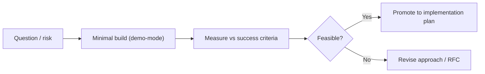

# poc/

Owner: Susank Shakya

<aside>
📁

**`docs/poc/`** — Proof-of-Concept specs that prove feasibility before full implementation.

</aside>

A PoC proves a risky part of the system is feasible **before** committing to full implementation. PoCs are throwaway-by-default — they answer a single question with measurable success criteria and stored evidence. The complete set of PoC specs lives in [PoC Specifications](https://app.notion.com/p/PoC-Specifications-36ff29d2a6b181e1bd14d17ff0790d56?pvs=21).

# Contents

| Document | Covers |
| --- | --- |
| [[README.md](http://README.md)](poc/README%20md%20cc469061a9864a01bf4ac1bf396c841d.md) | How PoCs work here — when to write one and what each must define. |
| [[poc-phase-4-storage-beauty.md](http://poc-phase-4-storage-beauty.md)](poc/poc-phase-4-storage-beauty%20md%20dd7556edc30a4215ab4b70447d5d5f38.md) | PoC 12: storage foundation + first beauty intelligence layer (Phase 4). |

# How a PoC flows

# Principles

- One question per PoC; measurable pass/fail; evidence stored under `implementation-plan/evidence/`.
- A PoC is not production code — it de-risks before a phase commits.

[[README.md](http://README.md)](poc/README%20md%20cc469061a9864a01bf4ac1bf396c841d.md)

[[poc-phase-4-storage-beauty.md](http://poc-phase-4-storage-beauty.md)](poc/poc-phase-4-storage-beauty%20md%20dd7556edc30a4215ab4b70447d5d5f38.md)