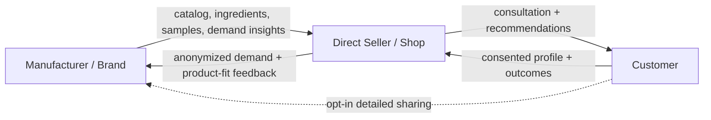
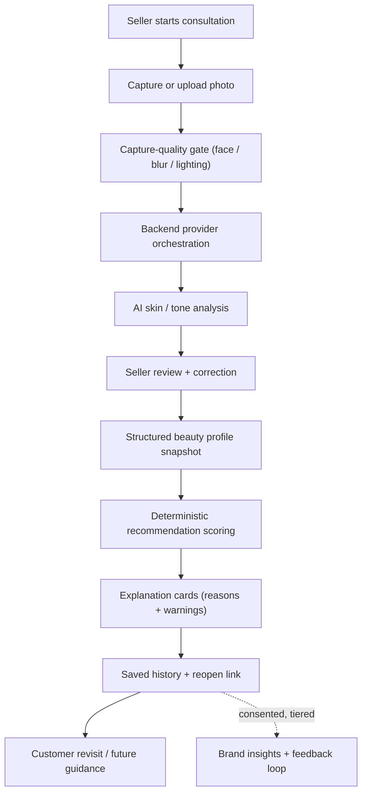

# concept-paper.md

Owner: Susank Shakya

<aside>
💡

**`docs/product/concept-paper.md`** · the product concept, problem, and vision for Nuvia Beauty. This page is self-contained; it is kept in sync with the canonical [Concept Paper](https://app.notion.com/p/Concept-Paper-36ff29d2a6b181c99153ed2b811f1312?pvs=21).

</aside>

# 1. Executive summary

Nuvia Beauty is a retail confidence system that helps small and medium beauty shops convert a short, seller-assisted in-store consultation into a privacy-aware, explainable, and reusable product recommendation experience. Instead of relying on packaging, influencer content, shelf placement, or seller memory, customers receive structured recommendations grounded in their own beauty profile — with clear reasons and warnings attached to every suggestion. Each consultation is saved as a reopenable profile, so guidance improves over time and follows the customer across visits.

Beyond the single shop, Nuvia is designed to grow into a **consent-driven, three-sided ecosystem** connecting **cosmetic manufacturers and brands → direct sellers → customers**. With explicit, tiered consent, structured profile attributes and outcomes flow back to brands as anonymized demand and product-fit signals, while verified product data, ingredients, and samples flow forward to shops and customers. Over time the system reduces its dependence on third-party analysis APIs by building its own **custom analysis model** trained on consented, seller-corrected data.

The MVP focuses on seller-assisted capture, a single AI skin/tone analysis provider, structured profile snapshots, deterministic recommendation scoring, explanation cards, quota control, and a demo fallback — giving physical retailers a practical AI advantage without building or maintaining their own AI infrastructure.

# 2. Background

Beauty retail is one of the most personal categories in commerce, yet one of the least personalized at the point of sale for small and medium retailers. Large brands and e-commerce platforms increasingly offer virtual try-on, shade matching, and AI skin diagnostics, but these capabilities rarely reach independent shops without engineering teams or AI budgets.

Customers are also more cautious than ever. Skin sensitivity, ingredient awareness, budget pressure, and conflicting online advice mean buyers want justification before they purchase — not just a product name. The in-store seller often gives that justification verbally, but the value disappears the moment the customer leaves. There is also a structural disconnect: manufacturers rarely receive fine-grained signals about which products fit which customers, while shops rarely receive structured brand support. Nuvia closes both gaps by turning the human consultation into durable, structured, explainable data.

# 3. Problem statement

Beauty shopping has a persistent **confidence gap**. Customers frequently buy based on surface cues rather than a structured understanding of their own profile:

```
Will this match my skin tone?
Will it fit my skin type?
Is this product relevant to my current concern?
Have I already tried something similar?
Why is this product being recommended to me?
```

This uncertainty produces wrong-product purchases, decision paralysis, lost institutional knowledge, no continuity across visits, and a blind supply chain. Most SME retailers lack any digital consultation layer to solve this — their excellent in-person advice is ephemeral and unstructured.

# 4. Opportunity & rationale

Nuvia reframes the consultation as a **reusable profile system** rather than a one-time conversation:

```
seller consultation → AI analysis → structured profile → explainable recommendations → saved history → better future guidance
```

Each consultation enriches the profile, sharpens future recommendations, and builds a trust relationship that keeps the customer returning to that specific shop — a defensible, AI-enabled differentiator without the cost of building AI in-house. The larger opportunity is to extend this loop into a connected, consent-governed beauty network.

# 5. Objectives

**General objective:** design and build a privacy-aware, explainable, seller-assisted AI consultation system that increases pre-purchase confidence, is realistically adoptable by SME beauty retailers, and can grow into a consent-driven manufacturer–seller–customer ecosystem.

**Specific objectives:**

1. Capture consultations through seller-assisted photo capture or upload.
2. Analyze skin tone and type via backend-orchestrated AI, evolving toward a custom model.
3. Generate a structured, persistent beauty profile per session.
4. Produce deterministic, explainable recommendations with reasons and warnings.
5. Store consultation history securely and allow profile reopen.
6. Give operators quota control, product mapping, provider toggles, and failed-task visibility.
7. Handle private media responsibly throughout.
8. Enable consent-driven connections across customers, sellers, and manufacturers, with tiered, revocable sharing.

# 6. The ecosystem model

Nuvia evolves from "a shop has a tool" into a network where value flows across three roles, with the customer's profile as the shared, consent-controlled key.



| Role | Gives | Gets |
| --- | --- | --- |
| Manufacturer / Brand | Verified product data, ingredients, avoid/concern tags, samples, training. | Anonymized demand signals, product-fit feedback, targeted sampling, authenticity assurance. |
| Direct Seller / Shop | Consultation, local relationship, stock, corrections to AI output. | Explainable recommendations, brand support, restock guidance, sales attribution. |
| Customer | Consent, profile attributes, outcomes (bought / liked / reacted). | Trusted recommendations, reusable profile, samples, authentic products, cross-shop continuity. |

# 7. Consent-driven data sharing

Nothing flows beyond a single session unless the customer explicitly allows it. Consent is **tiered, granular, and revocable**, and every grant is logged with a timestamp. Raw facial images are never shared upward — only structured attributes, and only at the chosen tier.

| Tier | What it enables | Who sees it |
| --- | --- | --- |
| T0 — Session only | One-time analysis + recommendations; media deleted after. | Seller, during session only. |
| T1 — Save profile | Reopenable profile + history for future visits. | Customer + originating shop. |
| T2 — Share with shop | Follow-up, routine reminders, restock-aware suggestions. | Shop / seller. |
| T3 — Anonymized to brand | Aggregate demand + product-fit insights (no identity). | Manufacturer / brand (aggregated). |
| T4 — Identified to brand | Targeted samples, offers, loyalty across shops. | Manufacturer / brand (contactable). |

<aside>
🔒

**Consent principles:** opt-in per tier, revocable at any time, with downgrades immediately stopping new sharing. The default is T0/T1, and detailed manufacturer sharing (T3/T4) is always an explicit, separate choice.

</aside>

# 8. Target users & stakeholders

| User | Need | Value delivered |
| --- | --- | --- |
| Customer | Safer, clearer product choices and less uncertainty before buying. | Explainable recommendations and a reusable, portable profile. |
| Seller / Shopkeeper | A fast way to guide customers and justify recommendations. | Structured consultation tool that augments their expertise. |
| Retail owner | Higher trust, repeat visits, differentiated service. | Customer retention, restock guidance, competitive edge. |
| Manufacturer / Brand | Real signals on which products fit which customers. | Anonymized demand insights, product-fit feedback, targeted sampling, authenticity. |
| Admin / Operator | Quota control, product mapping, provider toggles, failed-task visibility. | Operational control and cost predictability. |

# 9. Core concept & positioning

Nuvia Beauty is **not** a beauty filter and **not** a medical diagnosis tool. It is a **retail confidence system** combining seller-assisted capture, backend-only AI skin/tone analysis, structured profiles, deterministic recommendation scoring, explanation cards with reasons and warnings, private media handling, profile reopen links, consent-driven connections, and a path toward a custom model, self-scan, and try-on.

<aside>
⚠️

**Positioning guardrail:** All outputs are framed as cosmetic-fit guidance, never as medical, dermatological, or diagnostic claims. Recommendations include warnings where relevant (sensitivity, allergen, or patch-test reminders).

</aside>

# 10. System workflow



# 11. Key MVP features

- **Seller-assisted consultation** — guided capture or upload during an in-store visit.
- **Capture-quality gate** — reject blurry, dark, or no-face shots before spending an API call.
- **Single P0 analysis API** — one Perfect Corp provider for skin/tone attributes.
- **Seller review & correction** — sellers confirm or adjust AI output, creating high-quality labels.
- **Structured profile snapshots** — attributes, concerns, and history per session.
- **Deterministic recommendations** — transparent, reproducible scoring (not a black box).
- **Explanation cards** — reasons and relevant warnings on every recommendation.
- **Quota control** — operator-set limits with demo fallback when exceeded.
- **Profile reopen links** — customers can return to and reuse their profile.
- **Tiered consent capture** — explicit, logged consent governing all downstream sharing.

# 12. Custom analysis model strategy

The analysis capability evolves through a **cold-start → distill → own-model** progression rather than a day-one build:

- **Stage A — Provider cold start.** Use Perfect Corp / YouCam P0 to ship quickly and generate labeled examples.
- **Stage B — Consented data collection.** With T1+ consent, store image features, provider output, seller corrections, and purchase/return outcomes (active learning).
- **Stage C — Train a custom model.** Predict skin type, tone, undertone, and concern tags, favoring a lightweight, on-device-capable model.
- **Stage D — Distillation & fallback.** Distill provider knowledge into the custom model while keeping the provider in the fallback chain.

<aside>
🧠

**Model governance:** segmented fairness audits across skin tones (especially South Asian / darker tones), per-attribute confidence reporting, model versioning, and a training-data opt-out independent of feature use.

</aside>

# 13. Privacy, ethics & data handling

- **Consent-first capture** — media only captured/uploaded with explicit agreement.
- **Tiered, revocable sharing** — the T0–T4 model governs exactly what is shared and with whom.
- **Private media handling** — images processed through controlled backend paths, never exposed publicly; raw images never shared upward.
- **Data minimization** — raw images discarded after attributes are extracted where possible.
- **Purpose limitation** — analysis used only for cosmetic-fit guidance.
- **Non-medical framing** — no diagnostic or health claims.
- **Customer control** — profiles are reopenable, manageable, and deletable by the customer.

# 14. Research value & questions

The project studies how explainability affects confidence, whether seller-assisted AI consultation increases product understanding, whether saved profiles reduce repeated wrong-product purchasing, whether SMEs can adopt AI consultation without complex infrastructure, and how privacy-aware workflows affect trust.

<aside>
🔬

**Hypothesis:** If beauty customers receive explainable product recommendations grounded in profile attributes, then confidence before purchase will improve compared with generic browsing or seller memory alone.

</aside>

# 15. Success indicators

| Indicator | What it signals |
| --- | --- |
| Recommendation acceptance rate | Relevance and trust in suggestions. |
| Confused / no-decision rate | Reduction in decision paralysis. |
| Profile reopen usage | Durable, returning value of the profile. |
| Seller adoption | Practical usability in real consultations. |
| Discarded-session rate | Capture and analysis reliability. |
| Return-rate change | Business value to shops and brands. |

# 16. Scope & limitations

**In scope (MVP):** seller-assisted consultation, one Perfect Corp P0 API, structured profile snapshots, deterministic recommendations, quota control, tiered consent, demo fallback. See `mvp-boundary.md`.

**Out of scope (future phases):** full customer self-scan, advanced try-on studio, multi-provider AI, custom model in production, vector search, gamification, social features.

**Known limitations:** analysis quality depends on capture conditions; recommendations are bounded by mapped catalog and stock; the MVP assumes seller involvement; ecosystem features depend on manufacturer participation and consent.

# 17. Risks & mitigations

| Risk | Mitigation |
| --- | --- |
| Privacy concerns over facial images | Consent-first capture, backend-only media handling, data minimization, purpose limitation. |
| AI provider downtime or quota exhaustion | Multi-provider fallback chain and demo fallback; failed-task visibility. |
| Low seller adoption | Fast, guided flow designed around real consultation behavior; local-language UI. |
| Recommendations perceived as a black box | Deterministic scoring plus explanation cards with reasons and warnings. |
| Misinterpretation as medical advice | Explicit non-medical, cosmetic-fit framing and warnings. |
| Brand data sharing erodes trust | Strict tiered consent, anonymization by default, never sharing raw images, clear revocation. |
| Custom model bias across skin tones | Segmented fairness audits, confidence reporting, seller confirmation on low confidence. |
| Multi-tenant data leakage | Hard tenant isolation in database and storage; access scoped by role. |

# 18. Expected outcomes

A working MVP demonstrating end-to-end seller-assisted consultation; evidence on whether explainability improves confidence; a reusable profile model supporting continuity across visits; a validated low-infrastructure adoption path for SMEs; and a consent-governed foundation for manufacturer feedback loops and a future custom model.

# 19. Related documentation

- Canonical: [Concept Paper](https://app.notion.com/p/Concept-Paper-36ff29d2a6b181c99153ed2b811f1312?pvs=21).
- In this folder: `white-paper.md`, `technical-proposal.md`, `mvp-boundary.md`, `demo-scenarios.md`.
- Architecture: `architecture/hld-system-architecture.md`.