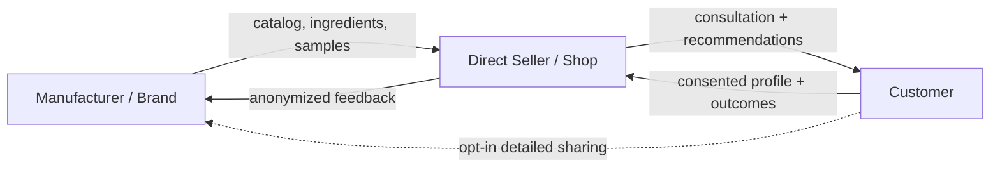

# technical-proposal.md

Owner: Susank Shakya

<aside>
🧭

**`docs/product/technical-proposal.md`** · the technical approach, stack, phasing, and scope. Self-contained; kept in sync with the canonical [Technical Proposal](https://app.notion.com/p/Technical-Proposal-36ff29d2a6b181518e25d540447d7534?pvs=21).

</aside>

# 1. Purpose

This technical proposal defines **what** Nuvia Beauty should build, **how** it should be built, **when** it should be phased, and **what must remain out of scope**. It covers the consent-driven ecosystem connecting manufacturers/brands, sellers, and customers, and the path toward a custom analysis model.

# 2. System goal

Build a **PWA-first** beauty consultation and recommendation system that works beside the existing commerce platform and supports customer, seller, vendor, admin, and (later) manufacturer/brand surfaces, with consent-governed data sharing across them.

# 3. Core principles

```
Laravel backend is authoritative.
Laravel is the primary backend; Rust only later for isolated, internal, strongly-typed services.
AI provider calls are backend-only.
MinIO/S3 media is private by default.
Product recommendations begin deterministic.
Profile snapshots are appended, not overwritten.
Consent is tiered, logged, and revocable.
Raw media is never shared upward to brands.
Brand sharing is opt-in and anonymized by default.
Custom model is a later evolution, not a day-one build.
Customer self-scan is post-MVP.
Makeup VTO is P1 after P0 analysis works.
No medical claims.
```

# 4. Architecture summary

```
Customer / Seller / Admin / Brand Frontends
  → Laravel backend-engine
    → MySQL
    → Redis queue
    → MinIO/S3 private media
    → Consent + sharing service
    → Perfect Corp provider via queue workers (multi-provider fallback chain)
    → Custom analysis model (later) with provider fallback
```

Full detail lives in `architecture/hld-system-architecture.md` and `architecture/reference-architecture.md`.

# 5. Ecosystem & consent model



| Tier | Enables | Audience |
| --- | --- | --- |
| T0 | Session-only analysis; media deleted after. | Seller, in session. |
| T1 | Saved, reopenable profile + history. | Customer + shop. |
| T2 | Follow-up, reminders, restock-aware suggestions. | Shop. |
| T3 | Anonymized demand + product-fit insights. | Brand (aggregated). |
| T4 | Targeted samples, offers, cross-shop loyalty. | Brand (identified). |

# 6. Custom analysis model strategy

```
Stage A: Perfect Corp / YouCam cold start (ship + generate labels)
Stage B: consented data + seller corrections (active learning)
Stage C: lightweight, on-device-capable custom model
Stage D: distillation; provider retained in fallback chain
```

Governance: segmented fairness audits across skin tones, per-attribute confidence reporting, model versioning for reproducibility, and a training-data opt-out independent of feature use.

# 7. Phase roadmap

| Phase | Name | Goal |
| --- | --- | --- |
| 0 | Baseline verification | Confirm repo, routes, versions, build stability. |
| 1 | Storage + recommendation foundation | Add private media and initial deterministic recommendations. |
| 2 | Mapping editors + events/signals | Admin/vendor mapping and recompute foundation. |
| 3 | Stabilization | Fix route-list blockers, migrations, builds, S3 flow. |
| 4 | Seller consultation foundation | Add session lifecycle, save/discard, recommendations. |
| 5 | Perfect Corp P0 integration | Add one backend-only AI analysis flow with fallback chain. |
| 6 | Demo/push readiness | Prepare a stable, secure pilot demonstration and release candidate. |
| 7 | Personalized domain expansion | Add shop-branded domain/profile reopen foundation. |
| 8 | Customer self-scan + profile history | Let customers update profiles after MVP. |
| 8.5 | Ecosystem + custom model | Consented manufacturer feedback loop, brand portal, custom analysis model. |
| 9 | Try-On Studio / Makeup VTO | Add controlled makeup virtual try-on for eligible products. |

The authoritative, checklist-level phase tracking lives in the `implementation-plan/` folder.

# 8. Major deliverables

**Backend:** Beauty domain under backend-engine; storage service and media lifecycle; quota service; consent + sharing service (tier management, logging, revocation); Perfect Corp provider adapter and jobs with multi-provider fallback; recommendation engine; profile snapshot and history service; brand insights/feedback aggregation (anonymized); custom model training pipeline and serving (later); audit events.

**Frontend:** seller consultation UI; customer saved profile/recommendation view with consent controls; admin mapping and provider controls; vendor mapping and consultation actions; brand/manufacturer portal (anonymized demand insights, product-fit feedback, sampling campaigns — later); customer scan and Try-On Studio (later).

**Data:** `beauty_sessions`, `beauty_profiles`, `beauty_profile_snapshots`, `beauty_media_assets`, `beauty_ai_tasks`, `beauty_analysis_results`, `beauty_product_mappings`, `beauty_recommendations`, `beauty_quota_accounts`, `beauty_quota_events`, `brands`, `product_ingredients` / `avoid_tags`, `consent_grants`, `outcomes`, `model_versions`, `sampling_campaigns`, `audit_logs`.

# 9. Future ecosystem enhancements (post-MVP)

Roadmap candidates, not MVP commitments, grouped by who they serve.

**For manufacturers / brands:** demand & gap dashboard (aggregated, anonymized profile distributions by region); product-fit feedback loop (acceptance, repurchase, return per SKU); authenticity / anti-counterfeit check (brand QR/serials); targeted sampling with conversion tracking; verified ingredient & avoid-tag feed.

**For sellers / shops:** restock & assortment guidance from the local profile mix; sales attribution; wholesale reorder integration; offline-first capture with later sync; messaging delivery (WhatsApp / Viber).

**For customers:** ingredient compatibility engine (warn against mixing incompatible actives); routine builder & reminders; in-store "scan any product" suitability check; non-medical adverse-reaction reporting that updates avoid tags; cross-shop loyalty on one profile.

# 10. Acceptance criteria

```
seller can start a consultation
seller can attach private media
backend can run demo or live analysis
profile snapshot is created
recommendations show reasons and warnings
seller can save or discard session
customer can reopen saved profile later
customer can set and revoke consent tiers
no data is shared beyond the granted consent tier
no raw media is shared upward to brands
no credentials appear in frontend
no raw media is public
```

# 11. Delivery strategy

Build foundations first, then provider integration, then customer expansion, then the ecosystem and custom model. Do **not** start with multi-provider AI in production, full self-scan, native mobile, brand portal, custom model, or advanced analytics. Consent plumbing should be in place early even though brand-sharing surfaces arrive later.

# 12. Related documentation

- Canonical: [Technical Proposal](https://app.notion.com/p/Technical-Proposal-36ff29d2a6b181518e25d540447d7534?pvs=21).
- In this folder: `concept-paper.md`, `white-paper.md`, `mvp-boundary.md`, `demo-scenarios.md`.
- Architecture & delivery: `architecture/`, `implementation-plan/`.
