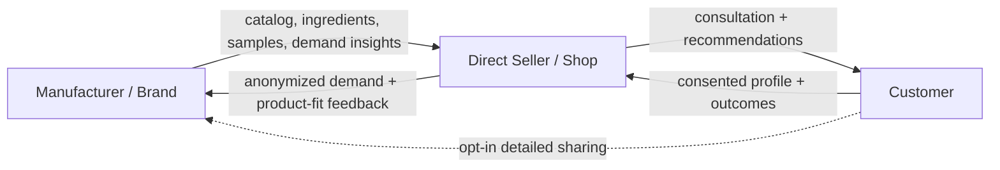

# white-paper.md

Owner: Susank Shakya

<aside>
📝

**`docs/product/white-paper.md`** · the narrative case for AI confidence shopping. Self-contained; kept in sync with the canonical [White Paper — AI Confidence Shopping](https://app.notion.com/p/White-Paper-AI-Confidence-Shopping-36ff29d2a6b18172ab84c0006ac1ad9e?pvs=21).

</aside>

# Abstract

Beauty commerce is often framed as discovery, but the deeper problem is **confidence**. Customers do not only need more products; they need clearer reasons to believe a product fits their profile, preferences, and context. Nuvia Beauty proposes an AI-assisted confidence shopping layer for beauty retailers, using seller-assisted capture, backend-only AI analysis, structured beauty profiles, and deterministic recommendation scoring to create explainable, reusable product guidance. Beyond the single shop, it is designed to become a **consent-driven, three-sided ecosystem** connecting **cosmetic manufacturers and brands → direct sellers → customers**, and to evolve from third-party analysis APIs toward its own **custom analysis model** trained on consented, seller-corrected data.

# 1. The overlooked problem: neglected product confidence

Many beauty shoppers do not fully understand their skin type, undertone, active concerns, ingredient sensitivities, or product fit. This is rarely intentional negligence — customers skip routines, overuse products, mix incompatible products, abandon products too early, or repeatedly buy unsuitable items because they lack structured guidance. In retail this appears as:

```
hesitation before purchase
wrong shade or wrong product type
product abandonment
low trust in recommendations
low repeat confidence
seller advice that is not preserved
```

There is a parallel problem upstream: manufacturers rarely receive trustworthy signals about which products fit which customers, and shops rarely receive structured brand support — a **blind supply chain** where assortment, sampling, and product decisions are made without ground-truth fit data.

# 2. Why AI matters here

AI is useful in beauty commerce when it improves confidence, not when it only adds novelty. The project uses AI for structured skin/tone/profile analysis, confidence-supporting recommendation cards, saved profile snapshots, product suitability explanations, and (later) before/after or try-on previews. The guiding principle: AI output must be translated into **retail-safe guidance** — the user sees practical reasons, not a black-box score.

# 3. Confidence shopping model

```
1. Capture: seller or customer provides usable media.
2. Analysis: backend runs provider analysis securely.
3. Profile: system stores structured, reusable attributes.
4. Recommendation: deterministic engine maps profile to products.
5. Explanation: customer sees why the product may fit or why to avoid it.
```

# 4. The three-sided ecosystem



- **Manufacturers / brands** contribute verified product data, ingredients, avoid/concern tags, and samples, and receive anonymized demand and product-fit feedback.
- **Sellers / shops** run consultations and correct AI output, and receive explainable recommendations, restock guidance, and sales attribution.
- **Customers** grant consent and contribute outcomes, and receive trusted recommendations, a reusable profile, samples, and cross-shop continuity.

# 5. Consent-driven data sharing

Nothing leaves a single session unless the customer explicitly allows it. Consent is tiered, granular, revocable, and logged. Raw facial images are never shared upward — only structured attributes, and only at the chosen tier.

| Tier | What it enables | Who sees it |
| --- | --- | --- |
| T0 — Session only | One-time analysis + recommendations; media deleted after. | Seller, during session only. |
| T1 — Save profile | Reopenable profile + history. | Customer + originating shop. |
| T2 — Share with shop | Follow-up, reminders, restock-aware suggestions. | Shop / seller. |
| T3 — Anonymized to brand | Aggregate demand + product-fit insights. | Manufacturer / brand (aggregated). |
| T4 — Identified to brand | Targeted samples, offers, cross-shop loyalty. | Manufacturer / brand (contactable). |

# 6. Toward a custom analysis model

The system starts on a third-party provider and progressively builds its own model to lower cost, improve accuracy for the real customer base, and strengthen privacy.

```
Stage A: provider cold start (ship + generate labels)
Stage B: consented data + seller corrections (active learning)
Stage C: lightweight, on-device-capable custom model
Stage D: distillation + provider kept as fallback
```

Model governance includes fairness audits across skin tones, per-attribute confidence reporting, versioning for reproducibility, and a training-data opt-out independent of feature use.

# 7. The underrated market

Large beauty brands have virtual try-on and AI consultation tools; small and medium retailers usually do not. Nuvia targets this underrated segment — shops that have products, sellers, and customer relationships but lack an AI-assisted consultation system. The opportunity is not only online conversion but **in-store retail augmentation**:

```
seller guidance becomes structured
customer profile becomes reusable
recommendations become explainable
future visits become faster
shop trust increases over time
manufacturers gain real product-fit signals
```

# 8. Product approach

The project avoids starting with a broad, risky AI platform and begins with a controlled MVP — seller-assisted consultation, one live AI analysis provider path, private media storage, structured profile snapshots, deterministic recommendation cards, quota and demo fallback, and tiered consent capture. It then expands to personalized shop domains, customer self-scan, profile history, a manufacturer feedback loop and targeted sampling, a custom analysis model, makeup virtual try-on, and future vector/ranking features. Everything in that “then expands to” list is **post-MVP (Future Roadmap, V2+)** and must not be read as an MVP requirement. The canonical scope authority is [](Untitled%2089b0720ce5d2457cb678cc48369d8047.md).

# 9. Safety & ethics

The product must not become a medical diagnosis tool. It uses **retail-safe language only**.

| Allowed language | Blocked language |
| --- | --- |
| profile-based confidence; predicted suitability; product match explanation; observed response notes; recommendation reason | diagnoses; cures; medically proven to heal; clinically treats; prevents disease |

Additional ecosystem safeguards: consent-gated sharing (opt-in, tiered, revocable), anonymization by default (identity shared only at T4), and fit-first ranking (recommendations stay deterministic; any sponsored placement is disclosed separately and never overrides suitability).

# 10. Research questions

1. Does explainable AI improve customer trust before purchase?
2. Does seller-assisted AI reduce confusion during product selection?
3. Do saved profiles increase repeat engagement?
4. Do recommendation warnings reduce unsuitable product selection?
5. Can SME beauty shops adopt AI consultation with low training overhead?
6. Does a consented manufacturer feedback loop improve assortment and product fit?

# 11. Future timeline

| Stage | Focus | Outcome |
| --- | --- | --- |
| MVP | Seller consultation + Perfect Corp P0 + recommendations + tiered consent | Demoable confidence-shopping loop |
| Phase 7 | Personalized domains | Shop-branded customer reopen experience |
| Phase 8 | Customer self-scan + profile history | Returning customers update profiles from home |
| Phase 9 | Makeup VTO | Visual confidence for eligible products |
| Beyond roadmap | Manufacturer feedback loop + custom model | Brand insights and reduced provider dependence |
| Later | Advanced ranking + analytics | Stronger personalization and retailer insights |

# 12. Conclusion

Nuvia Beauty reframes beauty commerce from product browsing to confidence building. By combining AI analysis, seller workflow, structured profiles, and explainable recommendations — and by connecting customers, sellers, and manufacturers through consent-governed data — it gives under-served beauty retailers a practical path into AI-powered retail without compromising privacy or trust.

# 13. Related documentation

- Canonical: [White Paper — AI Confidence Shopping](https://app.notion.com/p/White-Paper-AI-Confidence-Shopping-36ff29d2a6b18172ab84c0006ac1ad9e?pvs=21).
- In this folder: `concept-paper.md`, `technical-proposal.md`, `mvp-boundary.md`, `demo-scenarios.md`.
- Scope authority: [](Untitled%2089b0720ce5d2457cb678cc48369d8047.md) (`docs/product/release-strategy.md`).