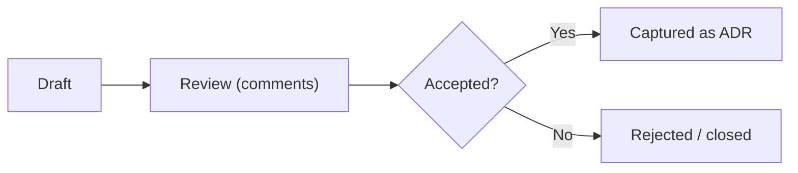

# rfc/

Owner: Susank Shakya

<aside>
📁

**`docs/rfc/`** — Requests for Comments: proposals opened for review before a decision is accepted.

</aside>

An RFC proposes a change and opens it for review **before** it is accepted; once accepted, the durable decision is recorded as an ADR in [ADR Pack](https://app.notion.com/p/ADR-Pack-36ff29d2a6b18108958af03b19f13a6e?pvs=21). This folder holds the RFC process and the active proposals.

# Contents

| Document | Covers |
| --- | --- |
| [[README.md](http://README.md)](rfc/README%20md%20d825b7e5338c452ab52030f9c853e1a4.md) | How RFCs work here — when to write one, lifecycle, and sections. |
| [[rfc-phase-4-storage-beauty-intelligence.md](http://rfc-phase-4-storage-beauty-intelligence.md)](rfc/rfc-phase-4-storage-beauty-intelligence%20md%207b0d9680123e464e96484dcd92100966.md) | Phase 4 proposal: S3-compatible storage foundation + beauty product intelligence. |

# How RFCs flow

# Principles

- One RFC per cross-cutting change; keep options and trade-offs explicit.
- Accepted RFCs are captured as ADRs — the RFC stays as the discussion record.

[[README.md](http://README.md)](rfc/README%20md%20d825b7e5338c452ab52030f9c853e1a4.md)

[[rfc-phase-4-storage-beauty-intelligence.md](http://rfc-phase-4-storage-beauty-intelligence.md)](rfc/rfc-phase-4-storage-beauty-intelligence%20md%207b0d9680123e464e96484dcd92100966.md)