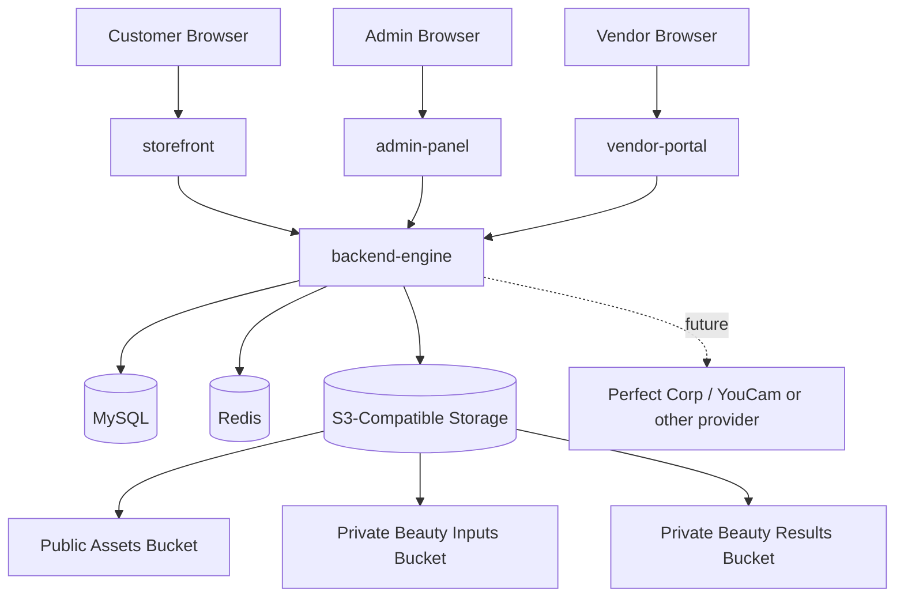

# rfc-phase-4-storage-beauty-intelligence.md

Owner: Susank Shakya

<aside>
📝

**`docs/rfc/rfc-phase-4-storage-beauty-intelligence.md`** · Phase 4 proposal for the S3-compatible storage foundation and beauty product intelligence layer.

</aside>

The canonical RFC lives in Technical Papers: [Request for Comments (RFC)](https://app.notion.com/p/Request-for-Comments-RFC-411c875deb6e4bb79489bf2e536e41cc?pvs=21). This page is the docs-aligned, self-contained version.

# Document overview

| Field | Value |
| --- | --- |
| Status | Draft for review |
| Target phase | Phase 4 |
| Primary scope | S3-compatible storage foundation and beauty product intelligence |
| Repository / branch | `Absolute-point/Nuvia-Beauty` · `development` |

# 1. Context & background

Nuvia Beauty has a deployed base app with four runtime apps — three frontend clients (`storefront`, `admin-panel`, `vendor-portal`) plus exactly one backend API (`backend-engine`) — along with API routing and S3/MinIO-compatible surfaces. Backend domains are Logical Modules inside that single API, not services. The next step moves from a generic deployed ecommerce base into a beauty-focused platform, which requires two foundations before any advanced AI workflows: a safe S3-compatible storage layer (public assets + private beauty/customer media), and a beauty product intelligence layer with structured mapping and explainable recommendations.

# 2. Problem statement

Today there is no finalized public/private storage abstraction, no backend-issued upload-slot flow, no media-metadata model, no private signed-download flow, no beauty-specific product mapping layer, no deterministic recommendation engine, no customer-facing reason/warning cards, and no finalized admin/vendor mapping workflow.

# 3. Goals & non-goals

**Goals**

- S3-compatible storage abstraction in the backend, MinIO/AIStor preferred without hardcoding provider logic.
- Separate public product/shop media from private beauty/customer media.
- Backend-controlled upload and read flows; media metadata tracked in MySQL.
- Beauty-specific product mapping; deterministic recommendation scoring with explainable reason/warning cards.
- Safe APIs for storefront, vendor-portal, and admin-panel; docs kept aligned with implementation.

**Non-goals**

- Full customer self-scan; full live Perfect Corp / YouCam workflow; multi-provider AI orchestration.
- Hair/jewelry try-on; native mobile app; subscription billing; advanced analytics; clinical/medical diagnosis; ML model training.

# 4. Proposed solution & architecture

The backend is the authority for authorization, media ownership, upload-slot creation, signed-URL generation, provider access, recommendation scoring, and DB writes. Frontends are clients only.



# 5. Technical design

## 5.1 Buckets

| Bucket | Visibility | Purpose |
| --- | --- | --- |
| `nuvia-public-assets` | Public/CDN | Product images, shop logos, banners, public UI assets. |
| `nuvia-private-beauty-inputs` | Private | Customer/source photos and future analysis inputs. |
| `nuvia-private-beauty-results` | Private | Generated results, overlays, future try-on media. |
| `nuvia-private-calibration` | Private | Explicit opt-in calibration images (future phase). |

Laravel disks: `s3_public`, `s3_beauty_inputs`, `s3_beauty_results`, `s3_beauty_calibration`.

## 5.2 Environment variables

```
STORAGE_DRIVER=s3_compatible
S3_PROVIDER=minio_aistor
S3_USE_PATH_STYLE_ENDPOINT=true
S3_PUBLIC_BUCKET=nuvia-public-assets
S3_BEAUTY_INPUTS_BUCKET=nuvia-private-beauty-inputs
S3_BEAUTY_RESULTS_BUCKET=nuvia-private-beauty-results
S3_BEAUTY_CALIBRATION_BUCKET=nuvia-private-calibration
S3_UPLOAD_URL_TTL_MINUTES=15
S3_DOWNLOAD_URL_TTL_MINUTES=60
```

## 5.3 Data models

- **`beauty_media_assets`** — ownership (`owner_type`/`owner_id`, `shop_id?`, `session_id?`, `profile_id?`), location (`disk_name`, `bucket`, `object_key`, `object_version?`), `content_type`, `size_bytes`, `checksum_sha256?`, `visibility`, lifecycle `status` (`pending_upload | uploaded | confirmed | discarded | expired | deleted | delete_failed`), `expires_at?`, timestamps.
- **`beauty_product_mappings`** — `product_id`, JSON tag sets (`concern_tags`, `skin_type_tags`, `tone_tags`, `undertone_tags`, `ingredient_tags`, `avoid_tags`), optional `explanation_template`, timestamps.

## 5.4 Recommendation design

Deterministic first. Inputs: product mapping tags, customer/session criteria, selected concern tags, skin type/tone preferences, and avoid tags. Every recommendation includes reasons; warnings appear when avoid tags match. No clinical/medical language; no hidden scoring.

```json
{
  "product_id": 123,
  "score": 87,
  "confidence": "high",
  "reasons": ["Matches oily skin profile", "Targets dark spot concern"],
  "warnings": ["Avoid if sensitive to fragrance"]
}
```

# 6. APIs

```
POST   /api/v1/storage/upload-slots
POST   /api/v1/storage/media/{mediaId}/confirm
GET    /api/v1/storage/media/{mediaId}/download-url
DELETE /api/v1/storage/media/{mediaId}
GET    /api/v1/beauty/product-mappings
POST   /api/v1/beauty/product-mappings
PUT    /api/v1/beauty/product-mappings/{id}
POST   /api/v1/beauty/recommendations/generate
GET    /api/v1/beauty/recommendations/{id}
```

# 7. Alternatives considered

| Alternative | Decision | Trade-off |
| --- | --- | --- |
| Local disk storage | Reject | Simple but weak for deployment, scaling, private lifecycle. |
| AWS S3 directly | Future option | Strong managed service but external cost/dependency. |
| Hardcode MinIO APIs | Reject | Fast but creates lock-in. |
| Live AI provider first | Reject (Phase 4) | Impressive but costly/unsafe without the foundation. |
| Deterministic recs first | Accept | Explainable, cheap, controllable. |

# 8. Security & performance

**Security:** backend-only storage & provider keys, short-lived signed URLs, ownership checks, MIME/size validation, no raw bytes in MySQL, no secrets/URLs in logs, no private media in public buckets.

| Area | Target |
| --- | --- |
| Upload slot creation | Under 500 ms (excl. network). |
| Recommendation generation | Under 1 second (seeded data). |
| Signed upload TTL | 15 minutes default. |
| Signed download TTL | 60 minutes default. |

# 9. Risks, assumptions, constraints

| Risk | Impact | Mitigation |
| --- | --- | --- |
| Storage endpoint misconfiguration | Uploads fail | Validate each disk/bucket separately. |
| Private media exposed publicly | High | Separate buckets; test access denial. |
| Frontend secret exposure | High | Backend-only credentials; inspect network. |
| Recommendation feels weak | Product | Reason/warning cards + curated seeds. |
| AI scope too early | Delivery | Keep provider out of required Phase 4. |
| Documentation drift | Engineering | Update docs in the same commit. |

# 10. Rollout strategy

The RFC proposes the following ordered rollout steps within Phase 4 (these are implementation steps, not project phases):

1. **Config & docs** — storage env, Laravel disks, validate connectivity.
2. **Media metadata & upload** — migration, storage service, upload-slot, confirm, private download.
3. **Public/product media** — route assets to the public bucket; verify access & rendering.
4. **Beauty mapping** — model/table, seed data, mapping APIs, admin/vendor view.
5. **Recommendation engine** — scoring service, reason/warning builder, endpoint, storefront cards.
6. **Verification** — no secrets in browser, private not public, validate recs, update docs.

**Rollback:** keep local filesystem config during transition; feature-flag the recommendation UI; disable upload endpoints on storage failure; reversible migrations; keep the existing product display operational.

# 11. Open questions

1. Mapping editable by vendors, admins, or both?
2. Recommendation scoring global or shop-specific first?
3. Minimum set of beauty tags for launch?
4. Private-media default retention: 24h, 7d, or configurable?
5. Move public media to S3 immediately or only new uploads?
6. Persist recommendation results or generate on demand?
7. Which UI surface exposes mapping first — admin or vendor?
8. Add provider/demo mode now or defer?

# 12. Proposed decision

Accept the storage + deterministic beauty-intelligence foundation: storage env/disks, media metadata + upload/download APIs, product mapping table + seed data, deterministic recommendation service, storefront display, and admin/vendor mapping (or a documented controlled seed workflow), followed by verification and docs. **Do not start live AI/provider workflows** until storage, media metadata, product mapping, recommendations, and private-media access are verified.

# 13. Related documentation

- Canonical: [Request for Comments (RFC)](https://app.notion.com/p/Request-for-Comments-RFC-411c875deb6e4bb79489bf2e536e41cc?pvs=21). Storage: `storage/storage-architecture.md`, `storage/private-bucket-policy.md`. Backend: `backend-engine/api-contracts.md`, `backend-engine/database-schema.md`. PoC: `poc/`. Decisions: [ADR Pack](https://app.notion.com/p/ADR-Pack-36ff29d2a6b18108958af03b19f13a6e?pvs=21).