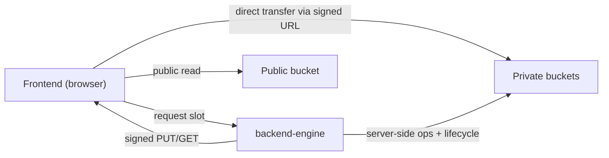

# README.md

Owner: Susank Shakya

<aside>
🗄️

**`docs/storage/README.md`** · overview of the storage subsystem — how Nuvia Beauty stores public assets and private beauty media safely.

</aside>

# 1. Purpose & scope

This subsystem governs **all object storage** for Nuvia Beauty: public marketing/product assets and the private, consent-bound media at the heart of the beauty workflow (customer uploads, derived analysis media, and calibration data). It exists to satisfy a hard product constraint — raw facial images and analysis media must never be publicly reachable, never live in MySQL, and never be handled with client-side credentials — established in [ADR Pack](https://app.notion.com/p/ADR-Pack-36ff29d2a6b18108958af03b19f13a6e?pvs=21) ADR 0003 (private MinIO/S3 media storage) and ADR 0009 (raw media never shared upward).

# 2. Design at a glance

All media lives in an **S3-compatible object store** (MinIO / AIStor). Public marketing assets live in a public bucket; all beauty inputs, results, and calibration data live in **private** buckets reachable only through short-lived signed URLs minted by `backend-engine`. The backend is the single holder of storage credentials; frontends only ever receive scoped, expiring URLs.



# 3. In this folder

| Document | Covers |
| --- | --- |
| [[storage-architecture.md](http://storage-architecture.md)](storage-architecture%20md%206d5af1d65af34c7b8d75df9073fbe603.md) | Buckets, drivers, key conventions, encryption, and data flow. |
| [[media-lifecycle.md](http://media-lifecycle.md)](media-lifecycle%20md%20db12b82338d94f128861624dd549d5b4.md) | The lifecycle of a media object from upload to expiry/deletion. |
| [[private-bucket-policy.md](http://private-bucket-policy.md)](private-bucket-policy%20md%204a6d4cd303184480a1132bb70e8eb2ea.md) | Access rules and enforcement layers for private buckets. |
| [[audit-logging.md](http://audit-logging.md)](audit-logging%20md%202ef7b9d34ce84b60aa39e61e053c75d2.md) | What storage access is logged, and what is never logged. |

# 4. Key configuration

```
STORAGE_DRIVER=s3_compatible
S3_PROVIDER=minio_aistor
S3_USE_PATH_STYLE_ENDPOINT=true
S3_ENDPOINT=http://minio:9000        # console on :9001
S3_REGION=us-east-1                  # nominal; required by SDK
S3_BUCKET_PUBLIC=nuvia-public-assets
S3_BUCKET_INPUTS=nuvia-private-beauty-inputs
S3_BUCKET_RESULTS=nuvia-private-beauty-results
S3_BUCKET_CALIBRATION=nuvia-private-calibration
S3_UPLOAD_URL_TTL=900                 # 15 min
S3_DOWNLOAD_URL_TTL=3600              # 60 min
```

- **Driver/adapter:** Laravel Flysystem via `league/flysystem-aws-s3-v3` against the S3-compatible endpoint.
- **Signed URL TTLs:** upload **15 min**, download **60 min**.
- All storage credentials are backend-only; they never appear in any `NEXT_PUBLIC_*` variable. Full reference: `deployment/environment-variables.md`.

# 5. Core principles

- **Private by default** — beauty media buckets deny all anonymous/public access.
- **Backend-only credentials** — only `backend-engine` can mint signed URLs.
- **No raw bytes in MySQL** — the database stores only object keys and metadata.
- **Short-lived, scoped access** — every URL is per-object, per-operation, and time-boxed.
- **Consent-bound lifecycle** — consent withdrawal deletes the associated media.
- **Fully audited** — every sensitive operation is logged without secrets or full URLs.

# 6. Related documentation

- Architecture: `architecture/hld-system-architecture.md` (storage section) and `architecture/diagrams/sequence-diagrams.md` (media upload sequence).
- Decisions: [ADR Pack](https://app.notion.com/p/ADR-Pack-36ff29d2a6b18108958af03b19f13a6e?pvs=21) (ADR 0003, 0009).
- Operations: storage incident handling and test plan live in `operations/` and `testing/`.