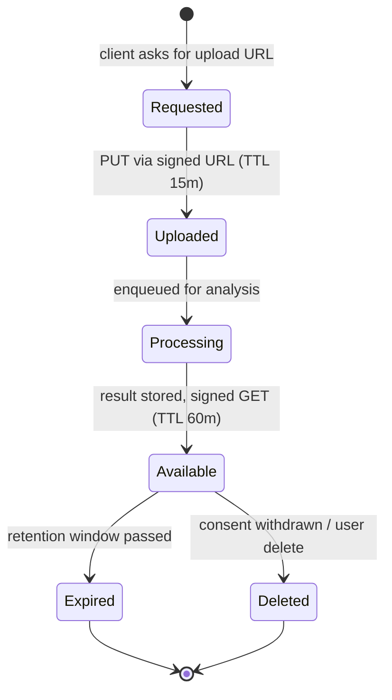

# media-lifecycle.md

Owner: Susank Shakya

<aside>
🔄

**`docs/storage/media-lifecycle.md`** · the lifecycle of a private media object from consented upload to expiry/deletion.

</aside>

# 1. Purpose & scope

This page defines the **end-to-end lifecycle** of a private media object — the states it moves through, the retention windows that bound it, the jobs that drive transitions, and the consent rules that can delete it early. It applies to beauty inputs and derived results; public assets are not subject to this lifecycle.

# 2. Lifecycle states

| State | Meaning | Trigger to next |
| --- | --- | --- |
| Requested | Backend minted a signed PUT after auth/consent/quota checks. | Client uploads bytes. |
| Uploaded | Object exists in the inputs bucket; media-asset row persisted. | Analysis job enqueued. |
| Processing | Provider/fallback analysis running on a queue worker. | Result stored. |
| Available | Result in results bucket; reads via fresh signed GET. | Retention passes / consent change. |
| Expired | Retention window elapsed; object eligible for cleanup. | Lifecycle job deletes it. |
| Deleted | Object removed (consent withdrawal, user delete, or expiry). | — |

# 3. Retention windows

| Consent tier | Inputs (raw media) | Results (structured) |
| --- | --- | --- |
| T0 — session only | Deleted at session end. | Discarded with the session. |
| T1+ — saved profile | Minimized: deleted after attributes are extracted where possible. | Retained with the saved profile snapshot. |
- Data minimization (Concept Paper §14): raw inputs are discarded once structured attributes exist, even when the profile is saved.
- Results are structured data; raw images are never shared upward to brands (ADR 0009).

# 4. Lifecycle jobs

- **Expiry sweep** — a scheduled job scans for objects past their retention window and deletes them, logging each deletion.
- **Discard cleanup** — when a session is discarded, its inputs are deleted immediately and the discard time is logged.
- **Consent-revocation cleanup** — a downgrade/withdrawal enqueues deletion of the affected inputs and results.
- **Orphan reconciliation** — periodically reconciles storage objects against MySQL media-asset rows; orphans are flagged and cleaned.

# 5. Rules

- Inputs land in `nuvia-private-beauty-inputs`; derived results in `nuvia-private-beauty-results` — never cross-written.
- Download access is always via a fresh signed GET (60 min); URLs are never persisted client-side beyond their TTL.
- Consent withdrawal triggers deletion of inputs and results.
- Every state transition is recorded (see `audit-logging.md`).

# 6. Limitations

- Demo-mode runs the full lifecycle against a local/stubbed store without live credentials.
- Provider failures move the object to a failed-task state surfaced to operators; the input still respects its retention window.

# 7. Related documentation

- Architecture: `storage-architecture.md`. Access: `private-bucket-policy.md`. Auditing: `audit-logging.md`.
- Flow: `architecture/diagrams/sequence-diagrams.md` (media upload + signed download).