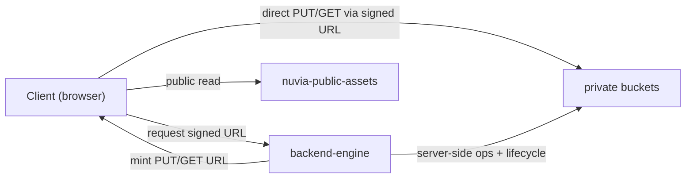

# storage-architecture.md

Owner: Susank Shakya

<aside>
🗄️

**`docs/storage/storage-architecture.md`** · buckets, drivers, key conventions, encryption, and data flow.

</aside>

# 1. Purpose & scope

This page defines the **object-storage architecture** for Nuvia Beauty: the buckets and their visibility, how the backend talks to the store, how objects are named, how they are encrypted, and how data flows between clients, the backend, and storage. It is the authoritative reference for anyone integrating with or operating storage.

# 2. Storage engine

Object storage is **S3-compatible** (MinIO / AIStor in self-hosted environments; any S3-compatible service in production). `backend-engine` is the only component that holds storage credentials; clients receive only short-lived signed URLs. Access uses **path-style** endpoints (`S3_USE_PATH_STYLE_ENDPOINT=true`) via the Laravel Flysystem adapter `league/flysystem-aws-s3-v3`.

# 3. Buckets

| Bucket | Visibility | Contents | Versioning |
| --- | --- | --- | --- |
| `nuvia-public-assets` | Public (read) | Marketing/product images, static assets | Optional |
| `nuvia-private-beauty-inputs` | Private | Customer-uploaded photos (consented) | Off (privacy) |
| `nuvia-private-beauty-results` | Private | Analysis outputs, derived media | Off |
| `nuvia-private-calibration` | Private | Calibration / reference data | Optional |

# 4. Object key conventions

Keys are tenant- and session-scoped so isolation is enforced structurally and lifecycle/cleanup jobs can target a shop or session precisely.

```
inputs/{shop_id}/{session_id}/{uuid}.{ext}            # raw consented upload
results/{shop_id}/{session_id}/{task_id}.json         # analysis result
results/{shop_id}/{session_id}/{task_id}-derived.{ext} # derived media (if any)
calibration/{shop_id}/{ref_id}.{ext}                  # calibration/reference data
public/products/{product_id}/{variant}.{ext}          # public catalog assets
```

- A corresponding row in MySQL stores the **object key, bucket, content type, size, and version** — never the bytes.
- `shop_id` in the key enforces multi-tenant isolation (ADR 0010) and scopes cleanup.

# 5. Data flow



1. Client requests an upload slot; backend validates auth + consent + quota and mints a scoped signed PUT (TTL 15m).
2. Client uploads bytes directly to the private bucket via the signed URL.
3. Client confirms; backend verifies the object (HEAD) and persists the media-asset row.
4. Reads use a fresh signed GET (TTL 60m) issued only after authorization.
5. Public assets are read directly from the public bucket / CDN.

# 6. Encryption & integrity

- **In transit:** TLS for all client↔storage and backend↔storage traffic.
- **At rest:** server-side encryption (SSE) enabled on private buckets where the provider supports it.
- **Integrity:** content-type and size are validated on upload confirmation; unexpected objects are rejected and logged.

# 7. Configuration

```
STORAGE_DRIVER=s3_compatible
S3_PROVIDER=minio_aistor
S3_USE_PATH_STYLE_ENDPOINT=true
S3_ENDPOINT=http://minio:9000   # API :9000, console :9001
S3_UPLOAD_URL_TTL=900           # 15 min
S3_DOWNLOAD_URL_TTL=3600        # 60 min
```

# 8. Scaling & capacity

- Object storage scales horizontally; capacity planning tracks input/result growth per active shop.
- Retention windows (see `media-lifecycle.md`) bound storage growth by expiring inputs after their window.
- The backend stays stateless with respect to media — it holds keys, not bytes — so app instances scale freely.

# 9. Limitations

- Demo-mode does not require live storage credentials; a local MinIO or stubbed store is used.
- Versioning is intentionally off on private input buckets to avoid retaining deleted facial media.

# 10. Related documentation

- Lifecycle: `media-lifecycle.md`. Access rules: `private-bucket-policy.md`. Auditing: `audit-logging.md`.
- Decisions: [ADR Pack](https://app.notion.com/p/ADR-Pack-36ff29d2a6b18108958af03b19f13a6e?pvs=21) (ADR 0003, 0009, 0010). Env: `deployment/environment-variables.md`.