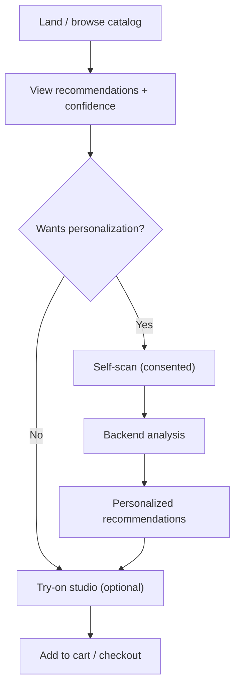

# customer-flow.md

Owner: Susank Shakya

<aside>
🧭

**`docs/storefront/customer-flow.md`** · the end-to-end customer journey, from landing to a confident purchase.

</aside>

# 1. Purpose & scope

This page describes the **customer journey** through the storefront and the rules that govern it. Personalization is always opt-in; the baseline experience works for everyone, and every step degrades gracefully when a provider is unavailable.

# 2. Journey

# 3. Stages

| Stage | What happens |
| --- | --- |
| Browse | Catalog browsing with baseline, confidence-tagged recommendations. |
| Consent | Customer chooses whether to personalize; consent tier is captured and revocable (T0–T4). |
| Self-scan | Consented capture → backend analysis (see `self-scan-flow.md`). |
| Personalized | Recommendations refresh with reasons and warnings from the profile. |
| Try-on | Optional VTO preview (Phase 9; graceful placeholder earlier). |
| Checkout | Add to cart and purchase with confidence. |

# 4. Rules

- Personalization is always **opt-in**; non-consenting customers still get baseline recommendations.
- Recommendations show **reasons** and **warnings** so the customer understands the suggestion.
- A saved profile (T1+) lets a returning customer reopen results without re-scanning.
- All steps degrade gracefully if a provider is unavailable (demo-mode fallback).

# 5. Related documentation

- Self-scan: `self-scan-flow.md`. Recommendations: `recommendation-ui.md`. Consent model: `product/concept-paper.md`. Sequences: `architecture/diagrams/sequence-diagrams.md`.