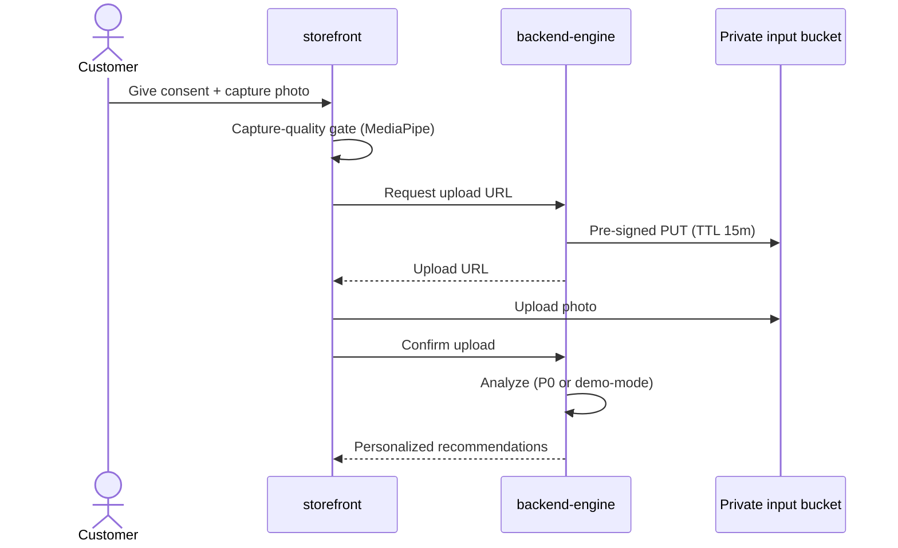

# self-scan-flow.md

Owner: Susank Shakya

<aside>
📸

**`docs/storefront/self-scan-flow.md`** · consented customer self-scan — capture, analyze server-side, return personalized results.

</aside>

# 1. Purpose & scope

This page describes the **consented self-scan**: the customer captures a photo, it is analyzed server-side, and personalized results are returned — without the browser ever touching private storage credentials. Consent is required, explicit, and revocable.

# 2. Flow

# 3. Capture-quality gate

Before requesting an upload URL, the client runs a **MediaPipe face-landmarking** check for framing, lighting, and a single clear face. Poor captures are rejected with guidance and never uploaded — this protects analysis quality and avoids wasted provider calls (see `integrations/ai-provider/safety-rules.md`).

# 4. Rules

- No analysis without explicit, revocable consent.
- The browser holds no storage credentials; it uploads only via the short-lived signed URL.
- Inputs go to `nuvia-private-beauty-inputs`; results to `nuvia-private-beauty-results`.
- Withdrawing consent deletes inputs and results (see `storage/media-lifecycle.md`).
- Analysis runs server-side and degrades to demo-mode if a provider is unavailable.

# 5. Error & edge handling

- Failed capture-quality check → inline guidance, retry, no upload.
- Upload failure → retriable; no partial state persisted.
- Provider failure → transparent demo-mode fallback; results flagged internally as `mode=demo`.

# 6. Related documentation

- Media: `storage/media-lifecycle.md`, `storage/private-bucket-policy.md`. Analysis: `integrations/ai-provider/orchestration.md`. Sequence: `architecture/diagrams/sequence-diagrams.md` (media upload + signed download).