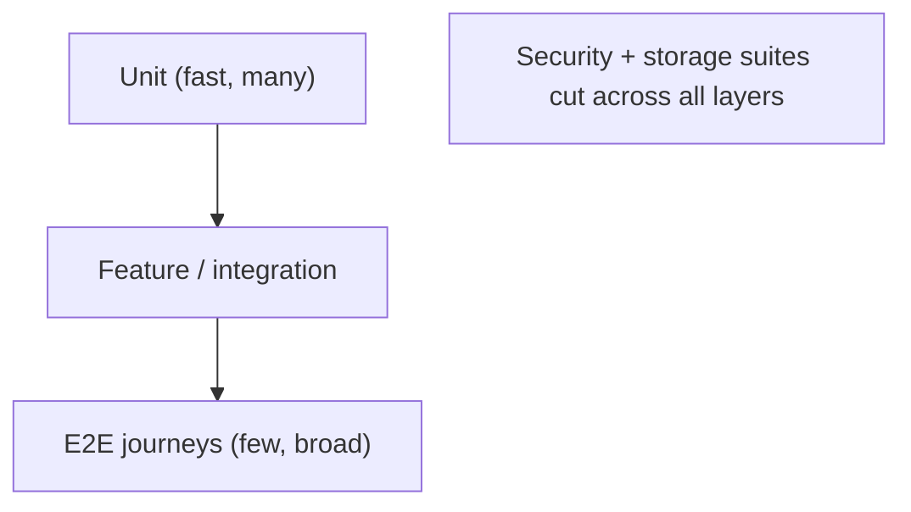

# README.md

Owner: Susank Shakya

<aside>
🧪

**`docs/testing/README.md`** · how Nuvia Beauty is tested — the layered strategy, tooling, gates, and evidence.

</aside>

# 1. Purpose & scope

This page defines the **testing strategy** across the backend, the three frontends, storage, security, and end-to-end journeys. Every layer must be verifiable in **demo-mode** with no live credentials, so tests are deterministic and reproducible in CI and on a developer machine. Testing exists to prove the safety boundaries the architecture promises — consent, tenant isolation, private-media protection, and retail-safe output ([ADR Pack](https://app.notion.com/p/ADR-Pack-36ff29d2a6b18108958af03b19f13a6e?pvs=21) ADR 0012).

# 2. Test layers

| Layer | Verifies | Tooling |
| --- | --- | --- |
| Backend | Domains, APIs, jobs, validation, settings. | PHPUnit / Pest, PHPStan |
| Frontend | Components, integration, accessibility for the 3 apps. | Per-workspace runners |
| E2E | Full cross-service journeys. | docker-compose stack + demo data |
| Storage | Signed URLs, isolation, lifecycle. | Feature tests vs MinIO/AIStor |
| Security | Authz, consent, private-media isolation. | Negative / abuse tests |

# 3. The testing pyramid

# 4. Principles

- **Deterministic** — demo-mode stubs replace live providers; no test depends on external availability.
- **Evidence-backed** — every suite stores results under `implementation-plan/evidence/`.
- **Gated** — tests must pass before staging promotion (`implementation-plan/checklists/`).
- **Safety-first** — no journey may leave private media publicly reachable.

# 5. Continuous integration

- Backend: `php artisan test` + `phpstan analyse` (max).
- Frontends: per-workspace component/integration tests.
- E2E: seeded docker-compose run.
- A red suite blocks promotion; evidence is attached to the relevant phase.

# 6. Plans

- [[backend-test-plan.md](http://backend-test-plan.md)](backend-test-plan%20md%206cc78172f9494938a66f2ba9dc843e6c.md) · [[frontend-test-plan.md](http://frontend-test-plan.md)](frontend-test-plan%20md%2091c91f692f5d45f2965fdaed6221f085.md) · [[e2e-test-plan.md](http://e2e-test-plan.md)](e2e-test-plan%20md%20c7de9b248c374aa099193e228167e250.md) · [[storage-test-plan.md](http://storage-test-plan.md)](storage-test-plan%20md%204f788d4da0a543b4948e183305b3d3e3.md) · [[security-test-plan.md](http://security-test-plan.md)](security-test-plan%20md%20a33afc60e2e241aba82fd689e96659b4.md)

# 7. Related documentation

- Evidence & gates: `implementation-plan/`. Deployment: `deployment/staging-deployment.md`, `deployment/production-readiness.md`. Decisions: ADR 0012.