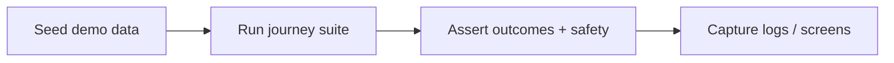

# e2e-test-plan.md

Owner: Susank Shakya

<aside>
🔗

**`docs/testing/e2e-test-plan.md`** · full user journeys across services, all in demo-mode.

</aside>

# 1. Purpose & scope

This plan covers **end-to-end journeys** spanning the frontends, backend, storage, and providers — run entirely in demo-mode against the docker-compose stack with seeded demo data. E2E proves the layers integrate correctly and that safety holds across a complete flow.

# 2. Journeys

| # | Journey | Asserts |
| --- | --- | --- |
| 1 | Browse → recommend | Catalog → confidence recommendations with reasons/warnings. |
| 2 | Consent → self-scan → result | Consent captured, media uploaded via signed URL, analysis returns, personalized recommendations shown. |
| 3 | Seller consultation | Vendor starts consultation, consented inputs, review + present. |
| 4 | Admin update → storefront effect | A product/setting change is reflected downstream. |
| 5 | Provider failure → fallback | Provider “down” → demo-mode keeps the flow working. |

# 3. Flow

# 4. Approach

- Run against the docker-compose stack; seed demo data first.
- Assert **no private media is publicly reachable** during any journey.
- Verify provider failure transparently degrades to demo-mode (`mode=demo`).

# 5. Evidence

- Store run logs/screens under `implementation-plan/evidence/staging-verification/`.

# 6. Limitations & future enhancements

- E2E uses demo-mode only; live-provider smoke tests run separately during production readiness.

# 7. Related documentation

- Flows: `storefront/customer-flow.md`, `vendor-portal/seller-consultation-flow.md`. Deployment: `deployment/staging-deployment.md`. Storage: [[storage-test-plan.md](http://storage-test-plan.md)](storage-test-plan%20md%204f788d4da0a543b4948e183305b3d3e3.md).