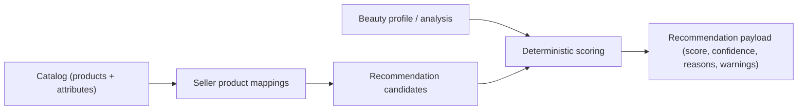
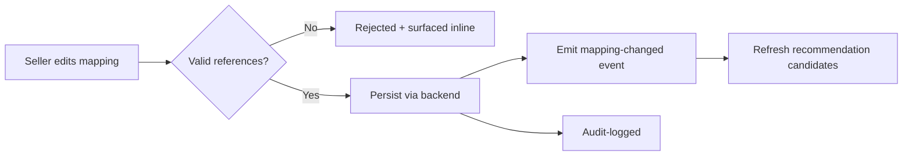

# product-mapping.md

Owner: Susank Shakya

<aside>
🗂️

**`docs/vendor-portal/product-mapping.md`** · how sellers map products to customer attributes and needs so the recommender has good candidates.

</aside>

# 1. Purpose & scope

This page describes how sellers **map products to customer attributes and needs**, building the candidate set the deterministic recommender scores against a beauty profile. Mapping quality directly shapes recommendation quality, so this is a foundational, continuously maintained dataset rather than a one-off setup. Seller mapping editors are introduced early (Phase 2) and mature into the Phase 4 consultation flow.

# 2. Business context

A recommendation is only as good as the catalog knowledge behind it. Sellers and senior advisors hold tacit product expertise — which shade suits which undertone, which formulation avoids which concern. Product mapping captures that expertise as structured data the scoring engine can use consistently, so every customer benefits from the store's collective knowledge instead of a single advisor's memory.

# 3. What sellers map

| Mapping | Detail |
| --- | --- |
| Attributes | Associate products with skin type, undertone, concern signals, and shade family. |
| Suitability | Mark products as well-suited or to-avoid for specific attribute combinations. |
| Candidates | Define the mappings the scoring engine treats as eligible candidates. |
| Maintenance | Keep mappings current as the catalog and shade ranges evolve. |

# 4. How mappings feed scoring

Mappings are the bridge between the admin-managed catalog and the recommender: they turn raw catalog entries into attribute-tagged candidates that can be matched against a profile.

# 5. Data model

| Table | Holds |
| --- | --- |
| `beauty_product_mappings` | Product ↔ attribute/need associations that seed scoring candidates. |
| `beauty_product_effect_logs` | Observed product effects/outcomes that inform future mappings and review. |

Mappings are tenant-scoped by `shop_id` (see `backend-engine/database-schema.md`); changes emit events that can refresh scored sets.

# 6. Workflow

# 7. Validation & guardrails

- Mappings are validated against the catalog; **invalid references are rejected**, not silently stored.
- All edits are authorized by Policy and audit-logged (ADR 0012).
- Mappings only affect candidate eligibility and ranking inputs; they never bypass consent or expose private media.
- Changes propagate via events so scored sets stay consistent with the latest mappings.

# 8. Limitations & future enhancements

- Today mappings are curated manually by sellers; the custom model (ADR 0008) will later learn mappings/weights from consented data and seller corrections, with sellers retaining override authority.

# 9. Related documentation

- Consultation: [[seller-consultation-flow.md](http://seller-consultation-flow.md)](seller-consultation-flow%20md%20a2e99ac1ba374b2eae724823abf3ad2e.md). Review: [[recommendations-review.md](http://recommendations-review.md)](recommendations-review%20md%20488f61fec2f943f09064dac350b71ce9.md). Catalog source: `admin-panel/product-management.md`. Scoring: `integrations/ai-provider/orchestration.md`. Schema: `backend-engine/database-schema.md`. Decisions: ADR 0008, 0012.