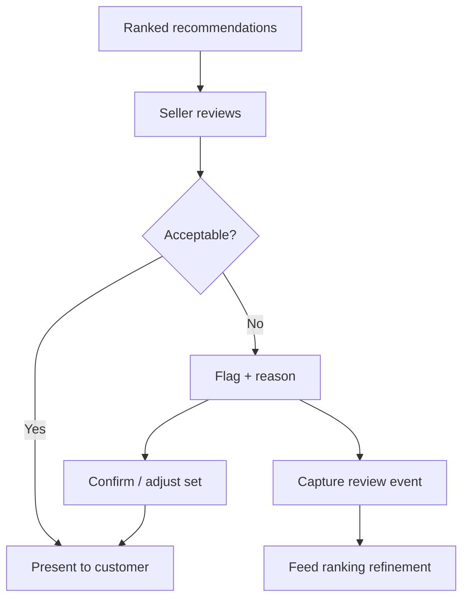
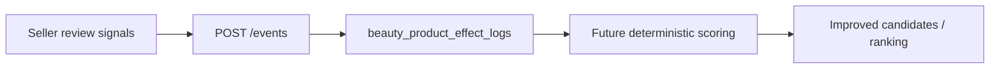

# recommendations-review.md

Owner: Susank Shakya

<aside>
🔬

**`docs/vendor-portal/recommendations-review.md`** · how sellers review recommendation quality and feed corrections back into future scoring.

</aside>

# 1. Purpose & scope

This page describes how sellers **review recommendation quality** before presenting it and how their feedback improves future scoring. Review is the seller's quality gate over the deterministic recommender: it keeps suggestions trustworthy in front of the customer and turns advisor judgment into a structured signal the system can learn from.

# 2. Business context

Deterministic scoring is consistent but not infallible — a shade may be technically eligible yet wrong for the customer in front of the advisor. Letting sellers inspect, flag, and adjust recommendations preserves human judgment at the point of sale, while capturing those corrections as data that steadily improves ranking quality across the store.

# 3. Capabilities

| Capability | Detail |
| --- | --- |
| Inspect | View a customer's ranked recommendations with `score`, `confidence`, `reasons`, and `warnings`. |
| Flag | Mark low-quality or inappropriate suggestions with a reason. |
| Adjust | Confirm or refine the set before presenting it to the customer. |
| Explain | Use reasons/warnings to justify each suggestion transparently. |

# 4. Review flow

# 5. Feedback loop

- Review signals are captured as **events** feeding ranking refinement and product-effect logs.
- Persistent quality issues surface to admins via audit/analytics for action (e.g. a bad mapping or catalog entry).

# 6. Data

| Source | Role |
| --- | --- |
| `/events` | Ingests review/flag signals from the portal. |
| `beauty_product_effect_logs` | Records observed outcomes that inform future scoring and mappings. |
| `audit_logs` | Trails sensitive review actions for oversight. |

# 7. Guardrails

- Review **never exposes raw provider internals** — only the canonical payload (`score`, `confidence`, `reasons`, `warnings`).
- All review actions are authorized by Policy and audit-logged (ADR 0012).
- Feedback adjusts ranking inputs; it never overrides consent or surfaces private media.
- Copy and warnings stay retail-safe and non-clinical (ADR 0005).

# 8. Limitations & future enhancements

- Today review feedback tunes deterministic ranking inputs; the custom model (ADR 0008) will incorporate these corrections as training signal while keeping recommendations explainable.

# 9. Related documentation

- Consultation: [[seller-consultation-flow.md](http://seller-consultation-flow.md)](seller-consultation-flow%20md%20a2e99ac1ba374b2eae724823abf3ad2e.md). Mapping: [[product-mapping.md](http://product-mapping.md)](product-mapping%20md%201ffb54a2c1e44ac685bb7b676772891a.md). Payload & events: `backend-engine/api-contracts.md`. Scoring: `integrations/ai-provider/orchestration.md`. Audit: `storage/audit-logging.md`. Decisions: ADR 0005, 0008, 0012.