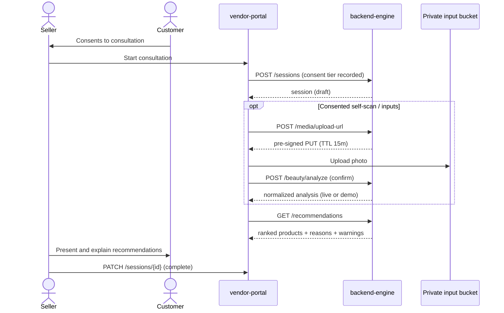
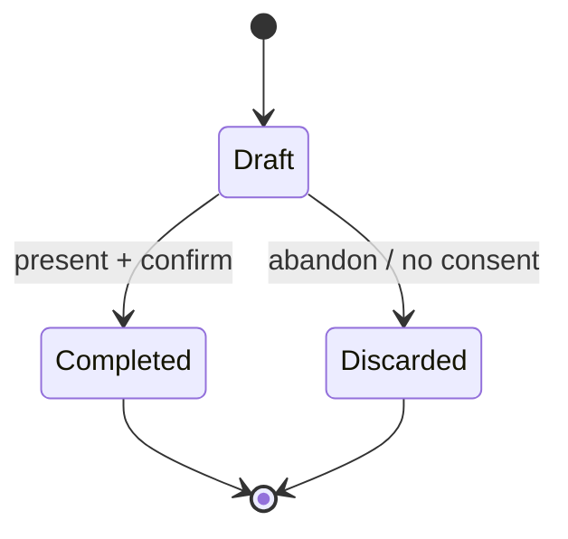

# seller-consultation-flow.md

Owner: Susank Shakya

<aside>
🧭

**`docs/vendor-portal/seller-consultation-flow.md`** · the guided, consent-first journey a seller follows to produce trustworthy recommendations.

</aside>

# 1. Purpose & scope

This page defines the **guided consultation flow** a seller follows, in store, to consult with a customer and produce explainable recommendations. It is the **Phase 4 — Seller consultation foundation** capability and is the seller-side counterpart to the customer self-scan flow. Consent is required, explicit, and revocable; every step degrades gracefully to demo-mode when a provider is unavailable.

# 2. Business context

Beauty advisors are the trusted human in the loop for small and medium retailers. The consultation flow lets an advisor capture a customer's needs, optionally run a consented analysis, and present ranked products with the **reasons** and **warnings** that justify them — turning an opaque suggestion into a transparent, confidence-building conversation. The seller adds judgment; the system supplies consistent, explainable candidates.

# 3. The consultation journey

# 4. Stages

| Stage | What happens | Backend |
| --- | --- | --- |
| Consent | Customer grants explicit, revocable consent; the tier (T0–T4) is recorded before anything else. | `POST /consent` |
| Start | Seller opens a consultation; a draft session is created and attributed to seller + shop. | `POST /sessions` |
| Inputs (optional) | Consented self-scan or manually captured attributes; media uploaded via signed URL and analyzed server-side. | `/media/upload-url`, `/beauty/analyze` |
| Recommend | Deterministic scoring returns the canonical ranked payload. | `GET /recommendations` |
| Present | Seller explains products using reasons and warnings; can review/adjust first (see `recommendations-review.md`). | — |
| Close | Session is completed or discarded; a snapshot is retained for T1+ consent. | `PATCH /sessions/{id}` |

# 5. Session states

- **Draft** — open consultation; inputs and recommendations may be added.
- **Completed** — presented and confirmed; snapshot retained for T1+ so a returning customer can reopen results.
- **Discarded** — abandoned or consent withheld/withdrawn; inputs and results are cleaned up.

# 6. Rules

- A consultation **cannot proceed without recorded customer consent**; withdrawing consent stops the flow and triggers cleanup (see `storage/media-lifecycle.md`).
- Sellers always see **reasons** and **warnings** so suggestions can be explained transparently.
- The browser holds no storage credentials; media moves only through short-lived signed URLs.
- Every state change is authorized by Policy and audit-logged (ADR 0012).
- Analysis runs server-side and degrades to demo-mode if a provider is unavailable.

# 7. Error & edge handling

- **No / withdrawn consent** → consultation cannot start or is discarded; nothing is analyzed or retained.
- **Capture-quality failure** → inline guidance and retry; nothing is uploaded (`integrations/ai-provider/safety-rules.md`).
- **Provider failure** → transparent demo-mode fallback; results flagged internally as `mode=demo`.
- **Abandoned session** → expires to discarded; scheduled cleanup removes any inputs.

# 8. Limitations & future enhancements

- Phase 4 covers single-customer, in-session consultations; multi-session history and richer personalization arrive in Phases 7–9.
- Try-on previews during a consultation depend on the Phase 9 Try-On Studio (`storefront/try-on-studio.md`).

# 9. Related documentation

- Mapping: [[product-mapping.md](http://product-mapping.md)](product-mapping%20md%201ffb54a2c1e44ac685bb7b676772891a.md). Review: [[recommendations-review.md](http://recommendations-review.md)](recommendations-review%20md%20488f61fec2f943f09064dac350b71ce9.md). Self-scan parallel: `storefront/self-scan-flow.md`. Orchestration: `integrations/ai-provider/orchestration.md`. Sequences: `architecture/diagrams/sequence-diagrams.md`. Decisions: ADR 0005, 0012.