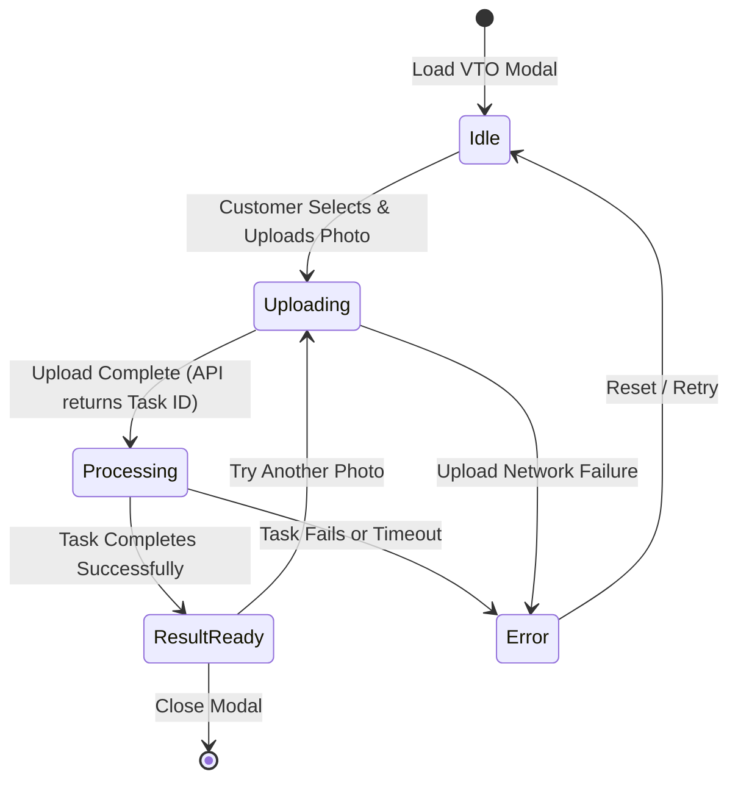

# 💅 Virtual Try-On (VTO) UI Flow

This document details the states and logic mapping of the virtual try-on frontend modal client.

---

## 🔄 State Machine Diagram

---

## ⚙️ Interface Guidelines

1. **Visual Loading Indicator**: While in `Uploading` and `Processing` states, the modal must display an animated progress spinner alongside helpful micro-copy (e.g. *"Applying makeup rendering..."*).
2. **Graceful Authentication Guard**: If the customer triggers VTO while unauthenticated, prevent the upload and display a clear action prompt reading: `"Please sign in to save try-on sessions"`.
3. **Approved Image Domains**: Only render resulting URLs from allowed domains configured in `next.config.js` to prevent Content Security Policy (CSP) failures.
4. **Input Mode Constraint**: The interface is restricted to photo uploads. Live camera video feedback is out of scope unless the backend is refactored to support stream processing.
